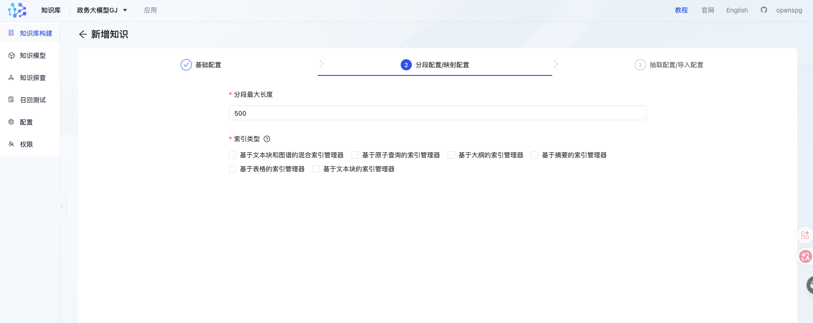

--- 
日期： 0827 

1. 梳理论文建图流程,建schema方法
2. 观察政务数据格式，选择合适的建schema方法 
3. 实际完成schema
4. 获取大模型api，采用llm抽取的方法抽取实体

实体抽取这个部分，是有问题的，openspg框架不一定能够满足论文中描述的建图策略，可能需要魔改
4.1 我们要确定是拿论文中框架移植到openspg中，还是使用openspg原生？
4.2 如果使用原生openspg 抽取的方案，对于不同数据如何选择适配的抽取方案？
5. 查看openspg的抽取实体实现逻辑，判断是否符合论文标准，是否需要修改

---
1. 对于建图，论文中只有三篇涉及到建图：
真正有用的只有：
- SocraticKG	抽三元组前先用 5W1H 生成"上下文独立"的 QA 对中间层，事实保留率最高 96.3%，图更连通	建图层：受理条件等隐式逻辑的抽取方法
- SynthKG (Distill)	分块 → 去语境化 → 逐块抽"命题+三元组"，用合成数据蒸馏 8B 模型，成本降约 97%	建图层：长文本结构化抽取的完整流水线
- Wikontic	从 Wikidata 派生本体约束库（2464 属性 + 域/值域约束）+ 实体规范化 + 别名表，仅 3.5% 三元组错位	建图层：schema 约束校验 + 实体归一

