# 面向知识增强推理的查询感知图注意力精准子图检索

**作者**：Yuanye Xu, Linyi Guo, Yue Zhang, Ning Fu*（* 通讯作者）

**机构**：School of Computer Science, Northwestern Polytechnical University（西北工业大学计算机科学学院）

**联系方式**：{yuanyenpu, linyi01, donening}@mail.nwpu.edu.cn, funing@nwpu.edu.cn

**原文元信息**：
- 英文原题：*Query-Aware Graph Attention for Precise Subgraph Retrieval in Knowledge-Augmented Reasoning*
- 会议：Findings of the Association for Computational Linguistics: ACL 2026（Findings of ACL 2026），论文编号 2026.findings-acl.398
- 页码：8127–8148
- 会议时间与版权：2026 年 7 月 2–7 日，©2026 Association for Computational Linguistics

## 译者说明

本译文基于本地 PDF（`2026.findings-acl.398-子图检索.pdf`）使用 `pdftotext -layout` 抽取的全文翻译而成。为便于查阅原始文献，数据集名（如 WebQSP、CWQ、Freebase）、模型名与方法名（如 QSRAG、QR-GAT、SubgraphRAG、RoG）、系统名、引用名（如 (Li et al., 2025)）、变量名、指标名（如 Triple Recall、Micro-F1）及 URL 均保留英文原文；参考文献列表未做翻译。公式采用 LaTeX 表示；表格以 Markdown 表格重建。原文 Figure 1、Figure 2 及附录表图为矢量图，无法通过 `pdfimages` 直接抽取，故以文字描述代替；其余可抽取的图片已存于同目录 `assets/` 下并在文中相对引用。

## 摘要

大语言模型（LLM）日益依赖外部知识来缓解幻觉问题，然而为知识增强推理检索精准的多跳证据仍然困难。现有的基于知识图谱（KG）的检索增强生成（RAG）系统对查询语义与关系类型之间交互的建模不足，导致子图检索不精确、推理不稳定。我们提出查询感知子图检索增强生成（Query-aware Subgraph Retrieval Augmented Generation, QSRAG），一个建立在查询-关系图注意力网络（Query-Relational Graph Attention Network, QR-GAT）之上的检索框架。QR-GAT 将查询语义和关系嵌入直接整合进注意力机制中，实现细粒度的三元组评分和可扩展的子图构建。这种"查询–关系"条件化改善了相关性估计并抑制了噪声边，从而产生忠实的推理子图。在 WebQSP 和 CWQ 上的实验在 Triple Recall 和 Answer Recall 两项指标上均取得了新的最先进结果，并在无需微调的情况下显著提升了 LLM 的推理准确率。这些发现凸显了建模查询–关系交互对于可靠的知识增强推理的有效性。

## 目录

- [1 引言](#1-引言)
- [2 相关工作](#2-相关工作)
- [3 预备知识](#3-预备知识)
- [4 方法](#4-方法)
  - [4.1 结构化证据检索](#41-结构化证据检索)
  - [4.2 基于证据的上下文推理](#42-基于证据的上下文推理)
- [5 实验](#5-实验)
  - [5.1 基于证据的上下文推理](#51-基于证据的上下文推理)
  - [5.2 实验设置](#52-实验设置)
  - [5.3 评测结果](#53-评测结果)
- [6 进一步分析](#6-进一步分析)
- [7 结论](#7-结论)
- [局限性](#局限性)
- [伦理考量](#伦理考量)
- [参考文献](#参考文献)
- [附录 A 补充实验](#附录-a-补充实验)
- [附录 B 实现细节](#附录-b-实现细节)
- [附录 C 问答示例](#附录-c-问答示例)

## 1 引言

大语言模型（LLM）推动了自然语言处理的快速进展 (Brown et al., 2020; Huang and Chang, 2022; Wei et al., 2022)，但其内部知识仍然是静态且不完整的 (Kasai et al., 2023; Ji et al., 2023)。检索增强生成（RAG）通过为 LLM 补充外部信息来缓解这一局限 (Borgeaud et al., 2022; Gao et al., 2023)。知识图谱（KG）凭借其结构化、多跳的关系信息，为知识图谱问答（KGQA）等复杂推理任务 (Guo et al., 2024; Pan et al., 2024; Peng et al., 2024) 提供了特别有前景的事实证据来源。

然而，要将 KG 有效整合进 RAG，就需要准确地检索出一个能够反映自然语言查询语义的紧凑子图。尽管近期取得了一些进展，现有的基于 KG 的 RAG 方法仍面临若干根本性障碍。

**挑战 1：识别正确的多跳推理证据依然困难。** 现实世界的 KGQA 查询往往依赖于细微的关系区分。虽然近期的检索方法 (Jiang et al., 2023a; Luo et al., 2024; Sun et al., 2024) 能够捕获看似合理的路径，但它们仍然容易受到冗余邻居和虚假关系的影响，这些噪声会掩盖真正的推理链。

**挑战 2：查询语义与关系类型之间交互的建模不足。** 大多数图检索和基于 GNN 的方法在与查询无关的情况下独立地编码图结构 (Mavromatis and Karypis, 2025; Yasunaga et al., 2021; Li et al., 2025)，这使得注意力无法适应推理意图。这一局限性在需要细粒度关系区分的问题上尤为明显。图 1 提供了一个能很好解释该问题的示例。对于问题 "Where was Rihanna raised?"，真实答案是 Saint Michael Parish。SubgraphRAG (Li et al., 2025) 却检索到了 Barbados，因为其 DDE+MLP 评分缺乏显式的查询–关系交互。由于不理解 "born" 与 "raised" 之间的语义差异，它过度加权了泛化的地理关系（如国籍、出生地），而忽略了更具体的居住地相关边。这个例子凸显了检索机制需要对多跳结构上的查询语义和关系类型同时保持敏感的必要性。

**挑战 3：检索或推理过程中反复调用 LLM 导致高延迟。** 若干基于 KG 的 RAG 系统在规划、路径扩展或迭代推理过程中多次调用 LLM (Jin et al., 2024; Gao et al., 2024; Kim et al., 2023; Ma et al., 2024; Xiong et al., 2024; Sun et al., 2024)。这些方法虽然有效，但其流程产生大量延迟，限制了实际场景中的可扩展性。一种更高效的范式是只执行一次结构化检索，然后依靠单次 LLM 推理完成最终推理。

> **图 1**：使用具体示例（"Where was Rihanna raised?"）比较查询感知检索机制。（原图为矢量图，未能抽取，特此说明。）

**我们的解决方案。** 为应对上述挑战，我们提出 QSRAG，一个围绕新颖的查询-关系图注意力网络（QR-GAT）构建的两阶段基于 KG 的 RAG 框架。QR-GAT 将全局查询语义和显式关系嵌入直接注入图消息传递的注意力计算中，从而在大规模 KG 上实现细粒度、查询感知且关系引导的三元组评分。这使模型能够优先选择与查询对齐的关系（例如 "raised" → 居住类关系），从而纠正 SubgraphRAG 等系统中观察到的失败模式。

利用所得的三元组级分数，QSRAG 构建一个简洁、高质量的子图，在有限的 LLM 上下文窗口内最大限度地减少冗余、降低噪声。最终推理阶段仅需单次 LLM 调用，且不依赖任何 LLM 微调，保持了通用性和高效性。

我们的贡献总结如下：

- 我们提出 QSRAG，一个面向 KGQA 结构化证据检索的框架，其核心是用于精准三元组评分的新型 QR-GAT。
- 在 WebQSP 和 CWQ 上的实验表明，QR-GAT 在标准检索指标上取得了最先进的性能。
- 整合 QR-GAT 子图可显著提升 LLM 推理准确率，在不进行 LLM 微调的情况下取得最先进或有竞争力的结果。
- 消融研究证实了查询–关系注意力的重要性，并表明置信度分数有助于 LLM 更有效地利用证据。

本文其余部分组织如下：第 2 节回顾相关工作；第 3 节介绍预备知识；第 4 节描述 QR-GAT 与 QSRAG 框架；第 5 节给出实验，随后第 6 节进行补充分析；第 7 节总结全文。附录提供了额外的 QA 示例、消融结果和辅助实验。

## 2 相关工作

**基于 KG 的 RAG 与图检索。** 检索增强生成已成为提升大语言模型事实可靠性的有效范式，而将知识图谱作为结构化外部来源整合进来在多跳推理方面显示出特殊前景。基于 KG 的 RAG 的一个核心挑战是从大规模 KG 中检索紧凑且与查询相关的子图，同时保留推理所需的多跳结构。近期的努力通过多种机制解决这一问题：RoG 中基于规划的路径检索 (Luo et al., 2024)、SubgraphRAG 等可训练的子图评分模型 (Li et al., 2025)、启发式或组合搜索方法 (Sun et al., 2024; He et al., 2024; Hu et al., 2024)、免训练的流扩散机制 (Zhou et al., 2026)。另一些工作将 KG 转换为序列化文本供 LLM 使用 (Wu et al., 2023)、引入仿生检索机制 (Gutierrez et al., 2024)，或为 KGQA 构建统一的检索器–推理器架构 (Jiang et al., 2023b)。此外，早期面向复杂 KGQA 的语义解析方法，如层次化查询图生成方法 HGNet (Chen et al., 2023)，也强调结构分解（例如将拓扑预测与实例选择解耦）以处理复杂查询。然而，这些方法主要用于生成可执行的 SPARQL 查询，并不提供同时以查询语义和关系类型为条件的三元组级相关性评分。因此，即便是基于 KG 的 RAG 或 KGQA 中结构感知的检索/语义解析方法，在多跳查询上仍可能给出粗粒度或虚假的关系证据。我们的工作直接针对这一空缺，引入查询与关系感知的注意力机制，分配细粒度的三元组级分数，实现全局精准的子图检索。

**面向 KG 的图神经网络。** 图神经网络已广泛应用于知识图谱的表示学习、链接预测和推理。GNN 在图邻域间传播信息，图注意力网络（GAT）(Brody et al., 2022) 进一步通过基于注意力的聚合增强了表达能力。若干 KGQA 和基于 KG 的 RAG 系统利用 GNN 编码问题特定的子图：GRAFT-Net (Sun et al., 2018) 使用异构注意力整合 KG 与文本证据；更近期的工作将 GNN 应用于稠密检索的子图或最短路径结构 (Mavromatis and Karypis, 2025)；GAT 的变体还探索了检索上下文中的时序或结构依赖 (Gao et al., 2024)。

然而，虽然一些现有的查询感知 GNN 针对节点分类等任务调节节点特征，它们通常在预先选定的候选子图上运行，并非为大规模 KG 上的细粒度子图检索量身定制。标准 GAT 对邻居在查询视角下一视同仁，无法基于关系语义动态调整注意力。我们的工作建立在这些基础之上，但引入了专为子图检索设计的图注意力机制而与之不同。通过将关系嵌入显式整合进注意力计算，我们的 QR-GAT 能够评估特定关系类型（如 "educated_at"）对查询的语义相关性，从而支持直接的三元组级相关性估计，实现精准高效的子图检索。

## 3 预备知识

本节介绍与本文工作相关的关键概念，并形式化定义所研究的问题。

**知识图谱。** 知识图谱 $\mathcal{G}$ 是以图形式对事实性知识的结构化表示。它通常由实体集合 $\mathcal{E}$、关系类型集合 $\mathcal{R}$ 和事实三元组集合 $\mathcal{T}$ 构成。每个三元组 $(h, r, t) \in \mathcal{T}$ 表示一个事实，其中 $h \in \mathcal{E}$ 为头实体，$r \in \mathcal{R}$ 为关系，$t \in \mathcal{E}$ 为尾实体。

**知识图谱问答。** KGQA 指通过从知识图谱 $\mathcal{G}$ 中识别出正确答案 $a$ 来回答自然语言问题 $q$ 的任务。答案 $a$ 可以是图中的单个实体或实体集合。求解 KGQA 通常需要理解问题的语义意图，将其映射到 KG 的结构，并执行推理或结构化查询以定位正确答案。

**检索增强生成。** RAG 是将信息检索与 LLM 生成能力相结合的强大范式。在典型的 RAG 框架中，给定用户查询，检索模块首先从外部知识源检索相关知识片段或证据；这些检索到的内容随后与原始查询拼接并送入生成模块（通常为 LLM）以产生最终回复或答案。RAG 使 LLM 能够纳入外部的、实时的或领域特定的知识，从而减少幻觉，提高生成的事实准确性与可靠性。

**问题定义。** 我们研究 RAG 框架下的复杂多跳 KGQA，其中外部知识源为知识图谱。形式化地，给定自然语言问题 $q$ 和知识图谱 $\mathcal{G} = (\mathcal{E}, \mathcal{R}, \mathcal{T})$，目标是训练一个两阶段模型，从 $\mathcal{G}$ 中输出正确答案 $a$。第一阶段检索一个子图 $S \subseteq G$，其中包含与 $q$ 高度相关、可支撑推理的三元组。第二阶段将检索到的子图 $S$ 作为上下文提供给 LLM，LLM 通过上下文学习（ICL）(Brown et al., 2020) 进行多跳推理以生成最终答案。这两个阶段协同工作，实现准确、可解释的基于 KG 的 RAG。

我们的核心关注点是设计高效且准确的检索模块，特别是利用查询-关系图注意力机制从大规模知识图谱中精准抽取多跳证据。

## 4 方法

我们提出 QSRAG，一个由知识图谱增强的检索增强生成框架，能够精准检索与给定问题相关的结构化证据并引导 LLM 推理。如图 2 所示，QSRAG 由两个主要阶段组成：结构化证据检索和基于证据的上下文推理。

> **图 2**：QSRAG 框架总览，由 (1) 用于从 KG 中检索结构化证据的 QR-GAT，以及 (2) 使用 LLM 进行上下文推理的模块组成。在图示中，紫色节点表示在查询中识别出的主题实体（例如 "Martin Luther King"），绿色节点表示答案实体。路径上的视觉重要性对应 QR-GAT 学到的注意力权重，表明模型聚焦于这些高分路径作为查询相关的推理证据。（原图为矢量图，未能抽取，特此说明。）

在构建图表示之前，我们使用 Qwen3-Embedding-0.6B 编码器 (Zhang et al., 2025) 获得实体、关系和输入问题的语义嵌入。由此得到丰富的表示：实体 $v_i$ 对应 $\mathbf{e}_i$，关系 $r_{ij}$ 对应 $\mathbf{r}_{ij}$，问题对应 $\mathbf{q}$。

### 4.1 结构化证据检索

本阶段的目标是从 KG 中抽取一个子图 $S \subseteq G$，其中包含与输入问题最相关的三元组。我们不使用传统的文本匹配或邻域扩展，而是使用一种新颖的注意力机制——QR-GAT，对查询、实体和关系在多跳路径上的细粒度语义交互进行建模。

QR-GAT 旨在将注意力动态引导至对回答特定问题至关重要的实体和关系。它将查询语义和关系嵌入同时纳入注意力计算过程。标准 GAT 通常对邻居一视同仁或仅基于结构处理，忽略了查询特定的信号。QR-GAT 通过引入查询与关系感知的注意力克服了这一局限，从而实现更聚焦的、针对当前问题的证据检索。

每个实体节点 $v_i$ 初始化为：

$$\mathbf{h}_i^{(0)} = \mathrm{Dropout}([\mathbf{e}_i \| \mathbf{q} \| \mathbf{p}_i])$$

其中 $\mathbf{e}_i \in \mathbb{R}^{d_e}$ 为实体嵌入，$\mathbf{q} \in \mathbb{R}^{d_q}$ 为查询嵌入，$\mathbf{p}_i$ 为用于标记该实体是否为主题实体的 one-hot 编码向量。这一初始化在最初阶段就将来自查询的语义信息和来自实体的结构知识注入图表示，有利于形成更具查询感知能力的注意力机制。

在每一层 $l$，我们进行线性投影：

$$\mathbf{z}_i^{(l)} = \mathbf{W}_s^{(l)} \cdot \mathbf{h}_i^{(l-1)}, \qquad \mathbf{z}_j^{(l)} = \mathbf{W}_t^{(l)} \cdot \mathbf{h}_j^{(l-1)}$$

其中 $\mathbf{W}_s^{(l)}$ 和 $\mathbf{W}_t^{(l)}$ 分别是源角色和目标角色的可学习权重。这些权重有助于优化相邻节点间的消息传递，更有效地捕获关系。

注意力分数 $\alpha_{ij}$ 通过结合结构与查询引导项计算：

$$\alpha_{ij,\text{base}}^{(l)} = \mathbf{a}^{(l)\top} \cdot \mathrm{LeakyReLU}\left(\mathbf{z}_i^{(l)} + \mathbf{z}_j^{(l)} + \mathbf{W}_e^{(l)} \cdot \mathbf{r}_{ij}^{(l)}\right)$$

$$\alpha_{ij,\text{plus}}^{(l)} = \left(\mathbf{W}_q^{(l)} \cdot \mathbf{q}\right)^{\top} \cdot \left(\mathbf{W}_r^{(l)} \cdot \mathbf{r}_{ij}^{(l)}\right)$$

$$\alpha_{ij}^{(l)} = \mathrm{softmax}_j\left(\alpha_{ij,\text{base}}^{(l)} + \alpha_{ij,\text{plus}}^{(l)}\right)$$

其中 $\mathbf{a}^{(l)}$ 是产生标量兼容性分数的可学习注意力向量。变换 $\mathbf{W}_e^{(l)}$ 将关系语义注入结构注意力项，而 $\mathbf{W}_q^{(l)}$ 和 $\mathbf{W}_r^{(l)}$ 将查询和关系嵌入投影到共享空间以建模它们的语义对齐。这一设计实现了对关系的查询条件化注意力，并通过强调查询相关的关系信号来缓解注意力稀释。

节点表示通过多头注意力更新：

$$\mathbf{h}_i^{(l)} = \mathrm{LayerNorm}\left([\mathbf{h}_{i,1}^{(l)} \| \ldots \| \mathbf{h}_{i,H}^{(l)}]\right)$$

其中对于注意力头 $k$，$\mathbf{h}_{i,k}^{(l)} = \sum_{j \in \mathcal{N}(i)} \alpha_{ij}^{(l,k)} \cdot \mathbf{z}_j^{(l)}$。多头注意力使模型能够捕获实体与关系之间多样化的交互模式。

我们使用双向 QR-GAT（BiQR-GAT）编码正向和反向边。最终实体表示为：

$$\mathbf{h}_i = [\mathbf{h}_i^{\rightarrow} \| \mathbf{h}_i^{\leftarrow}]$$

**关键工程洞察：** 在概念简单性之下，QR-GAT 建立在两个支撑其性能的关键工程洞察之上。1. 查询感知初始化策略：通过在节点嵌入初始化时注入查询的语义信息，我们增强了模型从一开始就捕获查询特定注意力模式的能力。该策略确保图在流程早期即"感知"查询语义，改善证据检索。2. 查询与关系嵌入的有效整合：使用可学习投影矩阵 $\mathbf{W}_q^{(l)}$ 和 $\mathbf{W}_r^{(l)}$ 实现查询与关系信息的细粒度整合。这确保注意力机制同时对图中的结构关系和查询的具体语义敏感，防止注意力分数被无关的关系信息稀释。

通过结合这些工程洞察，QR-GAT 能够基于查询和关系动态调整注意力，从而实现更准确、更高效的子图检索，以支撑复杂的多跳推理。

**三元组评分。** 使用头实体和尾实体的最终节点表示 $\mathbf{h}_h$ 和 $\mathbf{h}_t$，三元组 $(h, r, t)$ 的分数通过一个两层 MLP 计算：

$$s(h, r, t) = \mathbf{W}_2 \cdot \mathrm{ReLU}\left(\mathbf{W}_1 \cdot [\mathbf{q} \| \mathbf{h}_h \| \mathbf{r} \| \mathbf{h}_t]\right)$$

**训练与推理。** 检索器作为二分类器训练，使用二元交叉熵损失区分正例三元组（主题实体与答案实体之间最短路径上的三元组）与负例三元组。推理时，计算所有候选三元组的分数，并选出 top-k 三元组构成结构化证据子图。

## 5 实验

### 5.1 基于证据的上下文推理

检索到的结构化证据被序列化为文本形式并交给 LLM 进行最终答案生成。每个三元组被表达为简洁的事实陈述，如 `(head, relation, tail) (Confidence: 0.96)`，所有被选三元组的拼接构成附加在问题之后的证据上下文。LLM 随后在这个条件化于证据的提示上进行推理。

除了使用按相关性分数排序的 top-k 三元组之外，我们提出一种受语言生成中核采样（top-p）启发的自适应证据过滤机制。我们不固定检索三元组的数量，而是动态选择一个高质量证据的最小子集，其累积归一化概率超过阈值 $p$（例如 $p = 0.9$）。该流程包括一个预过滤阶段，通过 sigmoid 门移除极低分的三元组，随后对剩余 logits 进行 softmax 归一化。该算法自适应地确定累积质量超过阈值的最小三元组前缀，并受允许的最小和最大三元组数量约束。这一过滤策略防止 LLM 被无关证据淹没，同时为多跳推理保留足够的结构信息。具体算法实现见附录 B.1。

最终的证据集合与其置信度分数一起格式化后送入 LLM。我们发现，条件化于置信度的提示显著提升了模型优先选择可靠事实的能力并减少幻觉，在长推理链中尤为明显。完整的提示模板与定性示例——包括成功和失败案例——见附录 C，展示了 LLM 在多跳推理中如何利用不同置信度级别的证据。

为全面评估所提出的 QSRAG 框架的有效性，我们在两个标准的知识图谱问答数据集上进行了大量实验。本节详述实验设置、评测结果和深入分析。

### 5.2 实验设置

**数据集。** 我们使用两个广泛采用的 KGQA 基准：WebQuestionsSP（WebQSP）(Yih et al., 2016) 和 Complex WebQuestions（CWQ）(Talmor and Berant, 2018)，两者均构建于 Freebase (Bollacker et al., 2008) 之上。WebQSP 包含 4,737 个问题，需要最多两跳推理，反映相对简单到中等复杂度的查询。CWQ 包含 34,699 个问题，具有更高的组合性与多跳要求。我们遵循 RoG 等先前工作的预处理和数据划分。

**评测指标。** 我们在检索和推理两个层面评估性能。检索层面，Triple Recall@k 度量检索到的 top-k 三元组中位于主题实体到答案最短路径上的比例；Answer Recall@k 度量由检索到的 top-k 三元组构成的子图所覆盖的答案实体比例。对于 KGQA，我们采用该领域的标准评测指标：Micro F1 度量所有问答对上的整体 F1 表现，更好地反映在常见问题和多答案问题上的有效性；Macro F1 对每个问答对的 F1 取平均，更好地反映方法在不同问题类型上的平均表现；Hit 评估模型生成的答案中是否至少有一个正确；Hit@1 评估模型预测频次最高的答案是否与任一真实答案相符。

**基线。** 我们将 QSRAG 与一系列 KGQA 方法进行比较，从简单的检索策略——Random Triplet Selection 和 Ground Truth Triplet Selection——到最先进的基于图和基于 LLM 的方法。包括 SR+NSM w/ E2E (Zhang et al., 2022)、Retrieve-Rewrite-Answer (Wu et al., 2023)、RoG (Luo et al., 2024)、ToG (Sun et al., 2024)、G-Retriever (He et al., 2024)、GNN-RAG (Mavromatis and Karypis, 2025) 和 SubgraphRAG (Li et al., 2025)，它们分别采用路径规划、改写、优化、基于 GNN 的推理或方向性结构编码进行检索。我们还参考了层次化查询图生成方法 HGNet (Chen et al., 2023)，但由于其代码和参数不可得，未纳入结果。总体而言，这些基线涵盖了随机、完美与先进检索范式，实现全面比较。

**实现细节。** 所有模型训练和推理在 K100-AI 集群上进行。检索阶段，我们选取 top-k 三元组，k 取值范围为 50 至 500，并在后续章节分析不同 k 值的影响。推理阶段，我们使用多个大语言模型，包括 Llama-3.1-8B-Instruct、GPT-4o-mini-2024-07-18 和 GLM-4-Flash，推理时温度参数设为 0。虽然我们主要使用 top 100 三元组进行相关操作，我们也研究了 50 和 200 等代表性 k 值并在报告中给出结果。此外，我们还采用前述 top-p 采样策略，设置 $p = 0.9$ 并将保留的三元组数量约束在 50 至 200 之间。

### 5.3 评测结果

**检索性能。** 表 1 给出 WebQSP 和 CWQ 上的检索结果。QSRAG 在 Triple Recall 和 Answer Recall 上均持续取得最佳性能。在 WebQSP 上，其 Triple Recall 达到 0.906，超过 SubgraphRAG（0.883）并大幅超越 RoG（0.713）；Answer Recall 达 0.951，略高于 SubgraphRAG 的 0.944。在 CWQ 上的增益更为显著：QSRAG 将 Triple Recall 提升至 0.914——远高于 SubgraphRAG（0.811）和 RoG（0.623）——并取得 0.974 的新的最先进 Answer Recall。这些结果表明 QR-GAT 能实现更精准的多跳证据检索，并为 LLM 提供显著更干净、更有信息量的结构化上下文。

**表 1**：WebQSP 和 CWQ 数据集上的检索评估结果。最佳结果以粗体标示。

| 方法 | WebQSP Triple Recall | WebQSP Answer Recall | CWQ Triple Recall | CWQ Answer Recall |
|---|---|---|---|---|
| SR+NSM w/ E2E | 0.487 | 0.707 | – | – |
| Retrieve-Rewrite-Answer | 0.058 | 0.740 | – | – |
| RoG | 0.713 | 0.807 | 0.623 | 0.841 |
| G-Retriever | 0.294 | 0.545 | 0.183 | 0.375 |
| GNN-RAG | 0.522 | 0.818 | 0.500 | 0.841 |
| SubgraphRAG | 0.883 | 0.944 | 0.811 | 0.914 |
| **QSRAG** | **0.906** | **0.951** | **0.914** | **0.974** |

**推理性能。** 表 2 总结了 WebQSP 和 CWQ 上的 KGQA 结果。QSRAG 在各 LLM 和各检索预算下均带来清晰且一致的提升。在 WebQSP 上，最强配置——QSRAG + GPT-4o-mini (200)——取得 Micro-F1 55.52、Macro-F1 71.83。相比 RoG（52.60 / 70.45）提升分别为 +5.55% Micro-F1 和 +1.96% Macro-F1；相比 SubgraphRAG + GPT-4o-mini（49.78 / 69.76）提升更大，为 +11.53% / +2.97%。在检索敏感指标上，QSRAG 配合 GLM-4-Flash (200) 取得最高 Hit（92.12）和 Hit@1（81.45），超越所有先前系统，表明我们的检索器提供了明显更相关的答案证据。

在更具挑战性的 CWQ 数据集上，QSRAG 同样带来显著提升。配合 GPT-4o-mini 的 adaptive-k 版本取得最高 Micro-F1（52.35），超过 RoG（46.12）+13.51%，超过 SubgraphRAG + GPT-4o-mini（44.82）+16.80%。QSRAG 还取得有竞争力的 Macro-F1 以及强劲的 Hit/Hit@1 表现：QSRAG + GLM-4-Flash 各变体的 Hit 持续高于 66.03，Hit@1 高于 55.43，匹敌或超越 GNN-RAG 和 ToG 等专门的图模型。这些跨数据集、跨 LLM、跨检索预算的一致提升，凸显了 QSRAG 查询与关系感知检索的优势，使 LLM 能够在多跳 KG 证据上更准确地推理。

**表 2**：WebQSP 和 CWQ 上的 KGQA 结果。粗体表示总体最佳结果，下划线表示我们的最佳表现。括号 (200) 表示检索三元组数量（默认为 100）。"Adaptive k" 指动态三元组选择。

| 方法 | WebQSP Micro-F1 | WebQSP Macro-F1 | WebQSP Hit | WebQSP Hit@1 | CWQ Micro-F1 | CWQ Macro-F1 | CWQ Hit | CWQ Hit@1 |
|---|---|---|---|---|---|---|---|---|
| Random + Llama | 16.57 | 31.97 | 50.12 | 45.33 | 22.69 | 22.09 | 28.43 | 25.83 |
| Ground Truth + Llama | 60.62 | 83.73 | 88.82 | 88.39 | 67.25 | 60.10 | 63.24 | 62.62 |
| SR+NSM w/ E2E | – | 64.10 | – | – | – | 46.30 | – | – |
| ToG | – | – | 82.60 | – | – | – | 67.60 | – |
| Retrieve-Rewrite-Answer | – | – | 79.36 | – | – | – | – | – |
| G-Retriever | – | 53.41 | 73.46 | – | – | – | – | – |
| RoG | 52.60 | 70.45 | 85.38 | 79.36 | 46.12 | 54.44 | 60.97 | 56.10 |
| GNN-RAG | 10.89 | 71.28 | 85.69 | 80.59 | 28.80 | 59.08 | 66.69 | 61.34 |
| SubgraphRAG + Llama (200) | 43.64 | 70.13 | 81.88 | 77.36 | 42.90 | 46.96 | 51.32 | 48.23 |
| SubgraphRAG + GPT-4o-mini (200) | 49.78 | 69.76 | 85.54 | 78.89 | 44.82 | 43.00 | 53.33 | 48.12 |
| QSRAG + Llama | 48.63 | 70.64 | 85.61 | 80.60 | 43.35 | 45.72 | 56.96 | 51.64 |
| QSRAG + Llama (200) | 49.05 | 70.14 | 85.56 | 79.57 | 40.80 | 44.59 | 57.16 | 51.06 |
| QSRAG + Llama (Adaptive k) | 49.97 | 70.12 | 85.26 | 78.69 | 47.74 | 49.56 | 60.32 | 54.74 |
| QSRAG + GPT-4o-mini | 55.26 | 69.56 | 83.11 | 76.41 | 51.42 | 46.75 | 54.40 | 49.56 |
| **QSRAG + GPT-4o-mini (200)** | **55.52** | **71.83** | 85.01 | 77.76 | 50.96 | 46.95 | 55.20 | 50.35 |
| QSRAG + GPT-4o-mini (Adaptive k) | 54.92 | 69.91 | 83.11 | 76.47 | **52.35** | 46.93 | 54.43 | 49.73 |
| QSRAG + GLM-4-Flash | 46.12 | 66.80 | 90.28 | 80.00 | 33.97 | 45.80 | 66.03 | 55.43 |
| <u>QSRAG + GLM-4-Flash (200)</u> | 43.52 | 66.48 | <u>92.12</u> | <u>81.45</u> | 29.03 | 45.71 | <u>67.48</u> | <u>55.84</u> |
| QSRAG + GLM-4-Flash (Adaptive k) | 49.15 | 68.39 | 90.38 | 80.27 | 38.53 | 47.76 | 66.56 | 56.03 |

## 6 进一步分析

为了更深入地理解 QSRAG 中各组件的贡献与鲁棒性，我们进行了若干分析实验；更多分析见附录。

**检索 Top-k 的影响（检索）。** 表 3 报告了检索三元组数量变化对检索质量的影响。在 WebQSP 和 CWQ 上，增大 $k$ 持续提升 Triple Recall 和 Answer Recall，证实更大的证据池能捕获更多相关的多跳事实。在 WebQSP 上，Triple Recall 从 $k=50$ 的 0.825 升至 $k=500$ 的 0.979，Answer Recall 从 0.882 升至 0.973。CWQ 呈类似趋势，$k$ 从 50 增至 500 时 Triple Recall 从 0.868 升至 0.987，Answer Recall 从 0.916 升至 0.980。这些结果说明更宽的检索范围为下游推理提供了更丰富的结构线索。

**表 3**：检索 Top-k 对检索性能的影响（Recall@k）。

| TopK | WebQSP Triple Recall | WebQSP Answer Recall | CWQ Triple Recall | CWQ Answer Recall |
|---|---|---|---|---|
| 50 | 0.825 | 0.882 | 0.868 | 0.916 |
| 100 | 0.888 | 0.927 | 0.920 | 0.947 |
| 200 | 0.939 | 0.958 | 0.957 | 0.965 |
| 300 | 0.961 | 0.967 | 0.974 | 0.973 |
| 400 | 0.974 | 0.972 | 0.982 | 0.979 |
| 500 | 0.979 | 0.973 | 0.987 | 0.980 |

**检索 Top-k 的影响（推理）。** 表 4 展示了使用 gte-large-en-v1.5 (Li et al., 2023) 时不同 $k$ 对 QSRAG 推理性能（Macro-F1 和 Hit）的影响。与单调递增的检索召回（表 3）不同，推理呈现先升后降的模式：起初增加提供了更多有用证据，但超过某一点后，过多三元组注入的噪声会压垮 LLM。WebQSP 在 $k=100$ 达到峰值（70.61/85.63）；CWQ 的 Macro-F1 在 $k=50$ 达峰（45.78），Hit 在 $k=200$ 达峰（57.18）。这种分化表明，虽然更大的 $k$ 提升召回，但也可能引入干扰信息，最终降低 QA 性能。这些观察为主实验的 k 值选择提供了依据。

**表 4**：检索 Top-k 对使用 Llama-3.1-8B-Instruct 的推理性能的影响。

| TopK | WebQSP Macro-F1 | WebQSP Hit | CWQ Macro-F1 | CWQ Hit |
|---|---|---|---|---|
| 50 | 69.46 | 83.85 | 45.78 | 56.13 |
| 100 | 70.61 | 85.63 | 45.70 | 56.95 |
| 200 | 70.13 | 85.55 | 44.55 | 57.18 |
| 300 | 68.80 | 84.89 | 42.70 | 54.46 |
| 400 | 67.61 | 83.91 | 41.01 | 52.23 |
| 500 | 67.58 | 84.83 | 41.64 | 53.19 |

**检索器消融。** 为评估查询条件化在流程各阶段的贡献，我们通过隔离查询信号进行细粒度消融研究。具体而言，我们将三个变体与完整模型对比：(1) w/o Query-Init，从节点特征初始化中移除查询；(2) w/o Query-Attn，从 QR-GAT 注意力机制中移除查询，仅依赖静态结构注意力；(3) w/o Query-Score，从最终三元组评分函数中移除查询。

如表 5 所示，Full QR-GAT 在两个数据集上均持续优于所有消融变体。这种整体性效果证实查询信息在三个阶段——上下文初始化、结构路由和最终相关性评分——都不可或缺。有趣的是，我们观察到组件敏感性依赖于数据集。在 WebQSP 上，移除查询引导的初始化（w/o Query-Init）导致最大的性能下降（例如 Triple Recall 从 0.906 降至 0.819），表明早期查询上下文对更简单、更短的推理跳至关重要。相反，在更复杂的 CWQ 数据集上，从最终评分交互中移除查询（w/o Query-Score）最为关键，导致 Triple Recall 从 0.914 严重下降至 0.851。

此外，我们提出的查询-关系注意力（w/o Query-Attn）的作用在两个数据集上都表现出稳健的重要性。移除它会持续降低性能，WebQSP 上 Triple Recall 下降约 5.4%，CWQ 上下降约 3.7%。这巩固了我们的核心动机：图消息传递中的动态、查询感知的结构剪枝对于抑制噪声、有效检索全局精准的多跳推理子图至关重要。

**表 5**：查询感知检索模块的细粒度消融研究。我们通过分别从节点初始化（Init）、QR-GAT 注意力机制（Attn）和最终三元组评分函数（Score）中移除查询条件化来隔离其影响。

| 模型 | WebQSP Triple Recall | WebQSP Answer Recall | CWQ Triple Recall | CWQ Answer Recall |
|---|---|---|---|---|
| w/o Query-Init | 0.819 | 0.881 | 0.894 | 0.958 |
| w/o Query-Attn | 0.857 | 0.906 | 0.880 | 0.945 |
| w/o Query-Score | 0.898 | 0.925 | 0.851 | 0.930 |
| Full QR-GAT | 0.906 | 0.951 | 0.914 | 0.974 |

## 7 结论

在本工作中，我们通过提出以查询-关系图注意力网络为核心的 QSRAG 框架，解决了知识图谱增强生成中精准检索结构化证据的挑战。QR-GAT 借助查询感知且关系引导的注意力机制，实现了精准的三元组评分与子图检索。实验结果展示了我们方法强劲的检索性能，以及在 WebQSP 和 CWQ 两个数据集上最先进或有竞争力的 KGQA 结果。本研究表明，在图注意力中忠实建模查询语义是构建可靠证据通路的关键。精准的结构化检索不仅有益，而且往往是大语言模型在知识图谱上准确推理的必要条件。

## 局限性

虽然 QSRAG 取得了强劲的检索性能并有效识别了与问题相关的子图，但我们的工作并未穷尽检索到的三元组在下游推理中应如何组织与利用的设计空间。在本研究中，我们主要探索了两种构建推理输入的简单策略——top-k 选择与基于概率质量的 top-p 过滤——并且只执行单次检索加单次 LLM 生成。我们没有研究更复杂的检索后处理，如重排序、去噪、证据整合或自适应三元组过滤，而这些手段都可能进一步降低噪声、削弱偶尔残留于检索集合中的无关或虚假三元组的影响。因此，部分性能上限可能受限于对原始检索证据的直接使用。将 QSRAG 与先进的推理阶段证据处理相结合是一个有前景的未来研究方向。

## 伦理考量

我们确认本研究完全遵守 ACL 伦理政策。我们的研究使用两个公开可得的数据集：WebQSP 和 CWQ。WebQSP 由基于 Freebase、最多两跳推理的问题组成，CWQ 则包含同样基于 Freebase 的更复杂多跳问题。本研究使用的所有数据集均已在知识图谱问答研究中被广泛采用，不包含隐私、敏感或个人可识别信息。我们谨慎选择这些数据集以确保伦理合规并缓解潜在偏差。我们的研究不涉及收集或修改用户生成内容，也不引入可能导致意外错误信息的合成数据。

## 参考文献

（参考文献保留英文原文，未翻译。）

- Kurt Bollacker, Colin Evans, Praveen Paritosh, Tim Sturge, and Jamie Taylor. 2008. Freebase: a collaboratively created graph database for structuring human knowledge. In *Proceedings of the 2008 ACM SIGMOD international conference on Management of data*, pages 1247–1250.
- Sebastian Borgeaud, Arthur Mensch, Jordan Hoffmann, Trevor Cai, Eliza Rutherford, Katie Millican, George Bm Van Den Driessche, Jean-Baptiste Lespiau, Bogdan Damoc, Aidan Clark, and 1 others. 2022. Improving language models by retrieving from trillions of tokens. In *International conference on machine learning*, pages 2206–2240. PMLR.
- Shaked Brody, Uri Alon, and Eran Yahav. 2022. How attentive are graph attention networks? In *The Tenth International Conference on Learning Representations, ICLR 2022, Virtual Event, April 25-29, 2022*. OpenReview.net.
- Tom Brown, Benjamin Mann, Nick Ryder, Melanie Subbiah, Jared D Kaplan, Prafulla Dhariwal, Arvind Neelakantan, Pranav Shyam, Girish Sastry, Amanda Askell, and 1 others. 2020. Language models are few-shot learners. *Advances in neural information processing systems*, 33:1877–1901.
- Yongrui Chen, Huiying Li, Guilin Qi, Tianxing Wu, and Tenggou Wang. 2023. Outlining and filling: Hierarchical query graph generation for answering complex questions over knowledge graphs. *IEEE Trans. Knowl. Data Eng.*, 35(8):8343–8357.
- Yifu Gao, Linbo Qiao, Zhigang Kan, Zhihua Wen, Yongquan He, and Dongsheng Li. 2024. Two-stage generative question answering on temporal knowledge graph using large language models. In *Findings of the Association for Computational Linguistics, ACL 2024, Bangkok, Thailand and virtual meeting, August 11-16, 2024*, pages 6719–6734. Association for Computational Linguistics.
- Yunfan Gao, Yun Xiong, Xinyu Gao, Kangxiang Jia, Jinliu Pan, Yuxi Bi, Yixin Dai, Jiawei Sun, Haofen Wang, and Haofen Wang. 2023. Retrieval-augmented generation for large language models: A survey. *arXiv preprint arXiv:2312.10997*, 2:1.
- Tiezheng Guo, Qingwen Yang, Chen Wang, Yanyi Liu, Pan Li, Jiawei Tang, Dapeng Li, and Yingyou Wen. 2024. Knowledgenavigator: Leveraging large language models for enhanced reasoning over knowledge graph. *Complex & Intelligent Systems*, 10(5):7063–7076.
- Bernal Jimenez Gutierrez, Yiheng Shu, Yu Gu, Michihiro Yasunaga, and Yu Su. 2024. Hipporag: Neurobiologically inspired long-term memory for large language models. In *Advances in Neural Information Processing Systems 38: Annual Conference on Neural Information Processing Systems 2024, NeurIPS 2024, Vancouver, BC, Canada, December 10 - 15, 2024*.
- Xiaoxin He, Yijun Tian, Yifei Sun, Nitesh Chawla, Thomas Laurent, Yann LeCun, Xavier Bresson, and Bryan Hooi. 2024. G-retriever: Retrieval-augmented generation for textual graph understanding and question answering. *Advances in Neural Information Processing Systems*, 37:132876–132907.
- Yuntong Hu, Zhihan Lei, Zheng Zhang, Bo Pan, Chen Ling, and Liang Zhao. 2024. GRAG: graph retrieval-augmented generation. *CoRR*, abs/2405.16506.
- Jie Huang and Kevin Chen-Chuan Chang. 2022. Towards reasoning in large language models: A survey. *arXiv preprint arXiv:2212.10403*.
- Ziwei Ji, Nayeon Lee, Rita Frieske, Tiezheng Yu, Dan Su, Yan Xu, Etsuko Ishii, Ye Jin Bang, Andrea Madotto, and Pascale Fung. 2023. Survey of hallucination in natural language generation. *ACM computing surveys*, 55(12):1–38.
- Jinhao Jiang, Kun Zhou, Zican Dong, Keming Ye, Xin Zhao, and Ji-Rong Wen. 2023a. Structgpt: A general framework for large language model to reason over structured data. In *Proceedings of the 2023 Conference on Empirical Methods in Natural Language Processing, EMNLP 2023, Singapore, December 6-10, 2023*, pages 9237–9251. Association for Computational Linguistics.
- Jinhao Jiang, Kun Zhou, Xin Zhao, and Ji-Rong Wen. 2023b. Unikgqa: Unified retrieval and reasoning for solving multi-hop question answering over knowledge graph. In *The Eleventh International Conference on Learning Representations, ICLR 2023, Kigali, Rwanda, May 1-5, 2023*. OpenReview.net.
- Bowen Jin, Chulin Xie, Jiawei Zhang, Kashob Kumar Roy, Yu Zhang, Zheng Li, Ruirui Li, Xianfeng Tang, Suhang Wang, Yu Meng, and Jiawei Han. 2024. Graph chain-of-thought: Augmenting large language models by reasoning on graphs. In *Findings of the Association for Computational Linguistics, ACL 2024, Bangkok, Thailand and virtual meeting, August 11-16, 2024*, pages 163–184. Association for Computational Linguistics.
- Jungo Kasai, Keisuke Sakaguchi, Ronan Le Bras, Akari Asai, Xinyan Yu, Dragomir Radev, Noah A Smith, Yejin Choi, Kentaro Inui, and 1 others. 2023. Real-time qa: What's the answer right now? *Advances in neural information processing systems*, 36:49025–49043.
- Jiho Kim, Yeonsu Kwon, Yohan Jo, and Edward Choi. 2023. KG-GPT: A general framework for reasoning on knowledge graphs using large language models. In *Findings of the Association for Computational Linguistics: EMNLP 2023, Singapore, December 6-10, 2023*, pages 9410–9421. Association for Computational Linguistics.
- Mufei Li, Siqi Miao, and Pan Li. 2025. Simple is effective: The roles of graphs and large language models in knowledge-graph-based retrieval-augmented generation. In *The Thirteenth International Conference on Learning Representations*.
- Zehan Li, Xin Zhang, Yanzhao Zhang, Dingkun Long, Pengjun Xie, and Meishan Zhang. 2023. Towards general text embeddings with multi-stage contrastive learning. *CoRR*, abs/2308.03281.
- Linhao Luo, Yuan-Fang Li, Gholamreza Haffari, and Shirui Pan. 2024. Reasoning on graphs: Faithful and interpretable large language model reasoning. In *The Twelfth International Conference on Learning Representations, ICLR 2024, Vienna, Austria, May 7-11, 2024*. OpenReview.net.
- Shengjie Ma, Chengjin Xu, Xuhui Jiang, Muzhi Li, Huaren Qu, and Jian Guo. 2024. Think-on-graph 2.0: Deep and interpretable large language model reasoning with knowledge graph-guided retrieval. *CoRR*, abs/2407.10805.
- Costas Mavromatis and George Karypis. 2025. GNN-RAG: graph neural retrieval for efficient large language model reasoning on knowledge graphs. In *Findings of the Association for Computational Linguistics, ACL 2025, Vienna, Austria, July 27 - August 1, 2025*, pages 16682–16699. Association for Computational Linguistics.
- Shirui Pan, Linhao Luo, Yufei Wang, Chen Chen, Jiapu Wang, and Xindong Wu. 2024. Unifying large language models and knowledge graphs: A roadmap. *IEEE Transactions on Knowledge and Data Engineering*, 36(7):3580–3599.
- Boci Peng, Yun Zhu, Yongchao Liu, Xiaohe Bo, Haizhou Shi, Chuntao Hong, Yan Zhang, and Siliang Tang. 2024. Graph retrieval-augmented generation: A survey. *arXiv preprint arXiv:2408.08921*.
- Haitian Sun, Bhuwan Dhingra, Manzil Zaheer, Kathryn Mazaitis, Ruslan Salakhutdinov, and William W. Cohen. 2018. Open domain question answering using early fusion of knowledge bases and text. In *Proceedings of the 2018 Conference on Empirical Methods in Natural Language Processing, Brussels, Belgium, October 31 - November 4, 2018*, pages 4231–4242. Association for Computational Linguistics.
- Jiashuo Sun, Chengjin Xu, Lumingyuan Tang, Saizhuo Wang, Chen Lin, Yeyun Gong, Lionel M. Ni, Heung-Yeung Shum, and Jian Guo. 2024. Think-on-graph: Deep and responsible reasoning of large language model on knowledge graph. In *The Twelfth International Conference on Learning Representations, ICLR 2024, Vienna, Austria, May 7-11, 2024*. OpenReview.net.
- Alon Talmor and Jonathan Berant. 2018. The web as a knowledge-base for answering complex questions. In *Proceedings of the 2018 Conference of the North American Chapter of the Association for Computational Linguistics: Human Language Technologies, NAACL-HLT 2018, New Orleans, Louisiana, USA, June 1-6, 2018, Volume 1 (Long Papers)*, pages 641–651. Association for Computational Linguistics.
- Jason Wei, Xuezhi Wang, Dale Schuurmans, Maarten Bosma, Fei Xia, Ed Chi, Quoc V Le, Denny Zhou, and 1 others. 2022. Chain-of-thought prompting elicits reasoning in large language models. *Advances in neural information processing systems*, 35:24824–24837.
- Yike Wu, Nan Hu, Sheng Bi, Guilin Qi, Jie Ren, Anhuan Xie, and Wei Song. 2023. Retrieve-rewrite-answer: A kg-to-text enhanced llms framework for knowledge graph question answering. *CoRR*, abs/2309.11206.
- Guanming Xiong, Junwei Bao, and Wen Zhao. 2024. Interactive-kbqa: Multi-turn interactions for knowledge base question answering with large language models. In *Proceedings of the 62nd Annual Meeting of the Association for Computational Linguistics (Volume 1: Long Papers), ACL 2024, Bangkok, Thailand, August 11-16, 2024*, pages 10561–10582. Association for Computational Linguistics.
- Michihiro Yasunaga, Hongyu Ren, Antoine Bosselut, Percy Liang, and Jure Leskovec. 2021. QA-GNN: Reasoning with language models and knowledge graphs for question answering. In *Proceedings of the 2021 Conference of the North American Chapter of the Association for Computational Linguistics: Human Language Technologies, NAACL-HLT 2021, Online, June 6-11, 2021*, pages 535–546. Association for Computational Linguistics.
- Wen-tau Yih, Matthew Richardson, Christopher Meek, Ming-Wei Chang, and Jina Suh. 2016. The value of semantic parse labeling for knowledge base question answering. In *Proceedings of the 54th Annual Meeting of the Association for Computational Linguistics (Volume 2: Short Papers)*, pages 201–206.
- Jing Zhang, Xiaokang Zhang, Jifan Yu, Jian Tang, Jie Tang, Cuiping Li, and Hong Chen. 2022. Subgraph retrieval enhanced model for multi-hop knowledge base question answering. In *Proceedings of the 60th Annual Meeting of the Association for Computational Linguistics (Volume 1: Long Papers), ACL 2022, Dublin, Ireland, May 22-27, 2022*, pages 5773–5784. Association for Computational Linguistics.
- Yanzhao Zhang, Mingxin Li, Dingkun Long, Xin Zhang, Huan Lin, Baosong Yang, Pengjun Xie, An Yang, Dayiheng Liu, Junyang Lin, Fei Huang, and Jingren Zhou. 2025. Qwen3 embedding: Advancing text embedding and reranking through foundation models. *CoRR*, abs/2506.05176.
- Zhuoping Zhou, Davoud Ataee Tarzanagh, Sima Didari, Wenjun Hu, Baruch Gutow, Oxana Verkholyak, Masoud Faraki, Heng Hao, Hankyu Moon, and Seungjai Min. 2026. Query-aware flow diffusion for graph-based RAG with retrieval guarantees. In *The Fourteenth International Conference on Learning Representations*.

## 附录 A 补充实验

### A.1 多跳推理性能

我们通过按跳数对测试问题分组并将 QSRAG 与 SubgraphRAG 的性能进行比较，分析 QSRAG 在不同推理复杂度下的行为。我们在 WebQSP 和 CWQ 上报告 Triple Recall 和 Answer Recall。

**主要发现。** 结果呈现三个清晰模式：

第一，QSRAG 在 2 跳问题上取得最大增益。在 WebQSP 上，其 2 跳 Triple Recall 提升 +3.1%（0.771 对 0.748）。在以多跳结构为主的 CWQ 上，优势被显著放大：Triple Recall +12.3%（0.921 对 0.820），Answer Recall +3.3%（0.946 对 0.916）。这些提升凸显了查询与关系感知注意力在捕获中间关系依赖上的有效性。

第二，在更复杂的 CWQ 数据集上，QSRAG 在所有跳数级别均提供一致的提升。与 SubgraphRAG 相比，其 Triple Recall 在 1 跳提升 +12.5%，2 跳提升 +10.1%，3+ 跳提升 +11.8%。Answer Recall 呈类似提升：1 跳、2 跳和 3+ 跳分别为 +3.1%、+3.0% 和 +6.6%。这些增益表明 QR-GAT 的细粒度三元组评分缓解了长推理链中观察到的检索退化。

第三，虽然跳数刻画了结构复杂度，但并不能完全反映多跳推理的语义多样性。我们目前的分析未区分组合型、比较型或时序型问题。进行更细致的语义分解是理解 QSRAG 在推理类别上行为的重要下一步。

总体而言，这些结果表明 QSRAG 在结构化关系交互至关重要的多跳场景中具有特别优势，且其收益随推理复杂度增加而愈发明显。

**表 6**：WebQSP 上不同跳数的推理性能（括号内为数据分布）。

| 方法 | Triple Recall 1-hop (65.8%) | Triple Recall 2-hop (34.2%) | Answer Recall 1-hop (65.8%) | Answer Recall 2-hop (34.2%) |
|---|---|---|---|---|
| SubgraphRAG | 0.953 | 0.748 | 0.977 | 0.881 |
| QSRAG | 0.949 | 0.771 | 0.963 | 0.858 |

**表 7**：CWQ 上不同跳数的推理性能（括号内为数据分布）。

| 方法 | Triple Recall 1-hop (28%) | Triple Recall 2-hop (65.9%) | Triple Recall ≥3-hop (6.1%) | Answer Recall 1-hop (28%) | Answer Recall 2-hop (65.9%) | Answer Recall ≥3-hop (6.1%) |
|---|---|---|---|---|---|---|
| SubgraphRAG | 0.831 | 0.820 | 0.626 | 0.946 | 0.916 | 0.741 |
| QSRAG | 0.956 | 0.921 | 0.744 | 0.977 | 0.946 | 0.807 |

### A.2 推理效率比较

我们将 QSRAG 与代表性方法的推理效率进行比较。所有基线的延迟数据均直接取自 SubgraphRAG 论文的表 1，以确保公平一致的比较。

**端到端延迟。** 根据 SubgraphRAG 报告的测量，RoG（每查询 948 秒）和 GNN-RAG（68 秒）等迭代方法由于多轮检索和反复调用 LLM 而产生大量计算开销。采用单次检索加单次 LLM 调用的 SubgraphRAG 在基线中取得最佳端到端延迟，每查询仅 6 秒。由于 QSRAG 遵循同样的单次检索、单次推理范式，SubgraphRAG 是最合适的效率比较基线。

**检索效率。** 表 8 报告 QSRAG 与 SubgraphRAG 的检索延迟。虽然 QSRAG 的检索模块因查询感知的图注意力计算而慢约 8–9 倍，但两个系统都在相同的实际时间量级内运行（0.01 秒对 0.1 秒）。这表明 QSRAG 引入的额外开销在大多数现实场景中小到可以忽略。

**表 8**：检索延迟比较。

| 方法 | WebQSP | CWQ |
|---|---|---|
| QSRAG | 0.1006 s | 0.0920 s |
| SubgraphRAG | 0.0115 s | 0.0127 s |

**关键观察。** 由于 QSRAG 和 SubgraphRAG 都恰好执行一次检索步骤和一次 LLM 推理步骤，检索阶段是可能产生有意义效率差异的环节。结果表明：(i) 两个系统的检索延迟均保持在亚秒级，计算开销极小；(ii) QSRAG 额外的 0.08–0.09 秒成本相对于整个查询处理流程微不足道；(iii) 这一较小的开销换取了相对 SubgraphRAG 的显著准确率提升，包括 WebQSP 上 +2.6% 的 Triple Recall 和 CWQ 上 +12.7%。总体而言，QSRAG 在采用更重检索机制的同时，仍提供了强健的准确率–效率平衡，是一个实用的低延迟 KGQA 解决方案。

### A.3 不同编码器对检索性能的影响

为更好理解编码器选择对检索质量的影响，我们使用两个广泛采用的句子编码器评估 QSRAG：GTE-large-en-v1.5 和 Qwen3-Embedding-0.6B。这些编码器用于获得实体、关系和输入问题的语义嵌入，再送入 QR-GAT。检索器的其余部分和图结构保持不变。我们在 WebQSP 和 CWQ 上考察 Triple Recall@k 和 Answer Recall@k，使用若干代表性 k 值。

**表 9**：不同查询编码器在 WebQSP 和 CWQ 上的检索性能。

| TopK | WebQSP Triple Recall | WebQSP Answer Recall | CWQ Triple Recall | CWQ Answer Recall |
|---|---|---|---|---|
| **GTE-large-en-v1.5 编码器** | | | | |
| 50 | 0.845 | 0.879 | 0.827 | 0.880 |
| 100 | 0.900 | 0.919 | 0.886 | 0.911 |
| 200 | 0.946 | 0.948 | 0.934 | 0.942 |
| 300 | 0.963 | 0.959 | 0.954 | 0.954 |
| 400 | 0.974 | 0.967 | 0.964 | 0.961 |
| 500 | 0.980 | 0.971 | 0.971 | 0.966 |
| **Qwen-0.6B-Embedding 编码器** | | | | |
| 50 | 0.825 | 0.882 | 0.868 | 0.916 |
| 100 | 0.888 | 0.927 | 0.920 | 0.947 |
| 200 | 0.939 | 0.958 | 0.957 | 0.965 |
| 300 | 0.961 | 0.967 | 0.974 | 0.973 |
| 400 | 0.974 | 0.972 | 0.982 | 0.979 |
| 500 | 0.979 | 0.973 | 0.987 | 0.980 |

**分析。** 从表 9 的结果中，我们观察到编码器的选择对检索性能有显著影响，尤其在 Triple Recall 和 Answer Recall 上：

**GTE-large-en-v1.5 编码器**：该编码器在 WebQSP 的 Triple Recall 上表现明显更好，在 $k=200$ 时达到 0.946，相比之下 Qwen3-Embedding-0.6B 为 0.939。GTE-large-en-v1.5 在大多数 k 值上保持较高的 Triple Recall，使其在为 WebQSP 中的查询检索精确三元组证据方面尤为有效。

**Qwen3-Embedding-0.6B 编码器**：尽管 GTE-large-en-v1.5 在 WebQSP 的 Triple Recall 上占优，Qwen3-Embedding-0.6B 编码器在两个数据集上的 Answer Recall 持续胜出，尤其在 $k=50$ 时在 CWQ 上达到 0.916，在 $k=100$ 时在 WebQSP 上达到 0.927。该编码器特别擅长捕获查询的完整上下文，使其在 Answer Recall 上更稳健，而这对于 CWQ 这类复杂数据集上的高质量问答至关重要。

**增大 $k$ 的影响**：随着 $k$ 增大，两个编码器在 Triple Recall 和 Answer Recall 上均提升，但性能差距缩小。在较高的 k 值（如 300、400、500）下，两个编码器的检索性能变得更为接近。然而在较小的 k 值（如 50 或 100）下，Qwen3-Embedding-0.6B 在 Answer Recall 上持续表现出更优性能，使其成为优先考虑答案质量而非三元组精度的任务的首选编码器。

基于上述结果，Qwen3-Embedding-0.6B 编码器成为我们任务的最优选择。虽然 GTE-large-en-v1.5 在较简单的查询场景（如 WebQSP）中提供更好的 Triple Recall，但 Qwen3-Embedding-0.6B 在两个数据集上的 Answer Recall 均胜过它，尤其在 CWQ 这类更复杂的任务上。该编码器处理长且复杂查询的能力，同时保持答案检索的高准确率，使其成为我们知识图谱问答系统的理想选择。因此，我们选择 Qwen3-Embedding-0.6B，因其在现实、复杂的 KGQA 任务中的稳健表现，在高 Answer Recall 与有竞争力的检索效率之间取得平衡。

### A.4 推理输入消融

除了简单地移除置信度分数之外，我们还探索了利用这些分数的多种策略，特别关注基于置信度阈值过滤检索到的 top-k 三元组。表 10 给出不同置信度过滤阈值对推理性能影响的对比分析，以 Macro-F1 和 Hit 指标度量。比较的方法包括：Llama 不使用置信度分数、Llama 使用置信度分数、GLM-4-Air 使用置信度分数，以及 GLM-4-Air 在不同置信度阈值设置下的表现。

过滤策略 "Confidence > Threshold" 仅保留分数超过指定阈值的三元组。这一做法使我们能够评估基于置信度的过滤在提升推理性能方面的有效性。表 10 展示了使用 GTE-large-en-v1.5 编码器获得的结果。

**表 10**：推理输入消融：置信度过滤阈值对推理性能（Macro-F1 和 Hit）的影响。

| 过滤策略 | WebQSP Macro-F1 | WebQSP Hit | CWQ Macro-F1 | CWQ Hit |
|---|---|---|---|---|
| No Confidence + Llama | 69.08 | 83.48 | 44.40 | 56.84 |
| Confidence + Llama | 70.61 | 85.63 | 45.70 | 56.95 |
| QSRAG + GLM-4-Air | 68.25 | 88.85 | 44.16 | 63.15 |
| Confidence > 0.0001 + GLM-4-Air | 64.09 | 78.77 | 33.94 | 42.98 |
| Confidence > 0.001 + GLM-4-Air | 64.18 | 78.43 | 35.63 | 45.02 |
| Confidence > 0.01 + GLM-4-Air | 63.37 | 76.17 | 36.77 | 46.58 |
| Confidence > 0.1 + GLM-4-Air | 60.11 | 71.13 | 34.40 | 41.55 |

**分析。** 从表 10 可以清楚地看到，Llama 使用置信度分数的方法在两个数据集上均持续取得最佳性能。特别地，纳入置信度分数后 Macro-F1 和 Hit 两项指标都显著高于不使用时。这证明置信度分数为 LLM 提供了有价值的信号，辅助证据的细粒度整合。

置信度分数对性能的积极影响可归因于几个关键因素：1. **精炼相关三元组选择**：置信度分数由 QR-GAT 编码器生成，表明每个三元组与查询上下文的关联强度。这一信息使模型能够聚焦最相关的三元组，降低噪声并增强对有意义事实的关注。相应地，LLM 可以利用这些高置信度三元组提升答案质量，如 Llama 的 Hit 和 Macro-F1 分数提升所示。2. **引导 LLM 注意力**：Llama 和 GLM-4-Air 等 LLM 处理有限的上下文窗口，面对嘈杂或无关输入时可能陷入困境。通过纳入置信度分数，模型可以优先处理相关性更高的三元组，实现更准确的推理并降低无关路径导致幻觉的风险。与 "No Confidence" 基线相比，加入置信度分数后的性能提升即体现了这一点。3. **改进路径选择**：高置信度三元组更可能属于有效的推理路径，与底层知识图谱结构更契合。这降低了选择错误或弱相关路径的可能性，同时提升 Triple Recall 与 Answer Recall，因为模型聚焦高质量证据。

相反，对 GLM-4-Air 应用阈值过滤时，我们观察到随着阈值升高性能总体退化。例如在 WebQSP 上，将阈值从 0.0001 提高到 0.1 导致 Macro-F1 从 64.09 降至 60.11，Hit 从 78.77 降至 71.13。CWQ 上呈现类似趋势。这表明过于激进的过滤会移除过多低置信度三元组，从而无意中丢弃有价值的信息。过滤虽旨在降低噪声，但也会导致相关证据的丢失，影响下游推理质量。

这些发现进一步印证：QR-GAT 的置信度分数为 LLM 推理提供了关键信号，使模型能够选择性聚焦最相关的证据。结果还强调，将全部 top-k 三元组连同其置信度分数一起输入可获得最佳性能，因为这避免了过滤掉有用但置信度较低的三元组的风险。纳入置信度分数通过引导 LLM 聚焦更相关的三元组，显著提升推理性能。尽管阈值过滤可以降低噪声，但也可能丢弃有用信息，导致次优性能。

### A.5 自适应 k

表 11 展示了不同自适应 k 值对 QSRAG 配合 Llama-3.1-8B-Instruct 的推理性能的影响，在 WebQSP 和 CWQ 两个数据集上评估。自适应 k 策略基于具体查询上下文调整检索三元组的数量，旨在优化检索覆盖与计算效率之间的平衡。此外，我们在推理阶段采用 $p = 0.9$ 的 top-p 采样以进一步精炼三元组选择过程。实验中的 k 值对应检索三元组的范围，低于或高于该范围的三元组会被相应选择或截断。

**表 11**：Llama-3.1-8B-Instruct 下的自适应 k。该自适应策略基于查询上下文调整检索三元组范围以优化检索性能。推理阶段 top-p 采样使用 $p = 0.9$。

| 范围 | WebQSP Micro-F1 | WebQSP Macro-F1 | WebQSP Hit | WebQSP Hit@1 | CWQ Micro-F1 | CWQ Macro-F1 | CWQ Hit | CWQ Hit@1 |
|---|---|---|---|---|---|---|---|---|
| 20–200 | 48.07 | 69.34 | 81.70 | 77.40 | 48.38 | 48.85 | 57.97 | 52.79 |
| 50–200 | 49.97 | 70.12 | 85.26 | 78.69 | 47.74 | 49.56 | 60.32 | 54.74 |
| 50–300 | 49.82 | 70.20 | 85.81 | 79.36 | 46.00 | 48.52 | 59.27 | 54.15 |

**分析。** 从表 11 我们观察到，自适应 k 值相比静态检索策略显著提升性能。例如，最优检索范围（50–200）在 WebQSP 上取得最高 Micro-F1（49.97）和 Macro-F1（70.12），超越其他配置。在答案准确性指标（Hit 和 Hit@1）上，最优检索范围同样表现优越，Hit（85.26）和 Hit@1（78.69）相比中低检索范围（20–200）配置有明显提升。

在 CWQ 数据集上，最优检索范围（50–200）在 Hit@1（54.74）和 Hit（60.32）上继续优于其他取值，同时保持有竞争力的 Micro-F1 和 Macro-F1。值得注意的是，虽然高检索范围（50–300）配置在某些指标上略有优势，但最优检索范围在召回与计算效率之间取得良好平衡，尤其在 WebQSP 上。

这些结果表明，基于查询特征调整检索范围使 QSRAG 能够聚焦最相关的三元组，在不产生过高计算开销的前提下提升检索质量与推理准确率。这种自适应方法对查询复杂度多样的数据集（如 CWQ）尤为有益，精细调整检索三元组数量可提升性能。

总而言之，自适应 k 策略提升了三元组选择的精度和推理效率，证明动态的检索方法能有效平衡性能与资源使用。

## 附录 B 实现细节

### B.1 Top-p 自适应检索策略

为了动态确定每个查询检索的证据三元组数量，我们在检索阶段采用基于 Top-p（核采样）的自适应选择方法，如算法 1 所示。该策略用概率质量驱动的机制取代传统的固定 Top-k 方法，根据模型的置信度分布自适应调整检索范围。

给定 QR-GAT 对所有候选三元组预测的 logits，我们首先应用基于 sigmoid 的预过滤以移除极低置信度候选。然后仅对剩余 logits 做 softmax，计算累积概率质量，并找出超过 Top-p 阈值 $p = 0.9$ 的最小前缀。该核大小进一步约束在 $[K_{\min}, K_{\max}] = [50, 300]$ 内，以保证稳定性与鲁棒性。最终选出的三元组及其关联的 sigmoid 分数被传递给下游推理器。

这种基于 Top-p 的自适应策略使检索器能够根据每个查询的不确定性调整证据规模：当模型高度确定时，核较小；当查询需要更广泛的推理时，检索证据自然扩展。这消除了对 k 的任务特定调优，并在不同查询复杂度下提升检索质量。

**算法 1**：带 K 限制的自适应三元组检索

> **输入**：$Q, G$，阈值 $\tau_P, \tau_A$，限制 $K_{\min}, K_{\max}$
> **输出**：检索到的三元组集合 $T_{ret}$
> 1. $\mathbf{l} = \mathrm{Model}(Q, G)$　{计算 logits}
> 2. $\mathbf{s} = \sigma(\mathbf{l})$　{用于过滤的 Sigmoid 分数}
> 3. $I_{pass} = \{i \mid s_i > \tau_P\}$　{预过滤}
> 4. **if** $I_{pass}$ 为空 **then**
> 5. 　　**return** $\emptyset$
> 6. **end if**
> 7. $N = |I_{pass}|$
> 8. $\mathbf{p} = \mathrm{softmax}(\{l_i \mid i \in I_{pass}\})$　{相对概率}
> 9. 将 $\mathbf{p}$ 降序排序：$(p_{(0)}, \ldots, p_{(N-1)})$，对应索引 $I_{sort}$
> 10. 计算累积和：$c_k = \sum_{j=0}^{k} p_{(j)}$
> 11. 找 $k_A = \min\{k \mid c_k > \tau_A\}$（若不存在，则 $k_A = N - 1$）
> 12. $k_{final} = \min(\max(k_A + 1, K_{\min}), K_{\max}, N)$
> 13. $I_{sel} = \{I_{pass}[I_{sort}[j]] \mid 0 \le j < k_{final}\}$
> 14. **return** $T_{ret} = \{(h_i, r_i, t_i, s_i) \mid i \in I_{sel}\}$

这一自适应检索算法确保检索器为多跳推理捕获足够证据，同时防止 LLM 输入中的上下文溢出或噪声累积。softmax 仅应用于过滤后的子集，使核检测更集中于语义相关的三元组。$[K_{\min}, K_{\max}]$ 约束进一步保证跨不同数据集的稳定性能，使该策略对知识图谱问答稳健而有效。

### B.2 知识图谱可视化

本节展示知识图谱可视化，以展示我们的方法在处理单跳与多跳问题上的有效性。可视化聚焦目标三元组，边上标注置信度分数以展示模型如何利用相关知识进行推理。以下图表提供来自两个数据集（WebQSP 和 CWQ）的示例。

第一组可视化（图 3）展示 CWQ 数据集的示例。第一个问题是 "What is the type of government practices in the country where the Israeli Lira is used?"（以色列里拉流通的国家实行什么类型的政体？）。此例中，问题节点 Israeli Lira 以置信度分数 1 链接到中间节点 Israel，Israel 再以分数 0.51 链接到答案节点 Parliamentary system。该示例展示了模型处理多跳推理的能力，其中中间实体为回答复杂查询提供了有价值上下文。

第二个示例 "Which movie with a character called Ajila was directed by Angelina Jolie?"（哪部有名为 Ajila 角色的电影由 Angelina Jolie 执导？）展示了问题节点 Ajila 以置信度分数 0.98 链接到中间节点 m.0gw7h9w；该中间节点再以分数 0.84 指向答案节点 In the Land of Blood and Honey。这展示了模型通过中间节点正确链接角色 Ajila 与电影、执行多跳推理的能力。

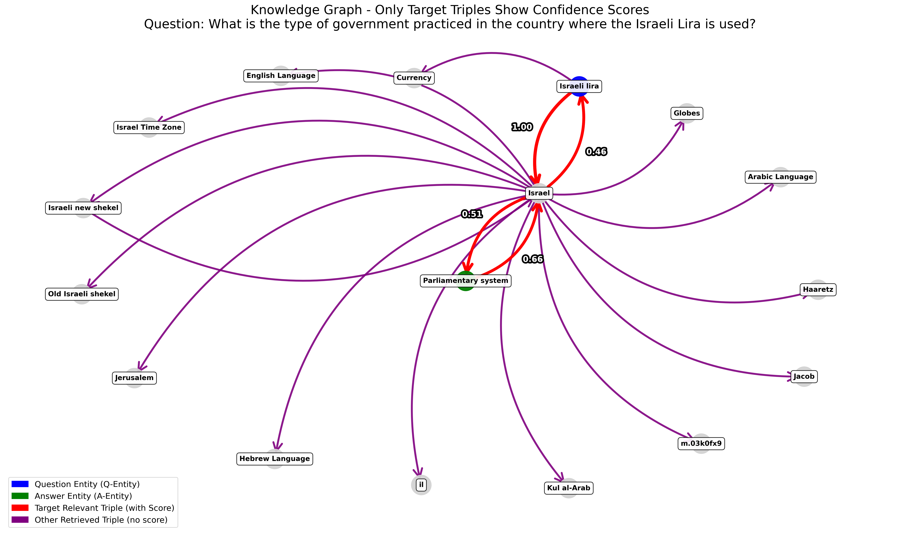

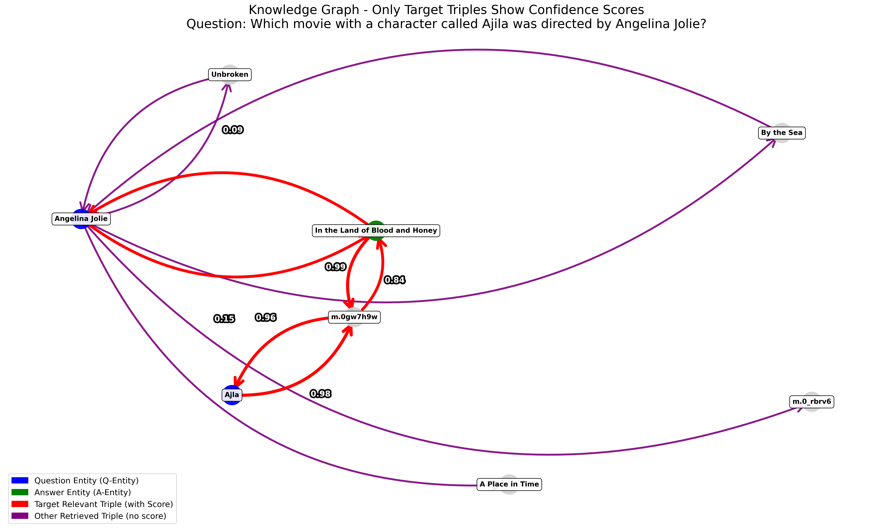

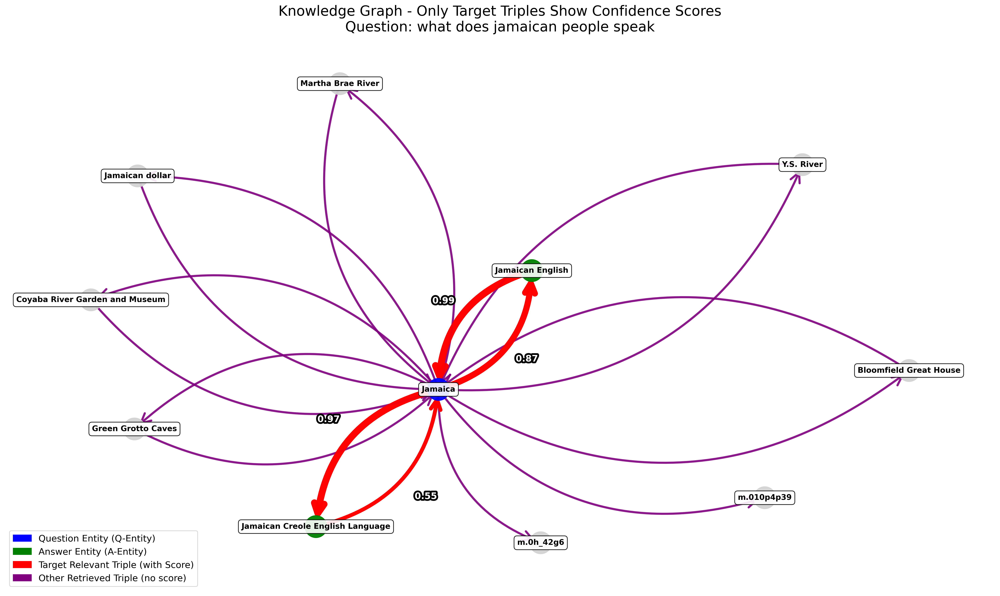

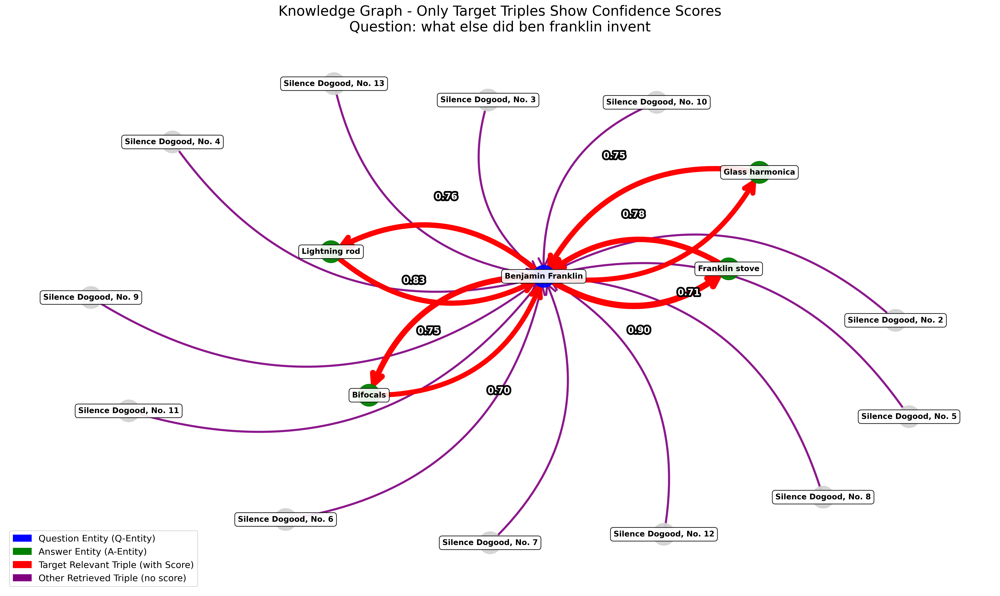

**图 3**：CWQ 示例的知识图谱可视化。

第二组可视化（图 4）展示 WebQSP 数据集的示例，该数据集主要聚焦单跳推理。第一个示例问 "What do Jamaican people speak?"（牙买加人说什么语言？）。问题节点 Jamaica 链接到两个答案节点：Jamaican English（分数 0.87）和 Jamaican Creole English Language（分数 0.97）。这些答案节点又分别以 0.99 和 0.55 的分数链回问题节点。这展示了模型在单跳查询中识别并链接相关实体的有效性。

第二个示例 "What else did Benjamin Franklin invent?"（Benjamin Franklin 还发明了什么？）展示了问题节点 Benjamin Franklin 链接到多个置信度分数高于 0.7 的答案节点，表明证据充分，支撑单跳推理过程的准确性。

（注：图 4 为矢量图，未能通过 pdfimages 抽取，故省略，特此说明。）

这些可视化说明了我们的方法如何有效利用知识图谱支撑单跳与多跳推理。边上的置信度分数使我们能够追踪模型如何选择并利用相关信息进行推理，从而提升答案的整体质量。

## 附录 C 问答示例

本节提供代表性的问答示例，以说明我们的检索与推理流程在实践中的表现。图 5 首先展示了系统使用的提示模板，包括向 LLM 呈现检索三元组与置信度分数的结构。

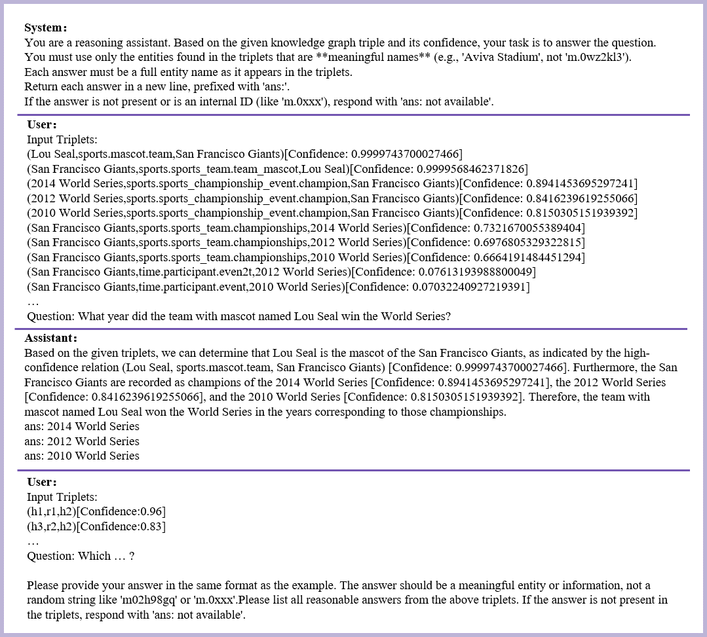

**图 5**：KGQA 的输入提示。

在提示模板之后，我们给出四个正确的 QA 示例，突出我们的方法在多跳与单跳场景下的优势。这些示例展示了置信度感知的三元组检索如何引导模型走向准确的推理路径。

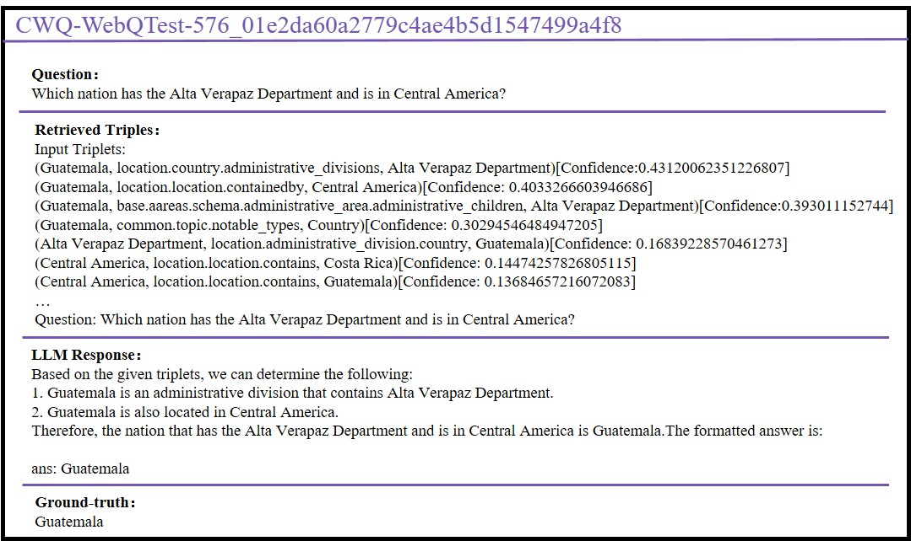

**图 6**：正确问答示例 1。

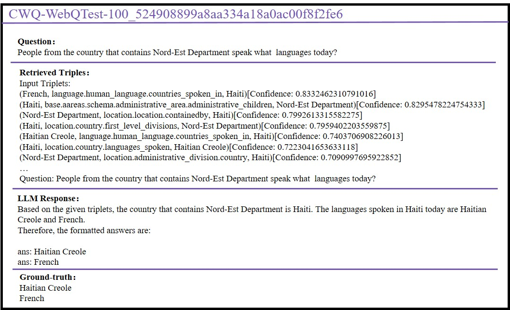

**图 7**：正确问答示例 2。

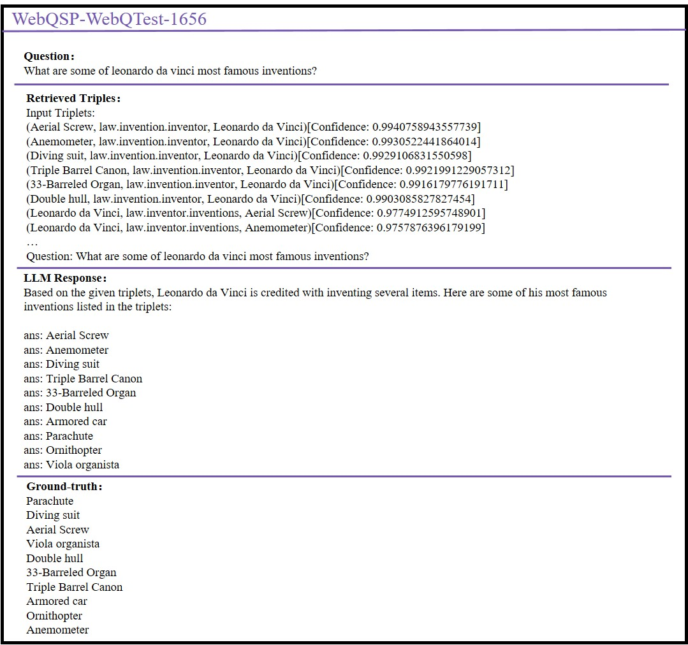

**图 8**：正确问答示例 3。

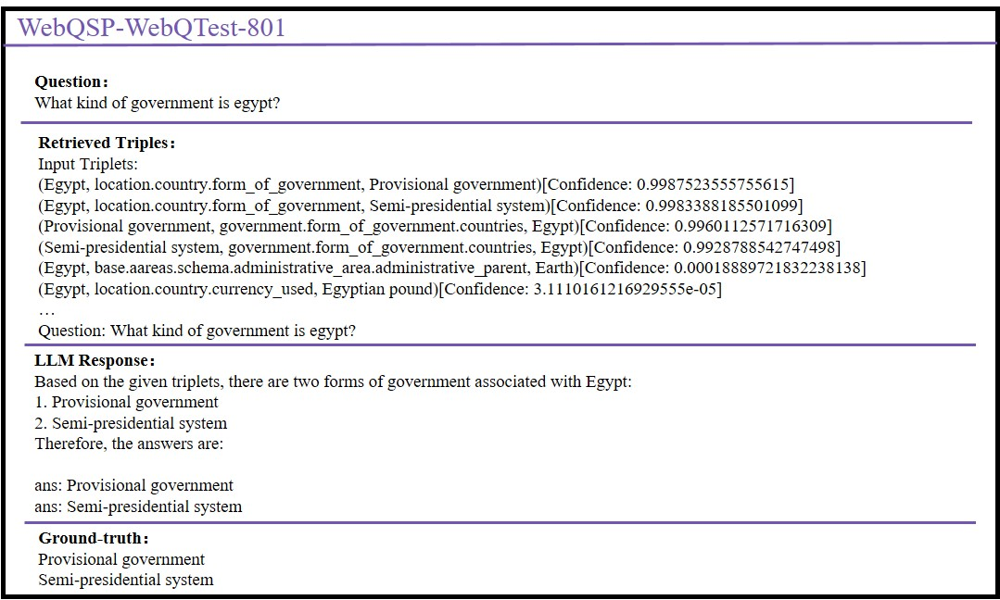

**图 9**：正确问答示例 4。

最后，我们给出两个错误的 QA 示例。这些案例揭示了系统中若干典型的失败来源：底层知识图谱中答案实体的不完整或缺失、破坏语义匹配的非文本或低质量实体的存在，以及偶尔导致模型无法组装完整推理链的检索缺口。这些示例共同勾勒出 KG 本身以及检索器所施加的实际局限，更清晰地呈现了本方法的边界条件。

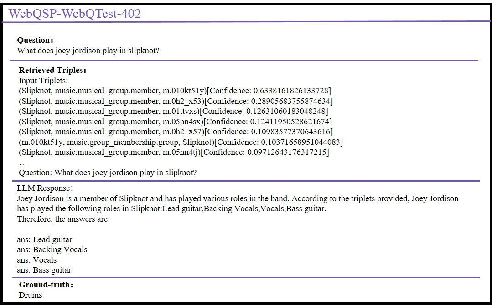

**图 10**：错误问答示例 1。

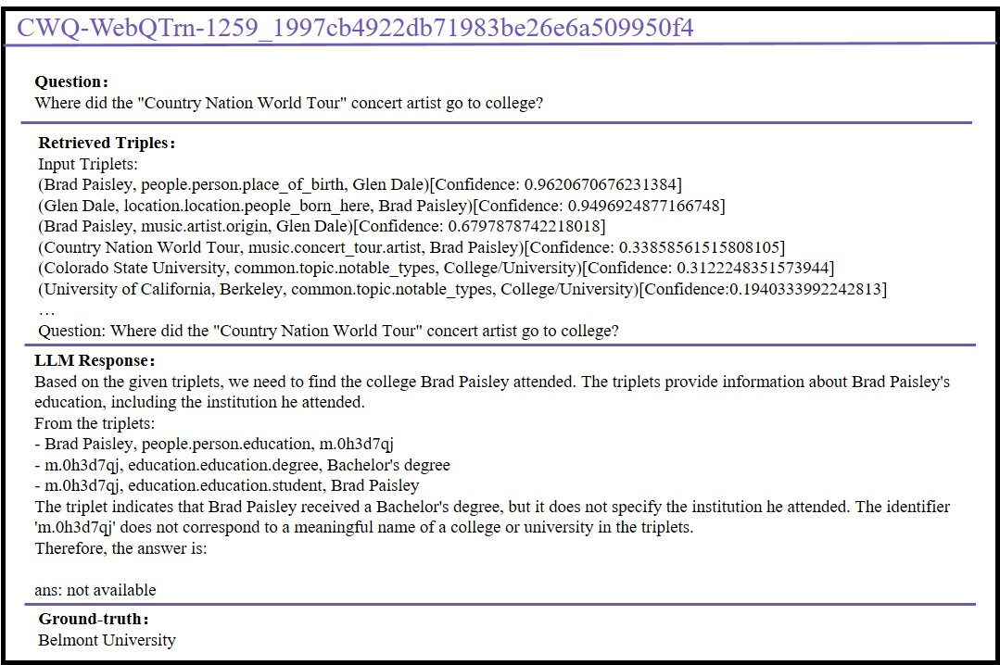

**图 11**：错误问答示例 2。
