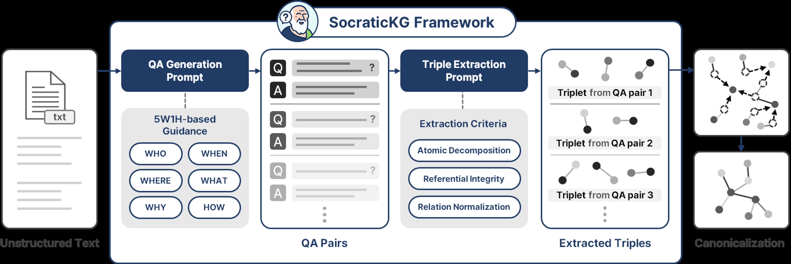
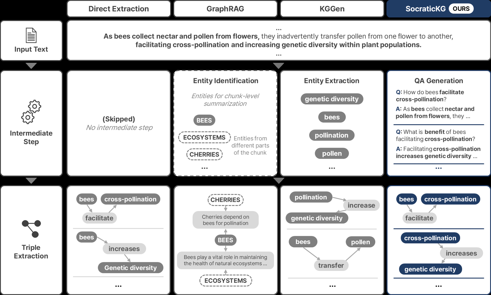
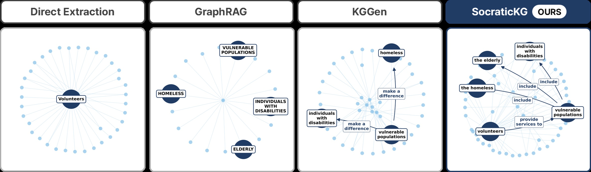

# SocraticKG：基于问答驱动事实抽取的知识图谱构建

**作者：** Sanghyeok Choi¹\*、Woosang Jeon¹,²\*、Kyuseok Yang¹、Taehyeong Kim¹,²,³,⁴†

1. 首尔大学生物系统工程系（Department of Biosystems Engineering, Seoul National University）
2. 首尔大学人工智能研究院（Artificial Intelligence Institute, Seoul National University）
3. 首尔大学人工智能交叉学科项目（Interdisciplinary Program in Artificial Intelligence, Seoul National University）
4. 首尔大学认知科学交叉学科项目（Interdisciplinary Program in Cognitive Science, Seoul National University）

联系方式：{cholsang83, jwoosang1, kyuseok0603, taehyeong.kim}@snu.ac.kr

\* 共同第一作者　† 通讯作者

## 原文元信息

| 项目 | 内容 |
|---|---|
| 英文原题 | SocraticKG: Knowledge Graph Construction via QA-Driven Fact Extraction |
| 会议 | Findings of the Association for Computational Linguistics: ACL 2026（ACL 2026 Findings） |
| 论文编号 | 2026.findings-acl.1951 |
| 页码 | 39149–39169 |
| 会议时间 | 2026 年 7 月 2–7 日 |
| 版权 | ©2026 Association for Computational Linguistics |
| 代码 | https://github.com/LABA-SNU/SocraticKG |

## 译者说明

本译文基于本地 PDF（`2026.findings-acl.1951-解决信息丢失.pdf`）抽取的文本翻译而成。数据集名、模型名、方法名、系统名、引用名（Author et al., Year）、变量名、指标名及 URL 保留英文原文；正文、图表标题与附录提示词均译为中文（附录中的英文提示词为论文实际使用的原始 prompt，为忠实呈现亦附中文说明）。公式使用 LaTeX 表示，表格以 Markdown 重建，插图从 PDF 中抽取并存于 `assets/` 目录。翻译如有歧义，请以英文原文为准。

## 摘要

从非结构化文本构建知识图谱（Knowledge Graphs, KGs）为知识表示与推理提供了结构化框架，然而当前基于 LLM 的方法面临一个根本性权衡：追求事实覆盖往往导致关系碎片化，而过早的归并整合又会造成信息丢失。为解决这一问题，我们提出 SocraticKG——一种自动化的 KG 构建方法，它引入问答对作为结构化的中间表示，在三元组抽取之前系统地展开文档级语义。通过采用 5W1H 引导的 QA 扩展，SocraticKG 能够捕捉直接 KG 抽取流程中通常丢失的上下文依赖与隐式关系链接，同时提供对源文档的显式锚定，有助于缓解隐式推理错误。在 MINE 基准与 HotpotQA 下游任务上的评估表明，我们的方法有效应对了覆盖度—连通性权衡，在支持复杂多跳推理的同时，实现了更优的事实保留与结构内聚性。

## 目录

- [1 引言](#1-引言)
- [2 相关工作](#2-相关工作)
  - [2.1 直接三元组抽取](#21-直接三元组抽取)
  - [2.2 以归并为中心的策略](#22-以归并为中心的策略)
  - [2.3 先变换后抽取的方法](#23-先变换后抽取的方法)
  - [2.4 面向知识抽取的问答](#24-面向知识抽取的问答)
- [3 方法](#3-方法)
  - [3.1 5W1H 引导的 QA 生成](#31-5w1h-引导的-qa-生成)
  - [3.2 从 QA 中抽取三元组](#32-从-qa-中抽取三元组)
  - [3.3 由三元组构建图谱](#33-由三元组构建图谱)
- [4 实验](#4-实验)
  - [4.1 评估指标](#41-评估指标)
  - [4.2 对比分析设计](#42-对比分析设计)
  - [4.3 实现细节](#43-实现细节)
- [5 结果与讨论](#5-结果与讨论)
  - [5.1 事实保留性能](#51-事实保留性能)
  - [5.2 图谱规模与连通性](#52-图谱规模与连通性)
  - [5.3 事实数量与结构内聚性](#53-事实数量与结构内聚性)
  - [5.4 下游多跳推理](#54-下游多跳推理)
  - [5.5 定性分析](#55-定性分析)
- [6 结论](#6-结论)
- [局限性](#局限性)
- [伦理考量](#伦理考量)
- [致谢](#致谢)
- [参考文献](#参考文献)
- [附录 A 消融研究](#附录-a-消融研究)
- [附录 B QA 生成提示词细节](#附录-b-qa-生成提示词细节)
- [附录 C 三元组抽取提示词细节](#附录-c-三元组抽取提示词细节)
- [附录 D 计算效率分析](#附录-d-计算效率分析)
- [附录 E 三元组质量与幻觉分析](#附录-e-三元组质量与幻觉分析)
- [附录 F QA 中介阶段的失败分析](#附录-f-qa-中介阶段的失败分析)

## 1 引言

随着大语言模型（LLMs）在知识密集型应用中被广泛使用，围绕事实可靠性、可解释性与锚定性（grounding）的担忧日益凸显（Ji et al., 2023; Huang et al., 2025）。虽然检索增强生成（Retrieval-Augmented Generation, RAG）通过将模型锚定到外部来源来应对这些问题，但它常常在碎片化的上下文与复杂事实的浅层整合面前力不从心（Lewis et al., 2020; Gao et al., 2023）。作为回应，知识图谱（KGs）重新成为一种互补性方案，为显式知识表示与推理提供结构化、可验证的骨干（Pan et al., 2023; Rajabi and Etminani, 2024）。

然而，对人工整理的依赖在历史上一直限制着领域特定 KG 的可获得性，由此推动了能够扩展到多样化、大规模文本来源的自动化构建方法的兴起（Ren et al., 2024）。LLM 的最新进展使得知识图谱构建朝着更具语义锚定的方向发展，从基于规则的模式匹配转向利用神经推理来解释非结构化文本的方法（Zhu et al., 2024）。当前的方法通过不同策略应对构建挑战：一些方法专注于单次捕捉显式的事实提及，直接从文本中抽取三元组（Cabot and Navigli, 2021; Shang et al., 2022; Zhang and Soh, 2024）；另一些则采用以归并为中心的策略，围绕预先识别的实体结构来组织抽取的事实，以提升图谱一致性（Zhong and Chen, 2021; Ye et al., 2022a; Wei et al., 2023; Mo et al., 2025）。

然而，这些方法面临一个持续的挑战：将源文档的叙事逻辑完整地外化为结构化图谱。由此得到的知识图谱常常在事实覆盖与结构一致性之间存在根本性张力：图谱可能包含大量事实，却因弱语义连通而碎片化；也可能组织良好却不完整，过滤掉了不符合预定义结构的上下文细节。这一挑战的核心在于，难以在全面的信息抽取与图谱中有意义的连通性之间取得平衡。

为解决这一局限，我们从人类自然地处理和组织文本信息的方式中获得启发。人类并非试图一步抽取结构化知识，其理解过程本质上是 interrogative（追问式）的：读者通过主动提问逐步澄清关键概念来构建理解（Graesser and Person, 1994; Ambrose et al., 2010）。这种追问式学习的过程为组织复杂信息提供了天然支架。尤其是问答（Question-Answering, QA），有助于聚焦注意力，并显式表达在直接抽取中可能保持隐式的关系（Wu et al., 2020）。

基于这一洞见，我们提出 SocraticKG（SoKG）——一种将 QA 不仅视为检索机制、而是视为结构化中间表示的方法，它在图谱构建之前系统地展开文档级语义（FitzGerald et al., 2018; Cohen et al., 2023）。SoKG 采用基于 5W1H 框架（who、what、when、where、why、how，即何人、何事、何时、何地、为何、如何）的结构化追问框架，生成锚定于文档的 QA 对，以捕捉关键概念、关系与上下文依赖。这种 QA 中介的扩展以显式的自然语言形式表达出隐式连接与上下文细节。由此得到的中间表示提供了定义良好的语义单元，而非要求同时消解语义与结构，从而促进更一致、更完整的三元组抽取。随后，这些抽取出的三元组通过一个规范化（canonicalization）过程（Mo et al., 2025）统一起来，该过程消解表面形式变异并将图谱整合为连贯的结构。

我们在 MINE（Measure of Information in Nodes and Edges）基准（Mo et al., 2025）以及 HotpotQA（Yang et al., 2018）下游多跳推理任务上评估所提方法。结果表明，SocraticKG 在多个 LLM 骨干模型上一致优于最先进的方法，实现了更优的事实保留，同时生成更致密、更少碎片化的图谱，并在复杂多跳推理上带来进一步提升。¹

总而言之，本文做出以下贡献：

- 我们提出 SocraticKG，一种以 QA 为中介的知识图谱构建方法，将问答形式化为展开文档叙事、并在结构化抽取之前显式表达隐式连接的语义支架。
- 我们引入 5W1H 引导的 QA 扩展，作为系统性地呈现直接抽取中通常被忽视的潜在依赖的方法，从而在减少隐式推理错误的同时提高事实覆盖。
- 我们证明，我们的方法缓解了结构碎片化与信息丢失，在多种 LLM 上实现了更优的事实保留与可恢复性。

**脚注 1**：我们的代码已公开：https://github.com/LABA-SNU/SocraticKG 。



**图 1：** SocraticKG 框架的整体架构。给定非结构化文本，该方法首先通过 5W1H 引导的提问生成原子化 QA 对，然后从这些 QA 对中抽取三元组，最后对三元组进行规范化以生成内聚的知识图谱。

## 2 相关工作

### 2.1 直接三元组抽取

知识图谱（KG）构建已经从传统的开放信息抽取（Open Information Extraction, OpenIE）（Etzioni et al., 2008; Fader et al., 2011）演进为通过 LLM 直接抽取三元组的现代方法（Cabot and Navigli, 2021; Bi et al., 2024; Zhang and Soh, 2024）。OpenIE 受限于表层语言模式（Niklaus et al., 2018），而此类直接抽取方法利用 LLM 的推理能力，在无需显式中间表示的情况下弥合语义鸿沟。

然而，这种直接抽取方式常常将模型局限于捕捉表层、显式的提及，而忽视了将它们联系在一起的潜在逻辑纽带。正如 Zhu et al. (2024) 与 Meher et al. (2025) 所指出的，这种方式往往带来浅层的事实覆盖，常常产生缺乏有效图推理所需连通性的碎片化子图。

### 2.2 以归并为中心的策略

为解决碎片化问题，各类流程强调通过抽取后归并来获得结构一致性。这些"实体优先"的方法首先识别关键实体，然后围绕这一预先建立的实体框架来组织关系结构。GraphRAG（Edge et al., 2024）构建全局的实体与关系索引，并划分为层级社区以支持面向查询的摘要；KGGen（Mo et al., 2025）则强调基于聚类的实体与关系规范化，以生成紧凑且可复用的知识图谱。类似地，CLARE（Henry and Gong, 2025）将其关系抽取锚定在初始实体识别之上，以确保归并后文本中的语义精确性。

尽管这些方法在组织三元组方面行之有效，但以归并为重点的策略可能成为表示瓶颈（Ye et al., 2022b）。当实体集合在流程早期被固定时，不符合初始实体结构的关系或上下文依赖可能被排除在外。这种顺序安排实际上将结构效用置于事实密度之上，可能低估文档的潜在关系。

### 2.3 先变换后抽取的方法

为降低抽取复杂度，许多方法采用两阶段流程：先通过中间表示变换原始文本，再从变换后的输出中抽取三元组。常见的变换策略包括处理指代表达的共指消解（Manning et al., 2014; Cetto et al., 2018），以及简化复杂结构的句法句子分解（Niklaus et al., 2019; Niklaus, 2022）。例如 CoDe-KG（Anuyah et al., 2025）利用人工引导的提示干预来纳入这些变换任务，以确保抽取前的结构清晰。

这些基于变换的方法主要在句子层面运作，聚焦局部句法规范化而非文档级语义组织。虽然它们能有效消解单句内的表层歧义，但无法系统性地捕捉跨句依赖或贯穿整个文档的上下文关系。这限制了它们外化更宏观的叙事结构与全局语义的能力，而这正是全面构建知识图谱所需要的。

### 2.4 面向知识抽取的问答

问答已被广泛用于从文本中引出结构化信息（Levy et al., 2017; Li et al., 2019; Du and Cardie, 2020），其依托于追问式探究的认知过程，有助于情境模型（situation models）的构建（Chi et al., 1989; Graesser and Person, 1994）。近期的抽取方法，如 StoryNet（Nagireddy, 2021）和 ChatIE（Wei et al., 2023），将 QA 驱动的提示作为其抽取流程的核心组件。

然而，这些方法将 QA 对视为临时产物，在单次抽取过程中生成并消耗它们，而没有将它们形式化为组织文档级语义的中间表示。因此，它们缺乏系统性的问题生成，难以在三元组抽取之前呈现出隐式的关系与上下文依赖。

尽管近期有工作探索将 QA 作为可解释知识构建的中间步骤（Aneja et al., 2025），但其主要强调通过事实重述来提升检索效用，而非语义组织。总体而言，这些空白表明，将 QA 形式化为结构化中间表示可为构建提供更稳健的基础，尤其是当系统性的追问被用来主动外化潜在的关系与因果依赖时。

## 3 方法

SoKG 将 QA 对作为基于 LLM 的 KG 构建的结构化中间表示。我们的方法并非提示 LLM 直接从原始文本中抽取三元组，而是首先将文档分解为显式的 QA 对，以自然语言消解上下文依赖与指代歧义。随后，这些 QA 对被映射为原子三元组，并通过规范化统一为最终的 KG。

### 3.1 5W1H 引导的 QA 生成

该阶段将文档转换为一系列离散、自包含的 QA 对。为确保对文本事实内容的全面覆盖，我们基于两个核心原则设计了提示策略：系统性追问与上下文独立性（详细提示词见附录 B.1）。

**通过 5W1H 进行细化提问。** 我们利用 5W1H 框架来指导系统性的问题构建。LLM 生成涵盖全部六类问题、遍及文档多样方面的问题。由此得到的 QA 对既能捕捉表层实体，也能捕捉复杂依赖，包括因果缘由（why）与过程细节（how）。

**上下文独立性。** 为确保每个 QA 对都能作为独立单元发挥作用，我们指示 LLM 生成无需参考原始文本即可完全理解的答案。具体而言，模型需要将代词（例如 it、they）替换为显式的实体名称，以消解指代歧义。这一约束防止了在三元组抽取阶段单独处理每个 QA 对时出现信息丢失。

### 3.2 从 QA 中抽取三元组

该阶段将 QA 对转换为结构化三元组，把每一对视为独立的抽取单元。在这些逻辑上自包含的单元上操作，使抽取过程能够聚焦于定义良好的语义边界，减少直接从冗长复杂的文本中抽取时常见的错误。为此，LLM 被指示遵循三个具体约束（详细提示词见附录 C.1）。

**原子分解。** 模型将每个 QA 对分解为独立的原子三元组，从提问与回答中捕捉细粒度事实，以最大化事实丰富度。

**实体清晰性。** 所有实体都表示为具体的名词短语，任何包含歧义代词的三元组都会被丢弃。这确保每条抽取的事实都是自包含的，并有清晰的证据支撑。

**关系简化。** 谓词被提炼为简洁的动词短语，以减少表面形式变异，便于后续规范化。如果关系仍然模糊，模型被指示跳过抽取。

### 3.3 由三元组构建图谱

最后阶段将离散的三元组统一为内聚的图结构。由于抽取是在相互独立的 QA 单元上进行的，原始集合中往往包含对同一概念的冗余或同义提及。为消解这些冗余，我们采用 Mo et al. (2025) 提出的规范化流程，该流程结合了基于嵌入的聚类与基于 LLM 的精炼。

规范化过程通过"先聚类、后精炼"的流程在实体和关系上独立进行。首先，使用文本嵌入模型为所有唯一实体和关系生成语义嵌入。为了缩小搜索空间，这些嵌入通过 K-means 聚类被划分为规模可控的簇。在每个簇内，通过平衡稠密语义相似度与稀疏词法重叠（BM25）来识别每个锚点的 top-k 潜在匹配项。最后，由 LLM 消解同义词与缩写，将这些变体映射到单一的代表形式，从而把碎片化的三元组整合为内聚的、规范化的图谱。

## 4 实验

我们从两个互补的视角评估 SoKG：源信息保留与下游推理效用。对于前者，我们使用 MINE 基准（Mo et al., 2025），该基准旨在量化原始文本与其图表示之间的信息差距，方法是衡量有多少源信息可以被恢复。该基准包含 100 篇多样化的文章，每篇文章配有 15 条经过验证的原子事实，在 1,500 个独立的事实实例上提供了严格的评估框架。遵循基准协议，我们为每篇文章构建一个 KG，并从事实保留与结构特征两方面评估每个图谱。

对于下游推理效用，我们考察 SoKG 的结构优势是否能转化为源信息保留之外的实际收益。为此，我们在 HotpotQA（Yang et al., 2018）上使用 800 个 "Hard" Bridge 样本进行了实验。这些样本需要识别一个连接不同证据片段的中间实体，因此非常适合评估基于图的多跳推理。



**图 2：** 使用 Gemini-2.5-flash-lite 的一个输出示例来对比各抽取流程。基线流程在复杂句子中常常错失句法连接，无法恢复蜜蜂与遗传多样性之间的因果链，而 SoKG 利用 QA 驱动的推理显式重建了中间概念。结果是，SoKG 成功恢复了完整的因果链（bees → cross-pollination → genetic diversity，蜜蜂 → 异花授粉 → 遗传多样性），而基线方法则倾向于简化或碎片化这一关系。

### 4.1 评估指标

**事实保留得分。** 作为主要指标，我们衡量从构建的 KG 中成功恢复的真实事实的比例。遵循 MINE 基准协议，我们为每条事实检索一个局部子图，由与目标陈述语义最相似的前 8 个节点及其 2 跳邻居组成。随后由 LLM 评审员判定该事实是否被检索到的子图上下文在逻辑上支持。该得分表示可验证事实的百分比，反映图谱在检索与推理等下游任务中对源文本信息的保留程度。

**结构内聚性与密度。** 为分析 KG 的组织与一致性，我们考察以下指标：

- **平均度（Deg）**：每个节点的唯一邻居节点平均数，刻画图的局部连通密度（Barabási, 2013）。它反映一个节点与多少个不同实体相连，与关系方向无关。按照无向图的标准做法，平均度计算为

$$Deg = \frac{2E}{N},$$

其中 $N$ 表示节点数，$E$ 表示边数。

- **三元组数量（#Tri）**：图中外化的原子事实总数。

- **归一化碎片化指数（Normalized Fragmentation Index, NFI）**：受"图碎片化即网络分解为不连通组件"这一概念（Borgatti, 2002）启发，我们定义一个基于组件的指标：

$$NFI = \frac{C-1}{N-1},$$

其中 $C$ 表示连通组件数，$N$ 为总节点数（$N \geq 2$）。该公式将碎片化归一化到单位区间 $[0, 1]$，其中 0 对应完全连通的图（$C=1$），1 表示完全碎片化的网络（$C=N$）。

**多跳推理准确率。** 在 HotpotQA 的下游评估中，我们衡量在 Hard Bridge 样本上的答案准确率。对于每个问题，我们从相关的源文档构建 KG，通过嵌入相似度检索一个 top-1 种子三元组，并将其邻域扩展到 2 跳和 3 跳深度。当仅给定检索到的子图上下文的 LLM 答题模型产生与标准答案一致的回答时，该答案被判定为正确。

### 4.2 对比分析设计

**KG 构建方法。** 我们将 SoKG 与当前基于 LLM 的 KG 构建领域中的三种代表性方法进行比较。为确保比较有效，我们选择了在自主、开放域设定下运行、无预定义模式且无人工干预的对比方法。图 2 总结了这些方法的流程。

- **Direct Extraction**：一种单遍抽取策略，直接从原始文本生成三元组（附录 C.2）。为公平比较，我们应用与 KGGen 和 SoKG 相同的规范化流程来整合抽取的三元组。它作为评估 LLM 在没有中间语义支架情况下隐式推理能力的主要基准。
- **GraphRAG**：工业界与学术界中面向全局、查询聚焦的实体索引的知名方案。我们使用 Microsoft 的官方实现进行层级社区检测与聚合，提供了与广泛采用的文本摘要式方法的对比基准。
- **KGGen**：近期聚焦实体中心抽取与结构整合的最先进方法。它是评估开放域中事实保留与结构内聚的主要对比方法。
- **SoKG (w/o 5W1H)**：SoKG 的消融变体，保留 QA 对作为中间表示，但用通用 QA 替代 5W1H 引导的追问。该设计分离出 5W1H 引导支架的贡献，以评估其影响。
- **SoKG (Ours)**：我们提出的方法，利用 5W1H 引导的 QA 生成从源文档系统地构建 KG。

除非另有说明，SoKG 均指这一完整实现。

**跨 LLM 评估。** 为评估在不同 LLM 架构与规模下的稳健性，我们在五个 LLM 上评估所选的 KG 构建方法：GPT-4o、GPT-4o-mini、Gemini-2.5（Gemini-2.5-Flash-Lite）、Qwen-2.5（Qwen2.5-7B-Instruct）和 Claude-4（Claude-4-Sonnet）。

**下游基线比较。** 在 HotpotQA 实验中，我们加入了 Naive RAG 基线，通过嵌入相似度检索扁平文本块。块大小与 SoKG 在各骨干模型下产生的基于图的检索上下文的平均字符长度相匹配，以确保两种方法在可比的上下文长度上运行：Qwen-2.5 为 100 字符 × Top-3，Claude-4 为 500 字符 × Top-3。

### 4.3 实现细节

对于所有 LLM，我们将解码温度设为 0 以确保可复现性，但 GraphRAG 除外，它遵循其官方实现的默认随机配置。

我们采用了 Mo et al. (2025) 提出的规范化与事实保留评估协议。对于第 3.3 节所述的语义聚类，我们将实体和关系划分为最多包含 128 个元素的簇。在识别潜在匹配时，我们将候选检索规模设为 $k = 16$，即由 LLM 评估的排名靠前的重复项数量。所有基于嵌入的过程使用 all-MiniLM-L6-v2 模型，事实验证通过以 GPT-4o 为 LLM 评审员的协议执行。

在 HotpotQA 下游实验中，GPT-4.1 作为答题模型，all-MiniLM-L6-v2 模型用于 KG 的三元组检索与 Naive RAG 的块检索。

## 5 结果与讨论

### 5.1 事实保留性能

表 1 总结了 MINE 基准上的事实保留性能。在所有对比方法与被评估的 LLM 中，SoKG 一致取得最高分，在 Claude-4 上达到峰值 96.3%。

| 方法 | Qwen-2.5 | GPT-4o-mini | GPT-4o | Gemini-2.5 | Claude-4 |
|---|---|---|---|---|---|
| Direct Extraction | 66.5 | 68.5 | 78.1 | 84.6 | 86.8 |
| GraphRAG | 59.7 | 49.5 | 49.3 | 48.5 | 52.3 |
| KGGen | 56.7 | 44.3 | 66.4 | 62.5 | 69.1 |
| SoKG (w/o 5W1H) | 67.1 | 80.5 | 83.5 | 85.6 | 94.6 |
| **SoKG (Ours)** | **73.4** | **83.9** | **89.3** | **87.7** | **96.3** |

**表 1：** MINE 基准上的事实保留得分（%）对比。SoKG 在所有被评估模型上一致取得最高性能。朴素变体（即 SoKG w/o 5W1H）展示了 5W1H 支架如何捕捉过程性与因果性事实，即使在 Qwen-2.5 这样较小的模型上也能提升事实一致性。

Direct Extraction 与 SoKG (w/o 5W1H) 之间的对比说明了引入 QA 作为中间表示的好处。即使没有 5W1H 引导，SoKG 在所有 LLM 模型上也优于 Direct Extraction。这一优势源于在三元组抽取之前将文档分解为离散、自包含的 QA 对。

值得注意的是，GraphRAG 和 KGGen 在事实保留方面均不如 Direct Extraction。GraphRAG 优先考虑层级社区结构与面向查询的摘要，而非全面的事实保存，导致原子事实覆盖率较低。KGGen 的实体优先瓶颈同样在初始实体识别失败时导致事实遗漏，表现出跨模型的不稳定性能。

Direct Extraction 的这种相对优势反映了其缺乏结构约束：通过避免早期过滤或归并，它保留了更大数量的原始三元组。然而，如表 2 和表 3 所示，这是以更高的碎片化为代价的，限制了所得图谱在下游推理中的效用。

相比之下，带有 5W1H 引导的 SoKG 通过系统性地呈现过程性与因果性维度进一步提升性能。这一追问式框架确保潜在依赖被显式捕捉，无论底层 LLM 模型固有的推理能力如何，都能保持较高的事实一致性。

为进一步验证我们的三元组抽取策略，我们在附录 A 中进行了额外实验。通过将 QA 支架的影响与抽取策略分离，这些研究表明，实体优先的方法即使应用于 QA 预处理的输入，仍是一个性能瓶颈。

### 5.2 图谱规模与连通性

表 1 所示的卓越事实保留引出一个关键问题：SoKG 是仅仅抽取了更多三元组，还是构建了一个本质上更好的图？为回答这个问题，我们考察表 2 中的图谱规模与连通性。

| 方法 | Qwen-2.5 N | Qwen-2.5 E | Qwen-2.5 Deg | GPT-4o-mini N | GPT-4o-mini E | GPT-4o-mini Deg | GPT-4o N | GPT-4o E | GPT-4o Deg | Gemini-2.5 N | Gemini-2.5 E | Gemini-2.5 Deg | Claude-4 N | Claude-4 E | Claude-4 Deg |
|---|---|---|---|---|---|---|---|---|---|---|---|---|---|---|---|
| Direct Extraction | 21.7 | 17.3 | 1.60 | 33.5 | 28.1 | 1.69 | 33.9 | 27.4 | 1.62 | 58.4 | 64.1 | 2.20 | 46.4 | 40.8 | 1.77 |
| GraphRAG | 19.8 | 19.0 | 2.00 | 11.2 | 10.2 | 1.84 | 11.3 | 9.70 | 1.75 | 15.4 | 17.7 | 2.35 | 14.6 | 16.2 | 2.20 |
| KGGen | 28.1 | 22.1 | 1.56 | 19.3 | 16.7 | 1.75 | 33.2 | 28.9 | 1.74 | 38.1 | 43.2 | 2.23 | 57.2 | 58.9 | 2.07 |
| SoKG (w/o 5W1H) | 28.0 | 25.4 | 1.81 | 49.2 | 50.5 | 2.06 | 51.9 | 49.1 | 1.89 | 58.0 | 67.8 | 2.34 | 84.2 | 94.5 | 2.25 |
| SoKG (Ours) | 34.9 | 34.1 | 1.96 | 57.9 | 62.2 | 2.16 | 62.3 | 60.5 | 1.95 | 65.7 | 80.8 | 2.47 | 104.2 | 128.4 | 2.48 |

**表 2：** MINE 基准 100 篇文章上的拓扑特征平均值。N、E、Deg 分别表示每个图谱的平均节点数、边数与平均度。SoKG 在所有骨干模型上一致地扩展了知识规模，同时保持高连通密度。

SoKG 在所有被评估的 LLM 上显著扩大图谱规模，同时保持或提升连通密度。相比之下，Direct Extraction 产生的图更小、连通性更低，而 GraphRAG 生成紧凑结构，以层级组织牺牲了全面的事实覆盖。SoKG (w/o 5W1H) 与 SoKG 之间的比较显示，5W1H 引导显著增加了抽取的实体与关系数量，同时提升了连通密度。这表明 5W1H 系统性地呈现了额外事实，而没有碎片化图结构。

重要的是，尽管使用了与 Direct Extraction 和 KGGen 相同的规范化流程，SoKG 仍实现了更高的连通性。这证实了结构优势源自 QA 中介的中间表示，使相关证据在 2 跳邻域内共位，直接支撑了表 1 中高的事实可恢复性。

此外，图谱规模的增加并不只是冗余扩张。遵循面向生成式关系抽取的最新质量导向评估视角（Jiang et al., 2024）的补充分析证实，即使抽取三元组数量大幅增加，SoKG 在唯一性、粒度与事实精确性上仍保持竞争力（附录 E）。

### 5.3 事实数量与结构内聚性

为进一步考察知识覆盖与图碎片化之间的关系，我们分析表 3 中的三元组数量与 NFI。SoKG 在所有被评估的 LLM 上大幅扩展知识量，同时降低碎片化。其他方法要么限制事实抽取（GraphRAG），要么表现出更高的碎片化（KGGen 和 Direct Extraction），而 SoKG 抽取了多得多的三元组，同时保持更低的 NFI 值。

| 方法 | Qwen-2.5 NFI | Qwen-2.5 #Tri | GPT-4o-mini NFI | GPT-4o-mini #Tri | GPT-4o NFI | GPT-4o #Tri | Gemini-2.5 NFI | Gemini-2.5 #Tri | Claude-4 NFI | Claude-4 #Tri |
|---|---|---|---|---|---|---|---|---|---|---|
| Direct Extraction | 0.162 | 1,955 | 0.145 | 3,100 | 0.172 | 2,941 | 0.038 | 7,315 | 0.127 | 4,417 |
| GraphRAG | 0.084 | 1,981 | 0.038 | 1,076 | 0.083 | 1,009 | 0.036 | 1,848 | 0.067 | 1,590 |
| KGGen | 0.187 | 2,375 | 0.091 | 1,942 | 0.112 | 3,089 | 0.030 | 5,301 | 0.052 | 6,391 |
| SoKG (w/o 5W1H) | 0.106 | 2,871 | 0.059 | 5,646 | 0.092 | 5,345 | 0.034 | 7,875 | 0.056 | 10,511 |
| **SoKG (Ours)** | **0.078** | **3,958** | **0.047** | **7,069** | 0.086 | **6,627** | **0.023** | **9,612** | **0.039** | **14,849** |

**表 3：** 100 篇文章上的图碎片化平均值（NFI；越低越好）与 100 篇文章总抽取信息量（#Tri）对比。结果表明 SoKG 有效解决了知识覆盖与结构连通性之间的权衡，即使抽取事实数量增加，仍保持高图内聚性。

SoKG (w/o 5W1H) 与 SoKG (Ours) 之间的比较进一步说明了 5W1H 引导的有效性。加入 5W1H 一致地增加三元组抽取量，同时降低或维持相近的碎片化水平。这一模式表明，5W1H 不仅呈现出额外事实，还增强了它们向图结构中的整合。

### 5.4 下游多跳推理

表 4 报告了 HotpotQA Hard Bridge 样本上的多跳推理准确率。SoKG 在两个骨干模型与各检索深度上均取得最佳整体性能。值得注意的是，尽管 KGGen 和 Direct Extraction 等若干基于图的方法在某些设定下低于 Naive RAG，SoKG 在所有被评估条件下一致优于它，表明图结构检索并非天然占优，而是当图足够连通且事实完整时才变得有利。

| 方法 | Qwen-2.5 2-hop | Qwen-2.5 3-hop | Claude-4 2-hop | Claude-4 3-hop |
|---|---|---|---|---|
| Direct Ext. | 19.50 | 23.88 | 37.87 | 39.88 |
| GraphRAG | 23.00 | 25.00 | 46.62 | 52.12 |
| KGGen | 16.50 | 18.50 | 38.25 | 46.75 |
| SoKG (w/o 5W1H) | 20.12 | 24.75 | 48.00 | 53.12 |
| **SoKG** | **23.62** | **27.00** | **48.50** | **56.38** |
| Naive RAG | – | 20.13 | – | 47.88 |

**表 4：** HotpotQA Hard Bridge 样本上的多跳推理准确率（%）。SoKG 在各骨干模型与检索深度上一致表现最佳，表明连通的图结构对多跳事实整合的益处。

最大增益出现在 Claude-4 的 3 跳检索下，SoKG 达到 56.38%，比 Naive RAG 高 8.5 个百分点，比 Direct Extraction 高 16.5 个百分点。GraphRAG 在 Claude-4 下也具有竞争力，可能得益于其层级社区结构能被更强的 LLM 更好地利用。在 Qwen-2.5 上，SoKG 同样在 3 跳检索下以 27.00% 领先，比 Naive RAG 高 6.9 个百分点。

SoKG 与 SoKG (w/o 5W1H) 的比较进一步表明，5W1H 引导的扩展不仅提升了事实保留，也提升了所得图谱的下游有用性。通过将潜在连接显式外化为可导航的边，SoKG 为需要跨分散事实推理的任务提供了更有效的表示。

### 5.5 定性分析

图 2 与图 3 中的案例提供了具体示例，说明 SoKG 的追问过程如何解决其他方法中出现的结构缺陷与信息丢失。



**图 3：** 针对例句 "Volunteers provide essential services and support to vulnerable populations, such as the homeless, the elderly, and individuals with disabilities."（志愿者为弱势群体提供基本服务与支持，例如无家可归者、老年人和残障人士。）的抽取图谱对比。文中隐含的嵌套关系路径（Volunteers → Vulnerable Populations → {Homeless, Elderly, Individuals with disabilities}，志愿者 → 弱势群体 → {无家可归者、老年人、残障人士}）被突出显示以评估关系完整性。具体而言，对应这条路径的节点被放大以便清晰可见，并用深蓝色粗箭头连接以指示三元组序列，其余背景图元素以浅蓝色显示。

图 2 展示了 SoKG 在复杂分词短语（如 facilitating cross-pollination，促进异花授粉）中保持逻辑连贯的能力。GraphRAG 依赖实体摘要，完全未能捕捉因果结构，而 Direct Extraction 和 KGGen 则将该关系碎片化或简化。相比之下，SoKG 明确表达了中介概念，确保了内聚的因果链：bees → cross-pollination → genetic diversity（蜜蜂 → 异花授粉 → 遗传多样性）。

类似地，图 3 展示了 SoKG 如何解决嵌套实体结构中的关系碎片化。GraphRAG 将关键实体孤立为互不相连的节点，而 KGGen 引入了诸如 make a difference 这样不精确的谓词，丢失了嵌套关系结构。SoKG 通过识别所有关键实体并用精确谓词（如 provide services to 和 include）连接它们，完整重建了关系树。

这些示例表明，在 5W1H 追问引导下的 QA 中介语义支架，系统性地解决了因果重建与关系完整性问题。我们还在附录 F 中提供了失败案例的定性分析，聚焦于主要瓶颈所在的 QA 中介阶段。

## 6 结论

我们提出了 SoKG，一种基于 LLM 的 KG 构建方法，它将 QA 对用作三元组抽取之前进行文档级语义扩展的结构化中间表示。通过采用 5W1H 引导的 QA 生成，SoKG 消解了指代歧义并呈现出隐式关系依赖，确保后续的结构映射锚定在显式、上下文化的实体之上，而非欠明确的推断。

在 MINE 基准上的评估表明，SoKG 在多种 LLM 上实现了更优的事实覆盖，同时提升了结构内聚性。这一性能源自 QA 中介的支架，它系统性地外化潜在的因果与关系依赖，即使抽取事实数量增加也能增强图的连通性。

此外，HotpotQA 上的下游实验证实这些结构优势可转化为实际的推理增益。其他基于图的方对 Naive RAG 的改进表现不一致，而 SoKG 在所有被评估设定下均优于 Naive RAG，表明 QA 中介构建产出的 KG 对复杂多跳推理具有实用价值。

我们的研究结果表明，通过 QA 生成进行显式语义组织并非仅仅是辅助性的预处理步骤，而是基于 LLM 的 KG 构建中保持图谱保真度的关键组件，能够实现更结构化的知识抽取。通过应对事实覆盖与结构连通性之间的固有权衡，SoKG 为锚定文档的知识表示与结构化推理提供了更可靠的基础。

## 局限性

虽然 SoKG 的多阶段流程天然比单遍抽取消耗更多 token，我们在附录 D 中提供了详细的成本分析。在保持事实密度的同时提升效率仍是未来工作的重要方向。

此外，由于图谱质量取决于底层 LLM 的推理深度，在需要高度专业化追问逻辑的领域中性能可能有所差异。特别是，我们的失败分析（附录 F）揭示主要瓶颈在于缺乏足够特异性的单维度问题，这提示更有针对性的提问策略可进一步提升抽取质量。

关于图表示，我们目前使用的二元三元组可能会简化多维限定词（例如时间或空间数据），而这些限定词本可通过 n 元关系更紧凑地编码。

最后，我们的评估聚焦于事实可恢复性与下游多跳推理。虽然这与我们保留文档级语义的目标一致，但其他维度——例如模式对齐与关系类型保真度——随着 KG 评估标准的演进，仍有待社区进一步探索。

## 伦理考量

本研究使用公开可用的 MINE 基准与 LLM。我们承认该基准与底层 LLM 可能存在固有偏见，这些偏见可能反映在构建的图谱中。此外，自动抽取存在幻觉出源文档中不存在事实的风险。对于敏感或高风险领域的应用，我们建议进行人工核验与验证。

## 致谢

本工作受以下项目资助：韩国产业通商资源部（MOTIE）技术创新计划（RS-2025-25453780）；韩国国家研究基金会（NRF）受韩国政府（MSIT）资助的项目 [RS-2021-II211343, 人工智能研究生院项目（首尔大学）]，作为欧盟委员会 "地平线欧洲" 框架计划的一部分（资助协议号 101135576, INTEND）；韩国信息与通信技术规划与评估院（IITP）受韩国政府（MSIT）资助的项目（RS-2023-00302123）；以及首尔大学 "创意先驱研究者计划"。

## 参考文献

Susan A Ambrose, Michael W Bridges, Michele DiPietro, Marsha C Lovett, and Marie K Norman. 2010. How learning works: Seven research-based principles for smart teaching. John Wiley & Sons.

Kartikeya Aneja, Manasvi Srivastava, Subhayan Das, and Nagender Aneja. 2025. Interpretable question answering with knowledge graphs. arXiv preprint arXiv:2510.19181.

Sydney Anuyah, Mehedi Mahmud Kaushik, Sri Rama Krishna Reddy Dwarampudi, Rakesh Shiradkar, Arjan Durresi, and Sunandan Chakraborty. 2025. Automated knowledge graph construction using large language models and sentence complexity modelling. In Proceedings of the 2025 Conference on Empirical Methods in Natural Language Processing, page 15526–15550. Association for Computational Linguistics.

Albert-László Barabási. 2013. Network science. Philosophical Transactions of the Royal Society A: Mathematical, Physical and Engineering Sciences, 371(1987):20120375.

Zhen Bi, Jing Chen, Yinuo Jiang, Feiyu Xiong, Wei Guo, Huajun Chen, and Ningyu Zhang. 2024. Codekgc: Code language model for generative knowledge graph construction. ACM Transactions on Asian and Low-Resource Language Information Processing, 23(3):1–16.

Steve Borgatti. 2002. The key player problem. SSRN Electronic Journal.

Pere-Lluís Huguet Cabot and Roberto Navigli. 2021. Rebel: Relation extraction by end-to-end language generation. In Findings of the association for computational linguistics: emnlp 2021, pages 2370–2381.

Matthias Cetto, Christina Niklaus, André Freitas, and Siegfried Handschuh. 2018. Graphene: a context-preserving open information extraction system. arXiv preprint arXiv:1808.09463.

Michelene TH Chi, Miriam Bassok, Matthew W Lewis, Peter Reimann, and Robert Glaser. 1989. Self-explanations: How students study and use examples in learning to solve problems. Cognitive science, 13(2):145–182.

William W Cohen, Wenhu Chen, Michiel De Jong, Nitish Gupta, Alessandro Presta, Pat Verga, and John Wieting. 2023. Qa is the new kr: Question-answer pairs as knowledge bases. In Proceedings of the AAAI Conference on Artificial Intelligence, volume 37, pages 15385–15392.

Xinya Du and Claire Cardie. 2020. Event extraction by answering (almost) natural questions. In Proceedings of the 2020 Conference on Empirical Methods in Natural Language Processing (EMNLP), pages 671–683.

Darren Edge, Ha Trinh, Newman Cheng, Joshua Bradley, Alex Chao, Apurva Mody, Steven Truitt, Dasha Metropolitansky, Robert Osazuwa Ness, and Jonathan Larson. 2024. From local to global: A graph rag approach to query-focused summarization. arXiv preprint arXiv:2404.16130.

Oren Etzioni, Michele Banko, Stephen Soderland, and Daniel S Weld. 2008. Open information extraction from the web. Communications of the ACM, 51(12):68–74.

Anthony Fader, Stephen Soderland, and Oren Etzioni. 2011. Identifying relations for open information extraction. In Proceedings of the 2011 conference on empirical methods in natural language processing, pages 1535–1545.

Nicholas FitzGerald, Julian Michael, Luheng He, and Luke Zettlemoyer. 2018. Large-scale qa-srl parsing. arXiv preprint arXiv:1805.05377.

Yunfan Gao, Yun Xiong, Xinyu Gao, Kangxiang Jia, Jinliu Pan, Yuxi Bi, Yixin Dai, Jiawei Sun, Haofen Wang, and Haofen Wang. 2023. Retrieval-augmented generation for large language models: A survey. arXiv preprint arXiv:2312.10997, 2(1).

Arthur C Graesser and Natalie K Person. 1994. Question asking during tutoring. American educational research journal, 31(1):104–137.

Ryan Henry and Jiaqi Gong. 2025. Clare: Context-aware, interactive knowledge graph construction from transcripts. Information, 16(10):866.

Lei Huang, Weijiang Yu, Weitao Ma, Weihong Zhong, Zhangyin Feng, Haotian Wang, Qianglong Chen, Weihua Peng, Xiaocheng Feng, Bing Qin, and 1 others. 2025. A survey on hallucination in large language models: Principles, taxonomy, challenges, and open questions. ACM Transactions on Information Systems, 43(2):1–55.

Ziwei Ji, Nayeon Lee, Rita Frieske, Tiezheng Yu, Dan Su, Yan Xu, Etsuko Ishii, Ye Jin Bang, Andrea Madotto, and Pascale Fung. 2023. Survey of hallucination in natural language generation. ACM computing surveys, 55(12):1–38.

Pengcheng Jiang, Jiacheng Lin, Zifeng Wang, Jimeng Sun, and Jiawei Han. 2024. Genres: Rethinking evaluation for generative relation extraction in the era of large language models. In Proceedings of the 2024 Conference of the North American Chapter of the Association for Computational Linguistics: Human Language Technologies (Volume 1: Long Papers), pages 2820–2837.

Omer Levy, Minjoon Seo, Eunsol Choi, and Luke Zettlemoyer. 2017. Zero-shot relation extraction via reading comprehension. arXiv preprint arXiv:1706.04115.

Patrick Lewis, Ethan Perez, Aleksandra Piktus, Fabio Petroni, Vladimir Karpukhin, Naman Goyal, Heinrich Küttler, Mike Lewis, Wen-tau Yih, Tim Rocktäschel, and 1 others. 2020. Retrieval-augmented generation for knowledge-intensive nlp tasks. Advances in neural information processing systems, 33:9459–9474.

Xiaoya Li, Fan Yin, Zijun Sun, Xiayu Li, Arianna Yuan, Duo Chai, Mingxin Zhou, and Jiwei Li. 2019. Entity-relation extraction as multi-turn question answering. arXiv preprint arXiv:1905.05529.

Christopher D Manning, Mihai Surdeanu, John Bauer, Jenny Rose Finkel, Steven Bethard, and David McClosky. 2014. The stanford corenlp natural language processing toolkit. In Proceedings of 52nd annual meeting of the association for computational linguistics: system demonstrations, pages 55–60.

Dipak Meher, Carlotta Domeniconi, and Guadalupe Correa-Cabrera. 2025. Link-kg: Llm-driven coreference-resolved knowledge graphs for human smuggling networks. arXiv preprint arXiv:2510.26486.

Belinda Mo, Kyssen Yu, Joshua Kazdan, Joan Cabezas, Proud Mpala, Lisa Yu, Chris Cundy, Charilaos Kanatsoulis, and Sanmi Koyejo. 2025. Kggen: Extracting knowledge graphs from plain text with language models. arXiv preprint arXiv:2502.09956.

Srichakradhar Reddy Nagireddy. 2021. StoryNet: A 5W1H-Based Knowledge Graph to Connect Stories. University of Missouri-Kansas City.

Christina Niklaus. 2022. From complex sentences to a formal semantic representation using syntactic text simplification and open information extraction. Springer Nature.

Christina Niklaus, Matthias Cetto, André Freitas, and Siegfried Handschuh. 2018. A survey of open information extraction. arXiv preprint arXiv:1806.05599.

Christina Niklaus, Matthias Cetto, André Freitas, and Siegfried Handschuh. 2019. Transforming complex sentences into a semantic hierarchy. arXiv preprint arXiv:1906.01038.

Jeff Z. Pan, Simon Razniewski, Jan-Christoph Kalo, Sneha Singhania, Jiaoyan Chen, Stefan Dietze, Hajira Jabeen, Janna Omeliyanenko, Wen Zhang, Matteo Lissandrini, Russa Biswas, Gerard de Melo, Angela Bonifati, Edlira Vakaj, Mauro Dragoni, and Damien Graux. 2023. Large Language Models and Knowledge Graphs: Opportunities and Challenges. Transactions on Graph Data and Knowledge, 1(1):2:1–2:38.

Enayat Rajabi and Kobra Etminani. 2024. Knowledge graph-based explainable ai: A systematic review. J. Inf. Sci., 50(4):1019–1029.

Xubin Ren, Jiabin Tang, Dawei Yin, Nitesh Chawla, and Chao Huang. 2024. A survey of large language models for graphs. In Proceedings of the 30th ACM SIGKDD Conference on Knowledge Discovery and Data Mining, pages 6616–6626.

Yu-Ming Shang, Heyan Huang, and Xianling Mao. 2022. Onerel: Joint entity and relation extraction with one module in one step. In Proceedings of the AAAI conference on artificial intelligence, volume 36, pages 11285–11293.

Xiang Wei, Xingyu Cui, Ning Cheng, Xiaobin Wang, Xin Zhang, Shen Huang, Pengjun Xie, Jinan Xu, Yufeng Chen, Meishan Zhang, and 1 others. 2023. Chatie: Zero-shot information extraction via chatting with chatgpt. arXiv preprint arXiv:2302.10205.

Wei Wu, Fei Wang, Arianna Yuan, Fei Wu, and Jiwei Li. 2020. Corefqa: Coreference resolution as query-based span prediction. In Proceedings of the 58th annual meeting of the association for computational linguistics, pages 6953–6963.

Zhilin Yang, Peng Qi, Saizheng Zhang, Yoshua Bengio, William Cohen, Ruslan Salakhutdinov, and Christopher D Manning. 2018. Hotpotqa: A dataset for diverse, explainable multi-hop question answering. In Proceedings of the 2018 conference on empirical methods in natural language processing, pages 2369–2380.

Deming Ye, Yankai Lin, Peng Li, and Maosong Sun. 2022a. Packed levitated marker for entity and relation extraction. In Proceedings of the 60th annual meeting of the association for computational linguistics (volume 1: long papers), pages 4904–4917.

Hongbin Ye, Ningyu Zhang, Hui Chen, and Huajun Chen. 2022b. Generative knowledge graph construction: A review. arXiv preprint arXiv:2210.12714.

Bowen Zhang and Harold Soh. 2024. Extract, define, canonicalize: An LLM-based framework for knowledge graph construction. In Proceedings of the 2024 Conference on Empirical Methods in Natural Language Processing, pages 9820–9836. Association for Computational Linguistics.

Zexuan Zhong and Danqi Chen. 2021. A frustratingly easy approach for entity and relation extraction. In Proceedings of the 2021 conference of the North American chapter of the association for computational linguistics: human language technologies, pages 50–61.

Yuqi Zhu, Xiaohan Wang, Jing Chen, Shuofei Qiao, Yixin Ou, Yunzhi Yao, Shumin Deng, Huajun Chen, and Ningyu Zhang. 2024. Llms for knowledge graph construction and reasoning: Recent capabilities and future opportunities. World Wide Web, 27(5):58.

## 附录 A 消融研究

| 提示词原型 | Qwen-2.5 w/o 5W1H | Qwen-2.5 Full | GPT-4o-mini w/o 5W1H | GPT-4o-mini Full | GPT-4o w/o 5W1H | GPT-4o Full | Gemini-2.5 w/o 5W1H | Gemini-2.5 Full | Claude-4 w/o 5W1H | Claude-4 Full |
|---|---|---|---|---|---|---|---|---|---|---|
| Role-Oriented (RO) | 67.1 | 73.4 | 80.5 | 83.9 | 83.5 | 89.3 | 85.6 | 87.7 | 94.6 | 96.3 |
| Procedural-Step (PS) | 60.7 | 64.5 | 79.6 | 83.0 | 82.1 | 87.1 | 86.7 | 87.3 | 93.5 | 95.8 |
| Instructional-Direct (ID) | 65.3 | 68.6 | 77.9 | 83.5 | 79.7 | 81.2 | 83.9 | 88.7 | 91.3 | 96.3 |
| 平均 | 64.4 | 68.8 | 79.3 | 83.5 | 81.8 | 85.9 | 85.4 | 87.9 | 93.1 | 96.1 |

**表 5：** 5W1H 引导扩展在不同提示词原型上的有效性。得分为 MINE 基准上的事实保留率（%）。结果表明 5W1H 框架是一种独立于文体框架的稳健认知引导。

| 方法 | Qwen-2.5 | GPT-4o-mini | GPT-4o | Gemini-2.5 | Claude-4 |
|---|---|---|---|---|---|
| KGGen | 56.7 | 44.3 | 66.4 | 62.5 | 69.1 |
| SoKG-EF | 72.1 | 79.7 | 76.9 | 87.0 | 92.5 |
| SoKG (Ours) | 73.4 | 83.9 | 89.3 | 87.7 | 96.3 |

**表 6：** 关于输入表示与三元组抽取策略的消融研究。SoKG-EF 展示了 QA 支架的基础性影响，而 SoKG 通过移除实体优先瓶颈，在所有 LLM 上实现峰值事实保留。

### A.1 提示词设计的稳健性

为评估 5W1H 框架的贡献，表 5 将完整的 5W1H 集成流程（Full）与省略 5W1H 引导扩展的版本（w/o 5W1H）在三种不同提示词原型上进行比较：

- **Role-Oriented（RO，角色导向）**：分配特定角色（例如 Knowledge Archivist，知识档案管理员），并将 5W1H 作为分析透镜来引导深入探索。该提示词设计被采用为主实验的主要设定。
- **Procedural-Step（PS，流程导向）**：定义系统化工作流（Read → Segment → Generate，阅读 → 分段 → 生成），以确保原子化事实抽取。
- **Instructional-Direct（ID，直白指令）**：采用标准的任务式指令，不含复杂角色扮演或多步骤流程。

如表 5 所示，无论底层提示词结构如何，5W1H 框架在所有 LLM 上均带来普遍的性能提升。RO 原型总体产生最高的保留率，在 Claude-4 上达到峰值 96.3%，而更为简洁的 PS 和 ID 模板在追问支架存在的情况下也显示出显著改进。这些结果表明，5W1H 约束发挥着一种基础性认知引导的作用，能够系统性地呈现过程性与因果性维度。

### A.2 实体优先约束

我们通过比较三种配置来评估 QA 支架与抽取策略各自的影响：KGGen、SoKG-EF（Entity-First，实体优先）和 SoKG。SoKG-EF 同时纳入了 KGGen 的抽取与整合逻辑，将这一以实体为中心的流程应用于我们的 QA 中介支架。这一设定使我们能够在保留底层实体优先逻辑的同时，独立评估支架的收益。

如表 6 所示，SoKG-EF 相对 KGGen 的优异表现证实了 QA 支架能够有效缓解原始文本的复杂性。然而，SoKG 更大的成功揭示了僵化的实体优先过滤构成了一种限制性瓶颈，即使在全面 QA 支架的支持下，也限制了模型捕捉完整关系深度的能力。

尽管中间阶段引入了开销，但这一丰富的追问结构通过为卓越的事实可恢复性提供稠密的语义基础，证明了其投入的合理性。与经常通过限制性过滤导致信息丢失的孤立实体抽取不同，QA 中介支架保留了更丰富的语义上下文。这些结果表明，对于结构化精炼而言，QA 驱动的方法相比传统的以实体为中心的方法，为知识构建提供了更系统、更包容的基础。

## 附录 B QA 生成提示词细节

> 译者注：以下为论文实际使用的英文原始 prompt，为保持技术准确性保留英文原文，关键小节附中文概述。

### B.1 Role-Oriented (RO)，带 5W1H

```text
## ROLE
You are a **Comprehensive Knowledge Archivist** who converts the [Full Document] into detailed,
document-grounded QA pairs.

## OBJECTIVE
Extract as many meaningful Question-Answer pairs as possible from the document.
Use the 5W1H perspectives (Who, What, When, Where, Why, How) **as analytical lenses** to help you
identify and expand potential questions, but do NOT restrict yourself to producing only
5W1H-type questions.
Your goal is to maximize informational coverage, capturing every explicit fact, relation, event,
definition, rationale, and process described in the document.

## INPUT
Full Document: "{document_text}"

## CONSTRAINTS
1. **Context-Independent**
   - Each QA must be self-contained and understandable without referencing the original text.
   - Replace pronouns with explicit entities.

2. **No Hallucination**
   - Use only facts explicitly stated in the document.

3. **Expansion-Oriented Thinking**
   - For each sentence or factual unit, consider the 5W1H perspectives as prompts to explore:
     - WHO is involved?
     - WHAT happened or is described?
     - WHEN did it occur?
     - WHERE did it occur?
     - WHY did it occur?
     - HOW was it carried out?
   - These perspectives are **guides** to inspire multiple possible QA pairs, even if they are
     implicit or only partially expressed.

4. **Coverage**
   - Extract all possible QA pairs that can be reasonably derived from the document.

## OUTPUT FORMAT
Return a JSON list of QA objects:

[
    {{"question": "...", "answer": "..."}},
    ...
]
```

（概述：要求模型扮演"全面知识档案管理员"角色，以 5W1H 为分析透镜，将整篇文档转换为上下文独立、无幻觉、覆盖最大化的 QA 对，输出 JSON 列表。）

### B.2 Role-Oriented (RO)，无 5W1H

```text
## ROLE
You are a **Comprehensive Knowledge Archivist** who converts the [Full Document] into precise and
meaningful QA pairs.

## OBJECTIVE
Extract as many high-quality Question-Answer pairs as needed to fully represent the document's
explicit information.
Use the following analytical perspectives as guides to discover potential questions, but do NOT
restrict your output to only these categories:

1. **Entities & Definitions** - Identify and clarify key terms, objects, roles, or concepts.
2. **Properties & Characteristics** - Extract notable features, attributes, components, or
   qualities.
3. **Events & Stated Facts** - Capture actions, processes, or explicit factual statements.
4. **Relationships & Dependencies** - Identify connections, comparisons, or dependencies between
   entities or ideas.

These perspectives are **guides for expanding coverage**, not mandatory categories.

## INPUT
Full Document: "{document_text}"

## CONSTRAINTS
1. **Context-Independent**
   - Each QA must be self-contained and understandable without referencing the original text.
   - Replace pronouns with explicit entities when needed.

2. **No Hallucination**
   - Use only facts explicitly stated in the document.

3. **Coverage without Inflation**
   - Extract all meaningful QA pairs that can be reasonably derived from the document.

## OUTPUT FORMAT
Return a JSON list:

[
    {{"question": "...", "answer": "..."}},
    ...
]
```

（概述：与 B.1 类似，但不使用 5W1H，而是以"实体与定义、属性与特征、事件与陈述事实、关系与依赖"四类视角作为扩展覆盖的引导。）

### B.3 Procedural-Step (PS)，带 5W1H

```text
## ROLE
You are a **Document-Grounded QA Extractor**.

## OBJECTIVE
Convert the full document into high-coverage, explicit-fact QA pairs.

## PROCEDURE
1. Read the document end-to-end.
2. Segment into atomic factual units.
3. For each unit:
   - Generate QAs that capture all explicit information it contains.
   - When forming questions, view the unit through the 5W1H angles (Who, What, When, Where, Why,
     How) so that different aspects of the same fact can be covered.
4. Merge duplicates and keep the most precise wording.

## INPUT
Full Document: "{document_text}"

## CONSTRAINTS
- Context-Independent QAs only.
- No Hallucination.
- Prefer concise but complete answers.

## OUTPUT FORMAT
Return a JSON list:
[
  {{"question": "...", "answer": "..."}},
  ...
]
```

（概述：流程导向版本，按"通读 → 分段为原子事实单元 → 逐单元从 5W1H 角度生成 QA → 合并去重"的步骤执行。）

### B.4 Procedural-Step (PS)，无 5W1H

```text
## ROLE
You are a **Document-Grounded QA Extractor**.

## OBJECTIVE
Convert the full document into high-coverage, explicit-fact QA pairs.

## PROCEDURE
1. Read the document end-to-end.
2. Segment into atomic factual units.
3. For each unit, generate QAs that capture all explicit information it contains.
4. Merge duplicates and keep the most precise wording.

## INPUT
Full Document: "{document_text}"

## CONSTRAINTS
- Context-Independent QAs only.
- No Hallucination.
- Prefer concise but complete answers.

## OUTPUT FORMAT
Return a JSON list:
[
  {{"question": "...", "answer": "..."}},
  ...
]
```

（概述：与 B.3 相同流程，但不要求从 5W1H 角度形成问题。）

### B.5 Instructional-Direct (ID)，带 5W1H

```text
Read the following document and generate question-answer pairs based on its content.
Generate as many high-quality questions as needed to cover the information explicitly stated in
the document.
For the same piece of information, consider the 5W1H dimensions (Who, What, When, Where, Why, How)
and generate separate questions whenever different aspects are supported by the text.
Do not stop at a single question if multiple 5W1H aspects can be identified.
If different parts of the document support different questions, include all of them.
Each question should be answerable using information explicitly stated in the document and written
in a clear and self-contained manner.

Input Document:
"{document_text}"

Output Format:
Return a JSON list of objects in the following form:
[
  {{"question": "...", "answer": "..."}},
  ...
]
```

（概述：直白指令版本，要求对同一信息从 5W1H 维度生成多个独立问题。）

### B.6 Instructional-Direct (ID)，无 5W1H

```text
Read the following document and generate question-answer pairs based on its content.
Generate as many high-quality questions as needed to cover the information explicitly stated in
the document.
If different parts of the document support different questions, include all of them.
Each question should be answerable using information explicitly stated in the document and written
in a clear and self-contained manner.

Input Document:
"{document_text}"

Output Format:
Return a JSON list of objects in the following form:
[
  {{"question": "...", "answer": "..."}},
  ...
]
```

（概述：与 B.5 相同，但无 5W1H 维度要求。）

## 附录 C 三元组抽取提示词细节

### C.1 从 QA 对抽取三元组

```text
## ROLE
You are a Semantic Knowledge Graph Builder.
Extract every structured triples (entity1, relation, entity2) from the Q&A pair, following the
rules below.

## GOAL
From the question-answer pair, extract only useful, knowledge-ready triples that can serve as
entries in a semantic knowledge graph.

## RULES
Extract clean (subject, relation, object) triples following the rules:

1. Split every stated or clearly implied fact into minimal triples; integrate question and answer
   context when needed.

2. Entities (entity1, entity2) must be short, concrete noun phrases.
   - No pronouns (this, that, it, its, these, those, etc.).
   - Entities must not be unresolved or reference-based pronouns (\eg those, they, someone,
     anyone, whoever); if such a pronoun appears, rewrite it into a specific, explicit noun phrase
     or skip the triple.
   - No clauses or relative clauses (no "who/that/which/what/as it ..." inside an entity).
   - No long gerund or sentence-like phrases. If a phrase contains a verb or clause marker,
     rewrite it into a concise noun concept or skip the triple.

3. Relations must be short, canonical verbs or verb phrases.
   - Express a single semantic link between the two entities (\eg causes, leads to, supports,
     believes, opposes).
   - Must be a compact predicate, not a sentence fragment.
   - No pronouns or clause markers inside the relation (no "its", "that", "as it", "what", etc.).
   - If the source uses an idiomatic or long expression, rewrite it into a simple canonical
     relation without pronouns or embedded clauses, or skip the triple.

4. Include a fact if it can be clearly rewritten into a concise, explicit triple that fits the
   rules above; otherwise skip it.

5. Output only concise, interpretable, knowledge-ready triples.

## INPUT
Q: {question}
A: {answer}

## OUTPUT FORMAT (JSON List)
- Return a list of JSON objects.
- Return [] if no valid triples exist.

[
    {{"entity1": "Specific_Noun", "relation": "precise_verb_phrase", "entity2": "Specific_Noun"}}
]
```

（概述：要求从单个 QA 对中抽取干净的最小三元组；实体须为具体短名词短语、禁用代词与从句；关系须为简洁规范的动词短语，表达单一语义链接；无法明确改写的跳过；输出 JSON 列表。）

### C.2 从原始文本抽取三元组（Direct Extraction）

```text
## ROLE
You are a Semantic Knowledge Graph Builder.
Extract every structured triples (entity1, relation, entity2) from the text, following the rules
below.

## GOAL
From the given text, extract only useful, knowledge-ready triples that can serve as entries in a
semantic knowledge graph.

## RULES
Extract clean (subject, relation, object) triples following the rules:

1. Split every stated or clearly implied fact into minimal triples.

2. Entities (entity1, entity2) must be short, concrete noun phrases.
   - No pronouns (this, that, it, its, these, those, etc.).
   - Entities must not be unresolved or reference-based pronouns (\eg those, they, someone,
     anyone, whoever); if such a pronoun appears, rewrite it into a specific, explicit noun phrase
     or skip the triple.
   - No clauses or relative clauses (no "who/that/which/what/as it ..." inside an entity).
   - No long gerund or sentence-like phrases. If a phrase contains a verb or clause marker,
     rewrite it into a concise noun concept or skip the triple.

3. Relations must be short, canonical verbs or verb phrases.
   - Express a single semantic link between the two entities (\eg causes, leads to, supports,
     believes, opposes).
   - Must be a compact predicate, not a sentence fragment.
   - No pronouns or clause markers inside the relation (no "its", "that", "as it", "what", etc.).
   - If the source uses an idiomatic or long expression, rewrite it into a simple canonical
     relation without pronouns or embedded clauses, or skip the triple.

4. Include a fact if it can be clearly rewritten into a concise, explicit triple that fits the
   rules above; otherwise skip it.

5. Output only concise, interpretable, knowledge-ready triples.

## INPUT
Text: {document_text}

## OUTPUT FORMAT (JSON List)
- Return a list of JSON objects.
- Return [] if no valid triples exist.

[
    {{"entity1": "Specific_Noun", "relation": "precise_verb_phrase", "entity2": "Specific_Noun"}}
]
```

（概述：与 C.1 规则相同，区别在于输入为整篇原始文本而非 QA 对，用于 Direct Extraction 基线。）

## 附录 D 计算效率分析

| 方法 | Qwen-2.5 $T_{total}$ | Qwen-2.5 $N_{tri}$ | Qwen-2.5 $\tau$ | Claude-4 $T_{total}$ | Claude-4 $N_{tri}$ | Claude-4 $\tau$ |
|---|---|---|---|---|---|---|
| Direct Extraction | 145,262 | 1,955 | 74.30 | 150,569 | 4,417 | 34.09 |
| GraphRAG | 333,646 | 1,981 | 168.42 | 331,313 | 1,590 | 208.37 |
| KGGen | 231,762 | 2,375 | 97.58 | 256,691 | 6,391 | 40.16 |
| SoKG (w/o 5W1H) | 275,137 | 2,871 | 95.83 | 392,284 | 10,511 | 37.32 |
| SoKG (Ours) | 333,917 | 3,958 | 84.36 | 553,530 | 14,849 | 37.28 |

**表 7：** MINE 基准上针对 Qwen-2.5（最弱骨干）与 Claude-4（最强骨干）的计算成本分析。$T_{total}$：截至三元组抽取的总 token 消耗（100 篇文章累计）；$N_{tri}$：规范化后的三元组数量；$\tau = T_{total}/N_{tri}$：每三元组 token 数。

多阶段 QA 流程天然比单遍抽取消耗更多 token。为量化这一开销，表 7 报告了各方法截至三元组抽取阶段的总 token 消耗（输入与输出），以及规范化后得到的三元组数量。

SoKG 在两个骨干模型上消耗的总 token 大约为 Direct Extraction 的 2–3 倍，反映了 QA 生成与逐对三元组抽取的额外成本。然而，这笔投入中有很大一部分转化为更大数量的规范化三元组：SoKG 在 Qwen-2.5 上产出的三元组是 Direct Extraction 的 2.0 倍，在 Claude-4 上为 3.4 倍。

Direct Extraction 的绝对 token 消耗最低，但如主结果（表 1–3）所示，其所得图谱表现出更高的碎片化与更低的事实保留，限制了下游效用。GraphRAG 和 KGGen 在某些骨干上消耗与 SoKG 相当甚至更多的总 token，却产出少得多的三元组，导致知识成本比更不理想。

这些结果表明，尽管 QA 中介流程引入了有意义的计算开销，但额外成本被抽取知识量与结构质量上成比例的更大增益所抵消。通过选择性 QA 生成或自适应提问深度来降低这一开销，是未来有前景的方向。

## 附录 E 三元组质量与幻觉分析

为验证 SoKG 扩展后的抽取量不会引入冗余或幻觉，我们使用 GenRES 框架（Jiang et al., 2024）的两个自动化指标——唯一性得分（Uniqueness Score, US）与粒度得分（Granularity Score, GS）——以及人工评估的事实精确性（Factual Precision, FP）来评估三元组质量。我们在 MINE 基准上使用 Qwen2.5-7B-Instruct 抽取的三元组进行该分析，这是评估中最轻量的骨干，因此最容易出现质量退化。

**唯一性得分（US）** 衡量每篇文档内抽取三元组之间的成对多样性。对每个三元组 $t_i$，我们计算其与同一文档中所有其他三元组的最大余弦相似度，并定义唯一性为 $US(t_i) = 1 - \max_{j \neq i} \cos(t_i, t_j)$。文档级 US 为所有三元组的平均值。

**粒度得分（GS）** 通过惩罚可进一步分解的过宽事实来评估每个三元组的原子性。遵循 Jiang et al. (2024)，由 LLM 评审员判断每个三元组是否表示单一的、不可再分的事实。

**事实精确性（FP）** 通过人工核验评估。五位人工标注员独立评估从三篇随机抽样的 MINE 文档中抽取的全部三元组，将其与源文本对照，标注每条三元组是否在事实上得到支持。

| 方法 | $N_{tri}$ | US (%) | GS | FP (%) |
|---|---|---|---|---|
| Direct Ext. | 1,955 | 88.02 | 69.09 | 86.42±4.21 |
| GraphRAG | 1,981 | 86.86 | 54.24 | 83.15±7.38 |
| KGGen | 2,375 | 83.66 | 87.72 | 83.93±8.67 |
| SoKG (w/o 5W1H) | 2,871 | 90.62 | 82.03 | 75.12±9.45 |
| SoKG | 3,958 | 91.75 | 82.59 | 84.21±6.33 |

**表 8：** Qwen-2.5 上的三元组质量分析。US：唯一性得分（%，越高越好）；GS：粒度得分（越高越好）；FP：人工评估的事实精确性（%）。

如表 8 所示，SoKG 取得最高的唯一性得分（91.75%），证实 5W1H 引导的扩展即使在抽取密度增加时也能呈现出互异、非重复的信息。粒度得分（82.59）大幅超过 Direct Extraction（69.09）和 GraphRAG（54.24），表明 QA 支架强制了原子精度，而非产出过宽的三元组。

在事实精确性方面，SoKG 达到 84.38%——与 Direct Extraction（88.00%）及基于归并的方法相当。Direct Extraction 略高的精确性反映了它倾向于只捕捉表层、显式且本质上更易验证的事实。值得注意的是，移除 5W1H 支架（SoKG w/o 5W1H）将精确性降至 74.55%，表明系统性的追问引导对在抽取量增加时保持锚定式构建至关重要。

这些结果共同表明，SoKG 扩展的知识量反映的是真正的信息增益，而非冗余或幻觉内容。

（译者注：正文给出的 84.38%、88.00%、74.55% 与表 8 中的 84.21%、86.42%、75.12% 略有出入，均按原文保留。）

## 附录 F QA 中介阶段的失败分析

为对框架的局限提供透明的说明，我们分析了 QA 中介阶段（本工作的主要贡献）中的失败模式，而非现代 LLM 已能相对熟练处理的三元组抽取。我们的分析发现 QA 生成期间的事实幻觉极少；生成的 QA 对基本锚定于源文本。主要失败模式并非缺乏真实性，而是缺乏语义效用：QA 对未能呈现出足够具体或具有区分度的信息供下游三元组抽取使用。

这些失败几乎全部源于单维度的 "What" 类问题，它们表现出以下反复出现的模式：

**缺乏特异性。** 问题针对宽泛主题而非具体机制，导致答案罗列实体而不澄清其功能性角色。

> Q: What new challenges have emerged with recent military technology advancements?（随着近期军事技术进步，出现了哪些新挑战？）
> A: The rise of UAVs, drones, and AI has introduced new challenges and opportunities.（无人机、无人飞行器与 AI 的兴起带来了新的挑战与机遇。）

答案罗列了技术实体本身（例如 precision strikes、real-time surveillance），而未能捕捉问题所暗示的因果机制。

**巧妙的非答案。** 答案复述了文档的表述框架，而非将回应锚定在具体证据上。

> Q: What is the essay exploring regarding military technology?（这篇文章在军事技术方面探讨的是什么？）
> A: This essay will explore the evolution of military technology, highlighting key innovations.（本文将探讨军事技术的演变，突出关键创新。）

回应停留在文档引言的层面，依赖泛指名词（例如 technology、innovation），而非从正文中抽取具体事实。

**上下文丢失。** 答案在事实上准确，但遗漏了能产生有区分度三元组的具体上下文细节。

> Q: What risk is associated with gene manipulation regarding individual rights?（基因操纵在个人权利方面存在什么风险？）
> A: There is a risk of infringing on individuals' rights to make informed decisions about their own genetic information.（存在侵犯个人就自身遗传信息作出知情决定的权利的风险。）

虽然正确，但答案遗漏了源文本中给出的具体例子——例如基于遗传特征的歧视——从而产生对基于图的推理区分度较低的三元组。

这些失败模式凸显了一个根本局限：QA 中介的质量受限于 LLM 提出深层、具体问题的能力。失败集中于 "What" 类问题表明，该类别虽然生成频率最高，也最容易出现浅层表述。更有针对性的提示精炼，或根据文档复杂度动态调整问题深度的自适应提问策略，是未来有前景的方向。
