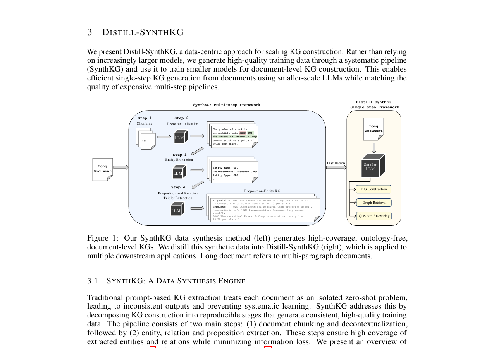
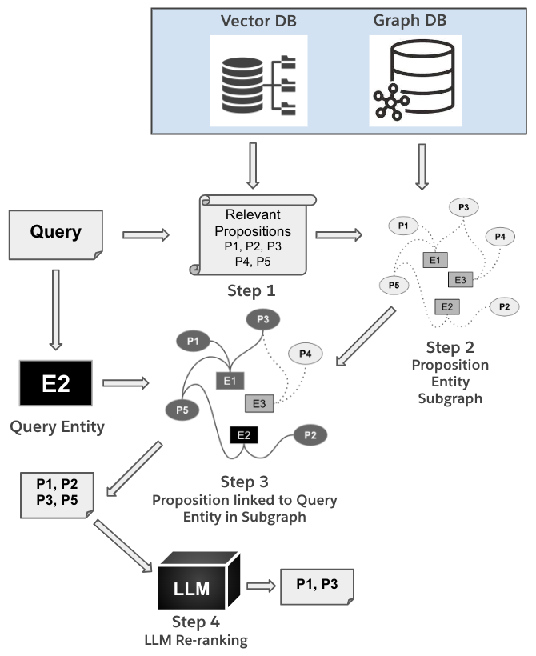
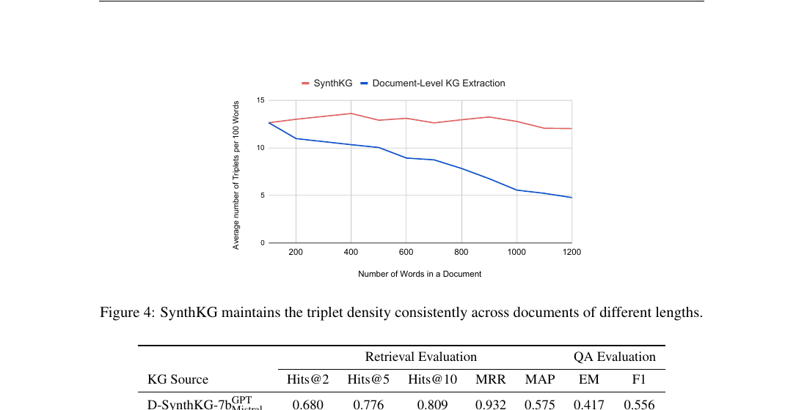
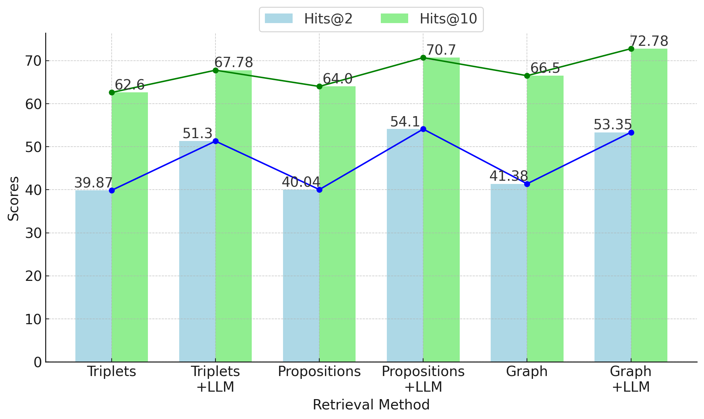
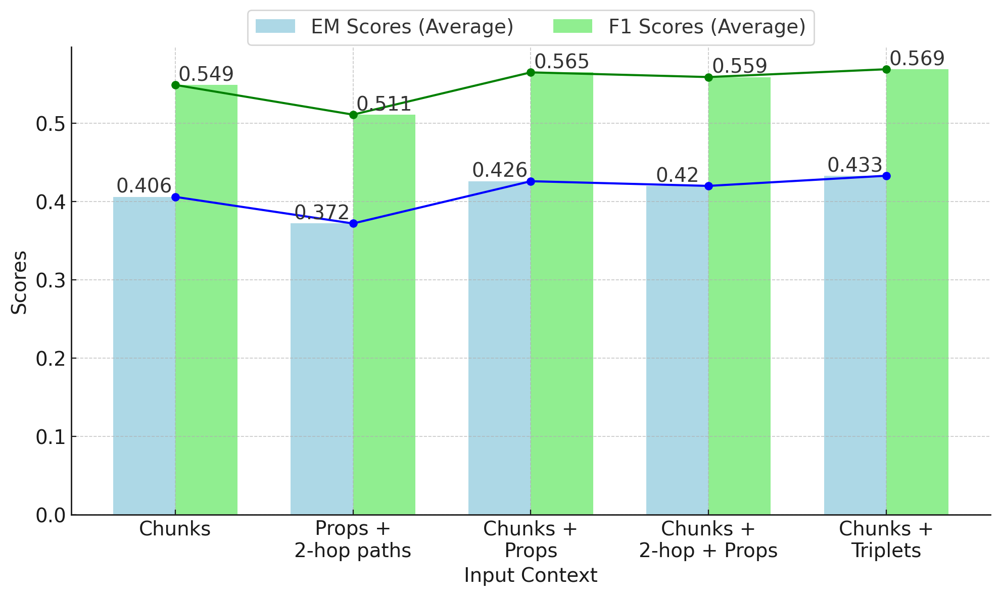
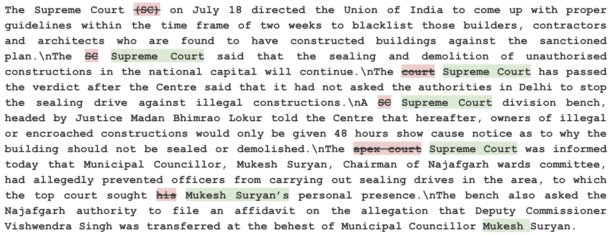

# 通过合成数据生成与蒸馏扩展知识图谱构建规模

**作者**：Prafulla Kumar Choubey\*¹, Xin Su\*², Man Luo\*³, Xiangyu Peng¹, Caiming Xiong¹, Tiep Le⁴, Shachar Rosenman⁵, Vasudev Lal⁴, Phil Mui¹, Ricky Ho¹, Phillip Howard†², Chien-Sheng Wu†¹

**机构**：
1. Salesforce Research
2. Thoughtworks
3. Abridge
4. Oracle
5. Intel Labs

**联系方式**：pchoubey@salesforce.com, xin.su@thoughtworks.com, man.luo@abridge.com
（\* 主要作者贡献相同，† 资深作者）

## 原文元信息

- **英文原题**：Scaling Knowledge Graph Construction Through Synthetic Data Generation and Distillation
- **arXiv 编号**：arXiv:2410.16597v2 [cs.CL]，2026 年 3 月 1 日
- **发表信息**：Published as a conference paper at ICLR 2026
- **源文件**：同目录下 `2410.16597v2-规模与成本.pdf`

## 译者说明

本译文基于本地 PDF 文件使用 `pdftotext` 工具抽取的英文全文翻译而成。翻译遵循以下约定：

- 数据集名、模型名、方法名、系统名、指标名（如 SynthKG、Distill-SynthKG、Llama-3-8b、MuSiQue、Hits@2 等）保留英文原文；
- 文中引用标注（如 (Edge et al., 2024)）保留英文格式，与文末参考文献列表对应；
- 参考文献列表保留英文原文，不做翻译；
- 公式与提示词（prompt）示例保留英文原文（提示词为系统实际使用的输入，翻译会失真），并在必要处辅以中文说明；
- 论文中的图表以从 PDF 中抽取/渲染的图片形式存放于同目录 `assets/` 文件夹下，并在文中相对引用。

## 摘要

文档级知识图谱（KG）构建面临一个根本性的扩展挑战：现有方法要么依赖昂贵的大语言模型（LLM），使其在大规模语料上不具经济可行性；要么采用较小的模型，但生成的图不完整且不一致。我们发现，这一局限并非源于模型能力，而是源于高质量文档级 KG 训练数据的不足。为弥补这一空白，我们提出了 SynthKG——一个多步数据合成管线，通过系统化的分块（chunking）、去语境化（decontextualization）以及使用 LLM 进行结构化抽取，生成高质量的"文档-KG"配对数据。通过在合成的"文档-KG"配对数据上微调较小的 LLM，我们将这一多步流程精简为单步 KG 生成方法，称为 Distill-SynthKG。此外，我们改造现有问答数据集构建 KG 评测数据集，并引入新的评测指标。利用 Distill-SynthKG 生成的 KG，我们还设计了一种新颖的基于图的检索框架用于 RAG。实验结果表明，Distill-SynthKG 不仅在 KG 质量上超越了所有基线模型（包括规模达其八倍的模型），还在检索与问答任务上取得持续提升。此外，我们提出的图检索框架在多个基准数据集上优于所有 KG 检索方法。

## 目录

- [1 引言](#1-引言)
- [2 相关工作](#2-相关工作)
- [3 Distill-SynthKG](#3-distill-synthkg)
  - [3.1 SynthKG：数据合成引擎](#31-synthkg数据合成引擎)
  - [3.2 蒸馏 SynthKG](#32-蒸馏-synthkg)
- [4 KG 覆盖率评测](#4-kg-覆盖率评测)
- [5 命题-实体图检索器](#5-命题-实体图检索器)
- [6 实验](#6-实验)
  - [6.1 KG 合成与蒸馏设置](#61-kg-合成与蒸馏设置)
  - [6.2 评测设置](#62-评测设置)
- [7 结果](#7-结果)
  - [7.1 KG 覆盖率结果](#71-kg-覆盖率结果rq1多步-vs-直接提示)
  - [7.2 检索](#72-检索rq2--rq4蒸馏有效性与下游影响)
  - [7.3 多跳问答结果](#73-多跳问答结果rq4端到端性能)
  - [7.4 分析](#74-分析rq3扩展性与设计验证)
- [8 结论](#8-结论)
- [可复现性声明](#可复现性声明)
- [参考文献](#参考文献)
- [附录](#附录)
  - [B 补充分析](#b-补充分析)
  - [C SynthKG 的 LLM 提示词](#c-synthkg-的-llm-提示词)
  - [D KG 覆盖率评测](#d-kg-覆盖率评测)
  - [E 实验设置](#e-实验设置)
  - [F 任务专属评测设置](#f-任务专属评测设置)
  - [G 数据发布与训练/推理成本考量](#g-数据发布与训练推理成本考量)
  - [H 许可信息](#h-许可信息)
  - [I 关于切分策略与文档结构保持的讨论](#i-关于切分策略与文档结构保持的讨论)
  - [J 关于人工超参数选择的讨论](#j-关于人工超参数选择的讨论)
  - [K LLM 使用声明](#k-llm-使用声明)

## 1 引言

检索增强生成（RAG）已被广泛用于将大语言模型（LLM）与外部知识源有效连接。近来，知识图谱（KG）增强的 RAG 方法展现出强大潜力，具有多项优势，例如有效的语料级信息汇总（Edge et al., 2024）、更强的推理能力（Gutiérrez et al., 2024; Li et al., 2024），以及对历史客户问题解决记录的精确建模以用于问答（Xu et al., 2024）。

近期的工作（Edge et al., 2024; Gutiérrez et al., 2024）开始探索使用 LLM 自动构建 KG，进而将其作为问答或构建智能体（agentic）框架等任务的知识源。然而，这些方法面临一个根本性的扩展挑战：它们依赖简单的零样本或少样本提示（prompting），使用 GPT-4o（OpenAI, 2024）等 LLM 一步完成 KG 构建。因此，应用于大型语料时，由于需要进行大量商业 API 调用，会产生高昂的推理成本。这些方法也缺乏针对文档级 KG 构建的严谨、可靠的设计，而用 LLM 处理整篇文档（尤其是长文本）可能导致信息丢失（Edge et al., 2024）。最后，文档级、无本体（ontology-free）KG 的数据集与评测方法的缺乏，使得我们难以判断 RAG 系统中的错误究竟来自特定推理组件的失效，还是来自低质量 KG 在整个系统中传播的错误。

我们发现，这些局限并非源于模型能力，而是源于高质量文档级 KG 构建训练数据的缺失。其他结构化抽取任务受益于监督数据集，而无本体 KG 构建缺乏足够的训练语料，迫使人们依赖昂贵的零样本推理。为弥补这一数据空白，我们提出了用于 KG 构建的数据合成管线 SynthKG。我们进一步将该管线蒸馏到较小的 LLM 中，得到 Distill-SynthKG，从而能够高效地一步生成高质量的文档级 KG。在 SynthKG 中，我们首先将输入文档切分为易于管理且语义完整的文本块（chunk）。每个文本块随后经过一个去语境化步骤，利用前文语境进行实体消歧，使每个文本块成为自包含的单元。然后我们提示 LLM 从每个文本块中抽取实体、关系和相关的命题（proposition），并将其组合形成最终的 KG。通过在 SynthKG 产生的合成"文档-KG"配对数据上微调 Distill-SynthKG，较小的模型只需单次推理即可为给定文档生成高质量的 KG。

此外，我们提出了一种构建文档级、无本体 KG 评测数据集的方法及相应的评测框架。具体而言，我们改造现有多跳问答（QA）数据集，将问题与答案转换为 ground-truth 关系三元组，其中答案作为三元组的头实体、尾实体或谓词出现。利用每个文档的这些 ground-truth 三元组，我们引入语义相似度和基于关键词的指标来评估 KG 三元组覆盖率。

最后，我们提出一个基于 Distill-SynthKG 所生成 KG 的图检索框架。我们设计了一种渐进式检索方法：先检索命题，再利用图结构检索与查询相关的三元组、命题和文本块。我们的检索器在三个多跳问答数据集——MuSiQue（Trivedi et al., 2022）、2WikiMultiHopQA（Ho et al., 2020）和 HotpotQA（Yang et al., 2018）——上的检索与问答准确率均优于最先进的方法。此外，我们的 KG 覆盖率评测框架与 QA 及检索性能高度相关，证明了其用于评估文档级 KG 覆盖率的有效性。

综上，我们的贡献如下：

1. 我们提出 SynthKG，一个系统化的数据合成管线，可生成高质量的文档级、无本体 KG，解决 KG 构建中训练数据稀缺的问题。
2. 我们提出 Distill-SynthKG，证明较小的 LLM 在合适的合成数据上训练后，可以达到大模型的 KG 构建质量。
3. 我们通过改造现有多跳问答数据集，建立了全面的 KG 评测数据集与指标。
4. 我们设计了一种新颖的基于图的检索框架，有效利用 KG 结构服务于 RAG。
5. 实验表明，Distill-SynthKG 生成的 KG 质量高于所有基线（包括规模达八倍的模型），同时在检索与问答性能上持续提升。

## 2 相关工作

近来，将 KG 用于各类检索增强生成（RAG）应用的兴趣日益增长。例如，GraphRAG（Edge et al., 2024）展示了在回答需要跨多篇文档汇总信息的全局性问题上，KG 相对于文本语料的优势。HippoRAG（Gutiérrez et al., 2024）证明在 LLM 生成的 KG 上应用个性化 PageRank 算法可以提升复杂多跳推理问题的检索准确率。GraphReader（Li et al., 2024）展示了 KG 如何帮助 LLM 智能体在长上下文中规划并推理以回答复杂问题。这些工作聚焦于最大化 KG 的效用。

上述所有工作以及许多其他工作，如 Chia et al. (2022)；Trajanoska et al. (2023)；Chen & Bertozzi (2023)；Kai Zhang (2023)；Nayak & Timmapathini (2023)；Mihindukulasooriya et al. (2023)；Zhu et al. (2024)；Jiao et al. (2023)；Khorashadizadeh et al. (2023)；Han et al. (2024)；Yao et al. (2024)；Bi et al. (2024)；Ding et al. (2024)；Sanmartin (2024)；Sun et al. (2024)；Yao et al. (2023)；Chase (2022)，都使用 LLM 提示来构建 KG 或从文本中抽取语义关系三元组。然而，所有先前的工作都忽略了提升无本体 KG 构建效率的问题。我们是首个为 KG 构建开发专用 LLM 的工作，通过从大模型转向更小、更高效的模型，在不牺牲性能的前提下提升效率。

## 3 Distill-SynthKG

我们提出 Distill-SynthKG，一种以数据为中心（data-centric）的 KG 构建扩展方法。我们不依赖越来越大的模型，而是通过系统化管线（SynthKG）生成高质量训练数据，并用其训练较小的模型进行文档级 KG 构建。这使得使用较小规模 LLM 即可从文档高效地单步生成 KG，同时匹敌昂贵的多步管线的质量。



**图 1**：我们的 SynthKG 数据合成方法（左）生成高覆盖率、无本体的文档级 KG。我们将这些合成数据蒸馏到 Distill-SynthKG（右），并可应用于多种下游任务。长文档指多段落文档。

### 3.1 SynthKG：数据合成引擎

传统的基于提示的 KG 抽取将每篇文档视为孤立的零样本问题，导致输出不一致，也无法进行系统化学习。SynthKG 通过将 KG 构建分解为可复现阶段来应对这一问题，这些阶段可以生成一致且高质量的训练数据。该管线包含两个主要步骤：(1) 文档切分与去语境化；(2) 实体、关系与命题抽取。这些步骤确保抽取的实体和关系具有高覆盖率，同时最小化信息损失。我们在图 1 中给出 SynthKG 的概览，详细提示词见第 C 节。

**文档切分与去语境化** 已有研究表明，将长文本直接输入 LLM 会导致信息丢失（Edge et al., 2024）。为降低这一风险，我们首先将每篇输入文档切分为更小、更易处理的文本块，再在后续步骤中交给 LLM 处理。切分沿句子边界进行，不重叠，以保持语义连贯并避免冗余。

然而，孤立地处理每个文本块可能丢失先前语境。例如，如果 "John Doe" 出现在一个文本块中，而 "John" 出现在另一个文本块中，我们可能无法追踪 "John" 指的是谁。为防止这种情况，我们应用"去语境化"步骤：提示 LLM 基于前一个文本块的语境重写每个文本块，将所有实体提及替换为其信息量最大的形式。该步骤具有关键的双重作用：确保实体在文本块之间的一致性，并创建可独立处理的自包含文本单元。例如，如果 "John Doe" 在前一个文本块中首次出现，后续对 "John D."、"John" 或相关代词的提及都会被替换为 "John Doe"。这不仅保留了语境，还防止同一实体以不同形式被表示——后者可能导致冗余、KG 路径中断以及推理时准确率下降。文档的第一个文本块不做去语境化，因为此时切分不会导致语境丢失。我们在图 8 中给出一个去语境化文本块的示例。

为验证前一个文本块是否足以完成去语境化，我们在生成的 10 万（100K）样本数据集上（数据集细节见 6.1 节）计算每篇文档中同一实体的平均文本块距离。具体而言，我们测量每个实体首次出现与其后续提及之间的距离。每个实体的总体平均文本块距离为 0.9，表明平均而言，实体在其首次出现后不到一个文本块内就会再次被提及。这说明仅使用前一个文本块就足够了，基于文本块的去语境化过程不会遗留大量未消解的实体。

提示 LLM 重写文本块的一个潜在缺点是，重写后的文本可能偏离原文，引入信息丢失或幻觉。为降低该风险，我们计算原始文本块与去语境化文本块之间的 ROUGE 分数，并过滤掉差异较大的样本。完整实验设置见 6.1 节。

为进一步评估去语境化的准确性，我们人工标注了 75 个随机选取的重写文本块。三位作者各标注 25 个文本块，并可同时查看原始文本块与完整文档。对每个文本块，标注者评估是否进行了修改、修改是否正确、以及是否有信息丢失。

在这 75 个文本块中，我们共记录了 593 处编辑，其中仅 6 处为错误修改，4 处存在信息丢失。总体而言，这些结果表明去语境化能产生高质量、自包含的文本。从定性角度看，大多数编辑提升了具体性，例如将 "scientists" 这类泛指词替换为 "Darwinian scientists"，说明重写后的文本块通常无需额外语境即可理解。

**实体与关系抽取** 与 Edge et al. (2024) 和 Gutiérrez et al. (2024) 类似，我们首先提示 LLM 从每个文本块中抽取所有实体及其对应类型（如图 1 步骤 3 所示）。然后，我们再次提示 LLM，基于文本块和先前抽取的实体，生成所有命题及相应的关系三元组（如图 1 步骤 4 所示）。每个关系由四元组表示，包含源实体、谓词、目标实体和一个命题（示例见图 1）。命题是一个描述源实体与目标实体之间语义关系的句子，封装了该关系的所有关键细节。

我们通过添加命题组件扩展了传统的 KG 三元组，命题作为中间思维链（chain of thought）（Wei et al., 2022），使 LLM 能够先连贯地表述相关语境，再抽取相应的三元组。因此，这种方法能更好地利用语境信息。此外，命题作为细粒度、自包含的检索单元，便于构建基于 KG 的检索索引。除三元组和文本块外，我们最终的 KG 还纳入了这些清晰、独立的命题。例如，命题 "OWC Pharmaceutical Research Corp preferred stock is convertible to common stock at $0.20 per share." 提供了重要语境细节（如"转换价格 $0.20 每股"），同时也是一个精确、可索引的单元。

至关重要的是，这种多步分解创造了可学习的一致模式。与产生可变输出的单步提示不同，我们的管线生成的 KG 具有可预测的结构：来自去语境化的一致实体命名、来自逐块处理的系统性覆盖、以及通过命题获得的可解释中间表示。这些性质使得其输出适合作为较小模型的训练数据。

### 3.2 蒸馏 SynthKG

虽然 SynthKG 详细的逐块工作流能够借助 LLM 实现高质量 KG 构建，但也带来了效率挑战。从单篇文档构建 KG 需要多次 LLM 调用，这增加了计算或 API 成本，并限制了可扩展性。例如，处理一篇 1,000 词的文档需要 12 次推理调用：文档被切成 4 个文本块，每个文本块触发去语境化、实体抽取和关系抽取共 3 次调用。

为了扩展 KG 构建，我们将多步 SynthKG 管线蒸馏为单步模型（如图 1 所示）。关键洞察在于：一旦 KG 构建被分解为系统化阶段，它就可以作为模式识别问题来学习，而无需在推理时通过多步提示重新求解。具体而言，我们在 SynthKG 生成的"文档-KG"配对数据上微调较小的 LLM，使其能够端到端地处理完整文档，并在单次前向传播中生成高质量 KG。

这种蒸馏方法克服了直接提示的局限，因为合成训练数据提供了两种关键信号：(1) 从逐块聚合输出中学到的、处理长文档而不丢失信息的一致示例；(2) 将多步流程隐式编码进模型参数。因此，模型不仅学会了抽取三元组，还学会了保持实体一致性以及 SynthKG 所展示的覆盖模式。值得注意的是，目前尚不存在用于这种"文档到 KG"训练形式的大规模数据集，这使得 SynthKG 对于生成实现有效蒸馏所需的数据至关重要。

## 4 KG 覆盖率评测

评估抽取得到的 KG 的质量对我们的以数据为中心的方法至关重要，因为它能对合成训练数据和蒸馏模型进行系统化评估。然而，目前缺乏面向无本体 KG 的文档级评测资源。虽然 DocRED（Yao et al., 2019）是一个现有数据集，但它仅包含 96 种关系，不适用于需要多样化、不受约束关系的开放域 KG。为弥补这一空白并实现可扩展的评估，我们提出一个改造多跳问答数据集以生成代理 ground-truth 三元组的框架，提供了首个针对文档级无本体 KG 构建的系统化评测方法。

**代理三元组生成** 我们利用多跳问答数据集，因为它们天然编码了回答复杂问题所需的结构化事实，而这正是 KG 应当捕获的信息。我们使用 GPT-4o 从问答对中生成三元组，因为每个多跳问题隐含包含多个相互关联的事实。当数据集以"子问题-答案"对的形式提供这些事实时，我们直接从这些配对构建三元组，并确保最终答案至少出现在某一个三元组的头实体、关系或尾实体中。当子问题或支持事实不可得时，我们先提示 GPT-4o 生成必要的子问题，再生成相应的三元组。

尽管该流程是合成的，但它产生了一个可扩展且一致的评测框架；若通过人工标注在训练数据验证所需的规模上获得这样的框架是不现实的。三元组生成与问题分解的提示词及示例见附录 D.1。人工评估表明，所生成的三元组总体有效（准确率 86%），细节见附录 D.2。

**KG 覆盖率评测指标** 现有 KG 评测指标通常依赖精确匹配或词级 F1，且往往假设关系来自预定义 schema。这一假设在无本体 KG 场景下不成立，因为实体和关系字符串不受约束，表层形式变化很常见。为处理这一场景，我们进行语义匹配以对齐抽取的三元组与 ground-truth 三元组，并报告三种互补度量：语义分数（semantic score）、三元组覆盖率（triplet coverage）和 F1。

出于实际考虑，我们强调覆盖率而非精确率。在 RAG 应用中，缺失关键信息（低召回）通常比抽取额外事实（较低精确率）更有害：无关三元组在检索时往往可以被忽略，而缺失的三元组可能使相关问题无法回答。因此，我们的指标关注图中是否包含回答问题所需的关键三元组。作为整体全面性的代理指标，我们还报告抽取的三元组总数。

我们提出的三个指标定义如下：

- **语义分数（Semantic score）**：我们计算每个 ground-truth 三元组的向量表示与 KG 中各三元组之间的余弦相似度，取最高相似度分数作为该 ground-truth 三元组的语义分数。语义分数越高表明 ground truth 与抽取图之间的匹配越紧密。
- **三元组覆盖率（Triplet Coverage）**：如果某个 ground-truth 三元组的语义分数超过截断阈值，则其被标记为已覆盖（coverage = 1）；否则该三元组未被覆盖（coverage = 0）。
- **F1 分数**：我们利用语义分数从 KG 中识别与 ground-truth 三元组最接近匹配的三元组，然后通过比较抽取三元组与 ground-truth 三元组的文本计算 F1 分数。

这些指标共同提供了 KG 质量的全面视图：语义分数刻画概念对齐，覆盖率衡量关键信息的召回，F1 分数评估表层准确率。三者结合，可以对不同 KG 构建方法进行系统比较，并验证我们以数据为中心方法的有效性。

## 5 命题-实体图检索器

我们提出一个利用我们合成 KG 结构的检索框架，特别是命题-实体二部图（图 2）。与以往基于稀疏三元组的图检索方法不同，我们的检索器将命题作为主要检索单元。由于命题是丰富的、自包含的文本陈述，它们可作为 RAG 的更高质量候选；同时二部拓扑通过共享实体提供显式链接，促进检索证据之间的逻辑连通性。这一设计之所以可行，得益于我们以数据为中心的管线所产出的一致 KG 结构。



**图 2**：我们的用于多跳推理的命题-实体图检索器：先检索语义相似的命题，再利用图遍历选择通过查询实体相连的命题，最后使用 LLM 对选中的命题重排序。

给定一个问题，我们首先使用嵌入相似度从 KG 中检索与问题最相关的前 M 个（top-M）命题，将搜索空间缩小到相关信息的较小子集。这一初始语义检索至关重要，因为命题与原始三元组不同，包含足够的语境以进行有意义的相似度计算。在第 2 步中，我们构建一个由这些命题及其关联实体组成的子图，捕获被检索命题之间的关系。在第 3 步中，我们从问题中提及的实体出发遍历子图，仅选择位于其 N 跳邻域内的命题。这种图约束过滤解决了多跳推理中的一个关键挑战：区分语义相关但逻辑上不连通的信息。例如，关于"总统华盛顿"与"华盛顿州"的命题可能具有很高的嵌入相似度，但图邻域不同。随后，我们将与所选命题对应的文本块（位于问题实体 N 跳范围内）按其与查询的嵌入相似度排序纳入，直到选满前 K 个（top-K）文本块。我们将这一方法称为 Graph Retriever。

此外，如图 2 第 4 步所示，我们用基于 LLM 的重排序增强检索。对于 Graph Retriever 返回的候选命题，我们提示 LLM 利用其推理能力选出回答问题所需的命题，对证据进行重排序。这是可行的，因为命题是 LLM 可以直接判断相关性的可解释文本单元，而孤立的三元组则不然。

重排序后，我们优先选择 LLM 选中的命题所关联的文本块，然后回退到 Graph Retriever 补足剩余预算，直至选满前 K 个文本块。我们在第 6 节将这种混合方法称为 Graph+LLM。

该检索框架的设计与我们的数据合成方法紧密耦合：来自去语境化的一致实体命名确保可靠的图遍历，而命题生成则提供了语义丰富的检索单元。

## 6 实验

我们的实验旨在从三个维度验证以数据为中心的方法：(1) 合成训练数据的质量；(2) 蒸馏的有效性；(3) 下游应用的性能。我们关注以下研究问题：(RQ1) 多步 SynthKG 管线是否比直接提示产生更高质量的 KG？(RQ2) 8B 模型能否通过在合成数据上蒸馏达到大模型性能？(RQ3) 数据规模如何影响蒸馏模型的性能？(RQ4) KG 质量的提升能否转化为更好的检索与问答性能？

### 6.1 KG 合成与蒸馏设置

**SynthKG 数据集与模型**：为创建大规模训练资源，我们使用 Llama-3.1-70b-Instruct（AI@Meta, 2024）对来自 IndustryCorpus（by BAAI）的 10 万（100K）篇文档合成 KG。我们通过从十个类别中均匀采样来保证领域多样性：政治、新闻、医学、文学、金融、影视、计算机科学、汽车、技术和教育。我们使用 Llama-Index（Liu, 2022）框架的 SentenceSplitter 将文档切分为文本块，块大小设为 256 token，块重叠设为 0 token。我们采用基于 ROUGE-1 F1 分数（Lin, 2004）的过滤准则，阈值为 0.70，以最小化去语境化引入幻觉的风险。我们在 Intel® Tiber™ AI Cloud 的 160 块 Intel® Gaudi 2 AI 加速器上使用 VLLM（Kwon et al., 2023）进行 KG 合成。我们生成的 10 万对"文档-KG"数据是首个面向无本体 KG 构建的大规模训练资源，并将公开发布。

**SynthKG 蒸馏**：为验证合成数据能够支持有效蒸馏，我们在 3 万（30K）篇合成文档上训练 Meta-Llama-3-8b-Instruct（AI@Meta, 2024）。模型学会在单次处理中直接为整篇输入文档生成相应的 KG。训练使用 8 块 Intel® Gaudi 2 AI 加速器，学习率为 5e-5，批大小为 32，训练一个 epoch。我们将该模型命名为 Distill-SynthKG，后文简称 D-SynthKG-8b。

### 6.2 评测设置

**数据集**：我们在三个多跳推理基准上评测：MuSiQue、2WikiMultiHopQA（2Wiki）和 HotpotQA。这些数据集非常适合 KG 评测，因为回答其问题依赖结构化的多事实推理，而这正是 KG 旨在支持的行为。遵循 HippoRAG（Gutiérrez et al., 2024）的实验协议，我们使用相同的 1,000 个问题及相同的候选段落集合（包括支持段落与干扰段落），以确保公平比较。对于 KG 覆盖率评测，我们按第 4 节所述使用 GPT-4o 生成代理 ground-truth 三元组。

**基线**：为进行全面评测，我们与多类基线进行比较：

- **直接提示基线**：Llama-3-8b 和 Llama-3-70b¹ 用于单步 KG 抽取；
- **多步基线**：使用 Llama-3-8b 的完整 SynthKG 管线（SynthKG-8b）与使用 Llama-3-70b 的版本（SynthKG-70b），用于评估蒸馏效果；
- **检索基线**：标准稠密向量检索，以及结合稠密检索与 LLM 重排序的两阶段方法（Dense+LLM），用于建立非 KG 性能基准；
- **基于 KG 的检索**：使用基于 GPT-4o 的 KG 进行检索；
- **KG-RAG 系统**：使用 GPT-4o 抽取的 KG 的 GraphRAG 与 HippoRAG，代表最先进的基于 KG 的方法²；
- **闭卷问答（Closed-book QA）**：LLM 仅使用参数化知识，用于确立性能下界。

我们在第 F 节提供包括超参数在内的完整实验细节。

> **脚注**
> 1. 我们在全文中使用两个模型的 Instruct 变体。
> 2. 为提升 GraphRAG 性能，我们在每个查询末尾附加指令："Only provide the answer without any context. For yes/no questions, just mention yes or no. Do not cite data sources."。对于 GraphRAG，我们报告 local 和 drift 模式的结果（二者表现最佳），排除 global 模式。对于 HippoRAG，我们使用 GPT-4o 构建 KG，并对检索到的文本块应用我们的查询合成器生成最终答案，以确保公平比较。

**多跳问答框架**：为展示我们 KG 的通用性，我们使用三个不同的检索框架评测，均使用 LlamaIndex 的 TreeSummarize 并以 GPT-4o 生成答案：

- **LlamaIndex**：使用 LlamaIndex 的 KnowledgeGraphIndex，结合关键词与语义混合搜索的标准基于 KG 的检索；
- **Chain-of-Triplet**：将问题分解为子查询并检索匹配三元组的直接 KG 推理（细节见附录 F.3.2）；
- **Graph+LLM**：我们带 LLM 重排序的命题-实体图检索器，利用我们合成 KG 的独特结构。

## 7 结果

**表 1**：KG 覆盖率性能。最佳分数加粗，次佳分数加下划线。

| KG 来源 | MuSiQue 三元组数 | MuSiQue 语义分数 | MuSiQue 覆盖率 | MuSiQue F1 | 2wiki 三元组数 | 2wiki 语义分数 | 2wiki 覆盖率 | 2wiki F1 | HotpotQA 三元组数 | HotpotQA 语义分数 | HotpotQA 覆盖率 | HotpotQA F1 |
|---|---|---|---|---|---|---|---|---|---|---|---|---|
| Llama-3-8b | 93855 | 0.8111 | 32.09 | 0.51 | 41384 | 0.8281 | 43.39 | 0.56 | 76906 | 0.8343 | 41.79 | 0.58 |
| SynthKG-8b | 125197 | 0.8341 | 38.84 | 0.55 | 56178 | 0.8275 | 44.56 | 0.54 | 108031 | 0.8448 | 47.72 | 0.60 |
| Llama-3-70b | 102119 | 0.8346 | 40.34 | 0.56 | 46100 | 0.8475 | 54.10 | 0.58 | 82948 | 0.8440 | 47.20 | 0.61 |
| SynthKG-70b | 140527 | 0.8559 | **47.18** | 0.59 | 71305 | 0.8778 | **63.30** | 0.61 | 124460 | 0.8633 | 54.54 | 0.63 |
| D-SynthKG-8b | 139376 | 0.8546 | 46.90 | 0.59 | 68800 | 0.8693 | 58.27 | 0.59 | 123458 | 0.8693 | **55.26** | 0.64 |

我们提出的实验结果验证了以数据为中心的 KG 构建方法，直接回应第 6 节提出的研究问题。

### 7.1 KG 覆盖率结果（RQ1：多步 vs 直接提示）

在所有三个数据集上，对于 LLaMA-3-8b 和 70b 两种模型，多步 SynthKG 管线均比常用的单步 LLM 提示方法生成更多三元组并获得更高覆盖率（表 1）。这验证了我们的假设：将 KG 构建分解为系统化步骤可以避免单遍处理固有的信息丢失。此外，我们的 D-SynthKG-8b 模型优于未经训练的 Llama-3-8b、Llama-3-70b 和 SynthKG-8b 基线，展示了以 Llama-3-70b 为教师蒸馏 SynthKG 管线的收益。值得注意的是，D-SynthKG-8b 尽管规模小约 8 倍且只依赖单步推理，也与 SynthKG-70b 具有很强的竞争力。这些结果强调，高质量训练数据可以弥合模型规模之间的差距。由于我们的 KG 覆盖率指标强调关键信息的召回，我们还通过人工抽检验证了精确率：在从 D-SynthKG-8b 预测中随机抽取的 150 个三元组中，仅 4 个错误、5 个无意义，表明生成的三元组在保持高覆盖率的同时与源内容基本一致。

### 7.2 检索（RQ2 & RQ4：蒸馏有效性与下游影响）

**表 2**：检索性能。最佳分数加粗，次佳分数加下划线。

| KG 来源 | 检索器 | MuSiQue Hits@2 | MuSiQue Hits@10 | MuSiQue MRR | MuSiQue MAP | 2wiki Hits@2 | 2wiki Hits@10 | 2wiki MRR | 2wiki MAP | HotpotQA Hits@2 | HotpotQA Hits@10 | HotpotQA MRR | HotpotQA MAP |
|---|---|---|---|---|---|---|---|---|---|---|---|---|---|
| None | Dense | 41.32 | 64.19 | 79.89 | 40.17 | 62.22 | 74.72 | 97.86 | 55.73 | 66.55 | 89.45 | 91.98 | 60.68 |
| None | Dense+LLM | 47.60 | 67.02 | 84.44 | 44.26 | 72.63 | 76.70 | 97.77 | 58.65 | 83.10 | 92.10 | 96.79 | 67.58 |
| Llama-3-8b | Graph + LLM | 31.33 | 42.68 | 60.67 | 29.49 | 41.55 | 45.60 | 66.53 | 36.70 | 50.65 | 57.45 | 73.72 | 45.06 |
| SynthKG-8b | Graph + LLM | 50.62 | 65.17 | 86.65 | 45.43 | 65.25 | 69.65 | 95.54 | 54.79 | 76.55 | 86.35 | 92.69 | 63.44 |
| Llama-3-70b | Graph + LLM | 48.64 | 68.93 | 85.24 | 45.20 | 68.73 | 74.47 | 97.32 | 57.42 | 79.10 | 93.75 | 93.27 | 65.78 |
| SynthKG-70b | Graph + LLM | **53.70** | **72.23** | 88.81 | 48.32 | 73.23 | 78.80 | 98.80 | 60.09 | 81.90 | 94.40 | 94.62 | 66.93 |
| D-SynthKG-8b | Graph + LLM | 53.35 | 72.78 | 87.41 | 48.04 | 73.15 | 78.57 | 98.74 | 59.91 | 81.85 | 94.70 | 94.53 | 67.22 |
| GPT-4o | Graph + LLM | 53.90 | 70.38 | 90.46 | 48.66 | **74.35** | **79.25** | **99.02** | **60.52** | **82.90** | **94.95** | 93.98 | 67.15 |

与预训练的 Llama-3-8b 相比，我们的 D-SynthKG-8b 将 Hits@2 平均提升 28.27 个百分点；相比 SynthKG-8b 提升 5.31 个百分点；相比更大的 Llama-3-70b 提升 3.96 个百分点（表 2）。这些提升表明，在合成数据上训练带来的是能力的质变，而非边际调优效应。值得注意的是，D-SynthKG-8b 尽管规模小得多且只需单步推理，仍与完整的 SynthKG-70b 管线具有很强竞争力，说明多步流程可以通过蒸馏被有效内化。它的表现也与 GPT-4o 相当（细节见附录 B.2）。

此外，我们的 Graph+LLM 检索器相比标准稠密检索将 Hits@2 提升 12.75 个百分点，相比带 LLM 重排序的稠密检索提升 1.67 个百分点，证明结构化 KG 能够支持更有效的检索策略。

### 7.3 多跳问答结果（RQ4：端到端性能）

**表 3**：多跳问答评测（EM 与 F1 分数）。每个框架下的最佳分数加下划线（原表格式）。

| 类别 | KG 来源 | 检索方式 | MuSiQue EM | MuSiQue F1 | 2wiki EM | 2wiki F1 | HotpotQA EM | HotpotQA F1 | 平均 EM | 平均 F1 |
|---|---|---|---|---|---|---|---|---|---|---|
| None | None | 无 | 0.100 | 0.220 | 0.190 | 0.340 | 0.290 | 0.440 | 0.193 | 0.333 |
| None | None | Dense Retriever | 0.237 | 0.376 | 0.380 | 0.497 | 0.471 | 0.641 | 0.363 | 0.505 |
| None | None | Dense + LLM | 0.260 | 0.398 | 0.414 | 0.531 | 0.509 | 0.678 | 0.394 | 0.536 |
| GPT-4o | GPT-4o | GraphRAG (local) | 0.291 | 0.412 | 0.432 | 0.491 | 0.448 | 0.569 | 0.390 | 0.491 |
| GPT-4o | GPT-4o | GraphRAG (drift) | 0.222 | 0.350 | 0.497 | 0.629 | 0.434 | 0.561 | 0.384 | 0.513 |
| GPT-4o | GPT-4o | HippoRAG | 0.224 | 0.368 | 0.493 | 0.627 | 0.492 | 0.644 | 0.403 | 0.546 |
| 本文方法 | Llama-3-8b | LlamaIndex | 0.155 | 0.259 | 0.366 | 0.461 | 0.405 | 0.555 | 0.308 | 0.425 |
| 本文方法 | Llama-3-70b | LlamaIndex | 0.202 | 0.309 | 0.417 | 0.507 | 0.424 | 0.563 | 0.347 | 0.459 |
| 本文方法 | D-SynthKG-8b | LlamaIndex | 0.217 | 0.320 | 0.435 | 0.528 | 0.451 | 0.608 | 0.367 | 0.485 |
| 本文方法 | Llama-3-8b | Chain-of-Triplet | 0.131 | 0.244 | 0.305 | 0.381 | 0.278 | 0.469 | 0.238 | 0.365 |
| 本文方法 | Llama-3-70b | Chain-of-Triplet | 0.188 | 0.299 | 0.351 | 0.428 | 0.370 | 0.517 | 0.303 | 0.415 |
| 本文方法 | D-SynthKG-8b | Chain-of-Triplet | 0.243 | 0.383 | 0.410 | 0.507 | 0.400 | 0.579 | 0.354 | 0.490 |
| 本文方法 | Llama-3-8b | Graph + LLM | 0.181 | 0.299 | 0.291 | 0.394 | 0.373 | 0.515 | 0.281 | 0.402 |
| 本文方法 | Llama-3-70b | Graph + LLM | 0.297 | 0.437 | 0.400 | 0.501 | 0.544 | 0.705 | 0.413 | 0.548 |
| 本文方法 | D-SynthKG-8b | Graph + LLM | 0.320 | 0.459 | 0.440 | 0.544 | 0.539 | 0.706 | 0.433 | 0.569 |

D-SynthKG-8b 在全部三个框架（LlamaIndex、Chain-of-Triplet 和 Graph+LLM）中均取得最佳总体结果，超越了 Llama-3-8b 和更大的 Llama-3-70b（表 3）。这些提升在不同 RAG 管线上的一致性，凸显了我们合成 KG 的鲁棒性与广泛适用性。最大的改进出现在 Graph+LLM 设置中，D-SynthKG-8b 相对 Llama-3-8b 取得 +15.2% 的绝对 EM 提升，相对 Llama-3-70b 提升 +2.0%，获得总体最佳性能。值得注意的是，它还优于 GraphRAG 和 HippoRAG 这两个基于 GPT-4o 生成 KG 的强大 KG-RAG 系统，突显了我们以数据为中心的方法使较小模型在实际应用中能与规模大得多的系统竞争。

### 7.4 分析（RQ3：扩展性与设计验证）

**多步 SynthKG 在处理越来越长的文档时效果如何？** 我们比较了多步 SynthKG 框架与单步 LLM 提示方法，考察不同长度文档下每 100 词生成的三元组数量（图 4，附录 B）。对于单步方法，抽取关系的比例随文档长度增加而下降，从 100 词文档到 1,200 词文档，三元组密度下降约 60%。相比之下，SynthKG 的三元组密度在所有长度上几乎保持不变。这验证了我们的切分策略，并说明了多步方法对创建一致训练数据的必要性。



**图 4**：SynthKG 在不同长度文档上保持一致的三元组密度。

**最优检索源是什么？** 我们的 KG 支持多种检索策略。在附录 B 的图 3(a) 中，我们比较了使用三元组、命题和完整图结构的检索。命题检索由于语境更丰富而优于三元组检索（Hits@10 +0.89），而基于图的检索取得最佳性能（比命题高 +2.50）。这验证了我们将命题作为 KG 一等组件（而非仅中间表示）的设计选择。



**图 3(a)**：不同基于 KG 的检索方法在多跳问答上的性能比较。

**我们的 KG 如何超越检索来改进 RAG？** 消融研究（附录 B 图 3(b)）表明，用结构化信号丰富检索上下文可以提升问答性能。向检索到的文本块添加命题（+2 EM）或 2 跳路径（+2.7 EM）可提升准确率，其中 2 跳路径因其捕获复杂关系的能力而略优。这表明我们的 KG 在简单检索之外还能提供价值，支持结构化推理。



**图 3(b)**：多跳问答中不同输入上下文组合的结果。

## 8 结论

我们提出了 SynthKG——一个生成高质量"文档-KG"配对数据的数据合成管线，以及将这一多步流程蒸馏为高效单步模型的 Distill-SynthKG。我们的实验表明，在合成数据上训练的 8B 模型在 KG 质量、检索和问答任务上匹敌或超越规模八倍的模型。这项工作将范式从扩展模型转向生成训练数据，表明结构化抽取能力可以通过合成示例而非参数量来迁移。我们发布了 10 万对"文档-KG"数据，以支持未来面向知识抽取的以数据为中心的研究。

## 可复现性声明

为确保可复现性，我们在第 6 节和附录 F 中提供了详细的实验设置和超参数。SynthKG 管线使用的所有提示词均包含在附录 C 中。10 万对合成"文档-KG"数据集将公开发布。核心实现代码（包括 KG 合成管线和评测指标）将被发布，以便复现我们的结果。

## 参考文献

（参考文献保留英文原文）

- AI@Meta. Llama 3 model card. 2024. URL https://github.com/meta-llama/llama3/blob/main/MODEL_CARD.md.
- Zhen Bi, Jing Chen, Yinuo Jiang, Feiyu Xiong, Wei Guo, Huajun Chen, and Ningyu Zhang. Codekgc: Code language model for generative knowledge graph construction, 2024. URL https://arxiv.org/abs/2304.09048.
- Harrison Chase. LangChain, October 2022. URL https://github.com/langchain-ai/langchain.
- Bohan Chen and Andrea L. Bertozzi. Autokg: Efficient automated knowledge graph generation for language models, 2023. URL https://arxiv.org/abs/2311.14740.
- Yew Ken Chia, Lidong Bing, Soujanya Poria, and Luo Si. Relationprompt: Leveraging prompts to generate synthetic data for zero-shot relation triplet extraction, 2022. URL https://arxiv.org/abs/2203.09101.
- Tim Dettmers, Artidoro Pagnoni, Ari Holtzman, and Luke Zettlemoyer. Qlora: Efficient finetuning of quantized llms. arXiv preprint arXiv:2305.14314, 2023.
- Linyi Ding, Sizhe Zhou, Jinfeng Xiao, and Jiawei Han. Automated construction of theme-specific knowledge graphs, 2024. URL https://arxiv.org/abs/2404.19146.
- Darren Edge, Ha Trinh, Newman Cheng, Joshua Bradley, Alex Chao, Apurva Mody, Steven Truitt, Dasha Metropolitansky, Robert Osazuwa Ness, and Jonathan Larson. From local to global: A graph rag approach to query-focused summarization. arXiv preprint arXiv:2404.16130, 2024.
- Bernal Jiménez Gutiérrez, Yiheng Shu, Yu Gu, Michihiro Yasunaga, and Yu Su. Hipporag: Neurobiologically inspired long-term memory for large language models. arXiv preprint arXiv:2405.14831, 2024. URL https://arxiv.org/abs/2405.14831.
- Jiuzhou Han, Nigel Collier, Wray Buntine, and Ehsan Shareghi. Pive: Prompting with iterative verification improving graph-based generative capability of llms, 2024. URL https://arxiv.org/abs/2305.12392.
- Xanh Ho, Anh-Khoa Duong Nguyen, Saku Sugawara, and Akiko Aizawa. Constructing a multi-hop QA dataset for comprehensive evaluation of reasoning steps. In Proceedings of the 28th International Conference on Computational Linguistics, pp. 6609–6625, Barcelona, Spain (Online), December 2020. International Committee on Computational Linguistics. URL https://www.aclweb.org/anthology/2020.coling-main.580.
- Albert Q. Jiang, Alexandre Sablayrolles, Arthur Mensch, Chris Bamford, Devendra Singh Chaplot, Diego de las Casas, Florian Bressand, Gianna Lengyel, Guillaume Lample, Lucile Saulnier, Lélio Renard Lavaud, Marie-Anne Lachaux, Pierre Stock, Teven Le Scao, Thibaut Lavril, Thomas Wang, Timothée Lacroix, and William El Sayed. Mistral 7b, 2023. URL https://arxiv.org/abs/2310.06825.
- Yizhu Jiao, Ming Zhong, Sha Li, Ruining Zhao, Siru Ouyang, Heng Ji, and Jiawei Han. Instruct and extract: Instruction tuning for on-demand information extraction. In Houda Bouamor, Juan Pino, and Kalika Bali (eds.), Proceedings of the 2023 Conference on Empirical Methods in Natural Language Processing, pp. 10030–10051, Singapore, December 2023. Association for Computational Linguistics. doi: 10.18653/v1/2023.emnlp-main.620. URL https://aclanthology.org/2023.emnlp-main.620.
- Yu Su Kai Zhang, Bernal Jiménez Gutiérrez. Aligning instruction tasks unlocks large language models as zero-shot relation extractors. In Findings of ACL, 2023.
- Hanieh Khorashadizadeh, Nandana Mihindukulasooriya, Sanju Tiwari, Jinghua Groppe, and Sven Groppe. Exploring in-context learning capabilities of foundation models for generating knowledge graphs from text, 2023. URL https://arxiv.org/abs/2305.08804.
- Woosuk Kwon, Zhuohan Li, Siyuan Zhuang, Ying Sheng, Lianmin Zheng, Cody Hao Yu, Joseph E. Gonzalez, Hao Zhang, and Ion Stoica. Efficient memory management for large language model serving with pagedattention. In Proceedings of the ACM SIGOPS 29th Symposium on Operating Systems Principles, 2023.
- Shilong Li, Yancheng He, Hangyu Guo, Xingyuan Bu, Ge Bai, Jie Liu, Jiaheng Liu, Xingwei Qu, Yangguang Li, Wanli Ouyang, Wenbo Su, and Bo Zheng. Graphreader: Building graph-based agent to enhance long-context abilities of large language models, 2024. URL https://arxiv.org/abs/2406.14550.
- Chin-Yew Lin. ROUGE: A package for automatic evaluation of summaries. In Text Summarization Branches Out, pp. 74–81, Barcelona, Spain, July 2004. Association for Computational Linguistics. URL https://aclanthology.org/W04-1013.
- Jerry Liu. LlamaIndex, 11 2022. URL https://github.com/jerryjliu/llama_index.
- Nandana Mihindukulasooriya, Sanju Tiwari, Carlos F Enguix, and Kusum Lata. Text2kgbench: A benchmark for ontology-driven knowledge graph generation from text. In International Semantic Web Conference, pp. 247–265. Springer, 2023.
- Anmol Nayak and Hari Prasad Timmapathini. Llm2kb: Constructing knowledge bases using instruction tuned context aware large language models, 2023. URL https://arxiv.org/abs/2308.13207.
- OpenAI. Hello gpt-4o! https://openai.com/index/hello-gpt-4o/, 2024.
- Diego Sanmartin. Kg-rag: Bridging the gap between knowledge and creativity, 2024. URL https://arxiv.org/abs/2405.12035.
- Qi Sun, Kun Huang, Xiaocui Yang, Rong Tong, Kun Zhang, and Soujanya Poria. Consistency guided knowledge retrieval and denoising in llms for zero-shot document-level relation triplet extraction. In Proceedings of the ACM on Web Conference 2024, WWW '24, pp. 4407–4416, New York, NY, USA, 2024. Association for Computing Machinery. ISBN 9798400701719. doi: 10.1145/3589334.3645678. URL https://doi.org/10.1145/3589334.3645678.
- Milena Trajanoska, Riste Stojanov, and Dimitar Trajanov. Enhancing knowledge graph construction using large language models, 2023. URL https://arxiv.org/abs/2305.04676.
- Harsh Trivedi, Niranjan Balasubramanian, Tushar Khot, and Ashish Sabharwal. MuSiQue: Multihop questions via single-hop question composition. Transactions of the Association for Computational Linguistics, 10:539–554, 2022. doi: 10.1162/tacl_a_00475. URL https://aclanthology.org/2022.tacl-1.31.
- Jason Wei, Xuezhi Wang, Dale Schuurmans, Maarten Bosma, Fei Xia, Ed Chi, Quoc V Le, Denny Zhou, et al. Chain-of-thought prompting elicits reasoning in large language models. Advances in neural information processing systems, 35:24824–24837, 2022.
- Zhentao Xu, Mark Jerome Cruz, Matthew Guevara, Tie Wang, Manasi Deshpande, Xiaofeng Wang, and Zheng Li. Retrieval-augmented generation with knowledge graphs for customer service question answering. In Proceedings of the 47th International ACM SIGIR Conference on Research and Development in Information Retrieval, SIGIR 2024. ACM, July 2024. doi: 10.1145/3626772.3661370. URL http://dx.doi.org/10.1145/3626772.3661370.
- Zhilin Yang, Peng Qi, Saizheng Zhang, Yoshua Bengio, William Cohen, Ruslan Salakhutdinov, and Christopher D. Manning. HotpotQA: A dataset for diverse, explainable multi-hop question answering. In Ellen Riloff, David Chiang, Julia Hockenmaier, and Jun'ichi Tsujii (eds.), Proceedings of the 2018 Conference on Empirical Methods in Natural Language Processing, pp. 2369–2380, Brussels, Belgium, October-November 2018. Association for Computational Linguistics. doi: 10.18653/v1/D18-1259. URL https://aclanthology.org/D18-1259.
- Liang Yao, Jiazhen Peng, Chengsheng Mao, and Yuan Luo. Exploring large language models for knowledge graph completion, 2024. URL https://arxiv.org/abs/2308.13916.
- Yuan Yao, Deming Ye, Peng Li, Xu Han, Yankai Lin, Zhenghao Liu, Zhiyuan Liu, Lixin Huang, Jie Zhou, and Maosong Sun. DocRED: A large-scale document-level relation extraction dataset. In Anna Korhonen, David Traum, and Lluís Màrquez (eds.), Proceedings of the 57th Annual Meeting of the Association for Computational Linguistics, pp. 764–777, Florence, Italy, July 2019. Association for Computational Linguistics. doi: 10.18653/v1/P19-1074. URL https://aclanthology.org/P19-1074.
- Yunzhi Yao, Shengyu Mao, Ningyu Zhang, Xiang Chen, Shumin Deng, Xi Chen, and Huajun Chen. Schema-aware reference as prompt improves data-efficient knowledge graph construction. In Proceedings of the 46th International ACM SIGIR Conference on Research and Development in Information Retrieval, SIGIR '23, pp. 911–921, New York, NY, USA, 2023. Association for Computing Machinery. ISBN 9781450394086. doi: 10.1145/3539618.3591763. URL https://doi.org/10.1145/3539618.3591763.
- Yuqi Zhu, Xiaohan Wang, Jing Chen, Shuofei Qiao, Yixin Ou, Yunzhi Yao, Shumin Deng, Huajun Chen, and Ningyu Zhang. Llms for knowledge graph construction and reasoning: Recent capabilities and future opportunities, 2024. URL https://arxiv.org/abs/2305.13168.

## 附录

### B 补充分析

#### B.1 Distill-SynthKG 的效率与泛化性

在表 4 中，我们研究了开发 Distill-SynthKG 的三个关键问题：1. 训练 Distill-SynthKG 的效率；2. 各种强大 LLM 用于合成训练数据的有效性；3. 在合成数据上微调其他较小 LLM 的泛化性。为回答这些问题，我们对约 1,000 对由 GPT-4o 和 Llama-3.1-70b-Instruct 生成的合成"文档-KG"配对采用 QLoRA（Dettmers et al., 2023）微调。微调配置见第 E.1 节。此外，为回答第三个问题，我们还微调了另一个著名的基座 LLM：Mistral-7b-Instruct-v0.3（Jiang et al., 2023）。

我们观察到，两个 QLoRA 微调模型在检索与多跳问答任务上的表现略低于全量微调模型。但性能差距很小，表明 QLoRA 微调即使在较小数据集上也保持竞争力，同时所需计算资源显著更少。在 GPT-4o 合成 KG 上微调的模型表现略低，我们将其归因于合成数据中更具概括性、更原子化的命题。

**表 4**：Distill-SynthKG 的效率与泛化性结果。结果为 MuSiQue、2wiki 和 HotpotQA 数据集上的平均性能。D-SynthKG-7b<sup>GPT Mistral</sup> 和 D-SynthKG-7b<sup>Llama-3 Mistral</sup> 是分别在 GPT-4o 与 Llama-3.1-70b-Instruct 标注的 1,000 对"文档-KG"数据上以 QLoRA 微调的 Mistral-7b-Instruct-v0.3 模型。

| KG 来源 | Hits@2 | Hits@5 | Hits@10 | MRR | MAP | EM | F1 |
|---|---|---|---|---|---|---|---|
| D-SynthKG-7b<sup>GPT Mistral</sup> | 0.680 | 0.776 | 0.809 | 0.932 | 0.575 | 0.417 | 0.556 |
| D-SynthKG-7b<sup>Llama-3 Mistral</sup> | 0.685 | 0.780 | 0.811 | 0.931 | 0.578 | 0.433 | 0.565 |
| D-SynthKG-8b | 0.695 | 0.792 | 0.820 | 0.936 | 0.584 | 0.433 | 0.569 |

（检索评测为 Hits@2/Hits@5/Hits@10/MRR/MAP，问答评测为 EM/F1。）

#### B.2 与专有基础模型的检索性能比较

我们补充了蒸馏模型 D-SynthKG-8b 与最先进专有基础模型 OpenAI GPT-4o 的比较。我们在三个多跳问答基准 2Wiki、HotpotQA 和 MuSiQue 上评测检索性能，结果见表 5。

**表 5**：D-SynthKG-8b 与 GPT-4o 在三个多跳问答数据集上的检索性能比较。

| 数据集 | 模型 | Hits@2 | Hits@10 | MAP | MRR |
|---|---|---|---|---|---|
| 2Wiki | GPT-4o (OpenAI) | 74.35 | 79.25 | 60.52 | 99.02 |
| 2Wiki | D-SynthKG-8b | 73.15 | 78.57 | 59.91 | 98.74 |
| HotpotQA | GPT-4o (OpenAI) | 82.90 | 94.95 | 67.15 | 93.98 |
| HotpotQA | D-SynthKG-8b | 81.85 | 94.70 | 67.22 | 94.53 |
| MuSiQue | GPT-4o (OpenAI) | 53.90 | 70.38 | 48.66 | 90.46 |
| MuSiQue | D-SynthKG-8b | 53.35 | 72.78 | 48.04 | 87.41 |

结果表明，D-SynthKG-8b 在所有数据集上的检索性能与 GPT-4o 高度接近。值得注意的是，D-SynthKG-8b 的平均 Hits@10 甚至略高（82.02 对 81.52），而其成本效率显著更优。GPT-4o 每百万输入 token 花费 $2.50、每百万输出 token 花费 $10，而 D-SynthKG-8b 每百万 token（输入或输出）仅 $0.20，约为推理成本的 3%。这些发现突显了我们的方法在成本敏感部署场景中的实际优势。

#### B.3 实体分布分析

在分析跨文档文本块的实体引用时，我们发现每个实体的总体平均文本块距离为 0.9。该指标表示实体某次提及与其最近一次先前提及之间的平均文本块数。进一步分析表明，80.03% 的实体的最近提及位于同一段落内，说明大多数实体引用在文档内相对局部化。

这些发现支持了我们在去语境化时仅参考紧邻前一个文本块的设计决策，因为该方式在计算效率与充足语境信息之间取得了有效平衡。

### C SynthKG 的 LLM 提示词

我们在 SynthKG 中分别使用图 5、图 6 和图 7 的提示词进行去语境化、实体抽取和关系抽取。我们还在图 8 中提供了一个去语境化文本块的示例。

**图 5**：文本块去语境化的提示词（原文如下，含一个完整示例）。

```text
Previous paragraph from Document: [previous paragraph]
Instruction:
Rewrite the below paragraph by resolving all entity coreferences with the preceding paragraph from document.
- Resolve all inter-sentence pronoun references.
- Make sure that all pronouns in a sentence refers to some named entity with in the same sentence.
- Explicitly mention entity names wherever necessary to remove ambiguity from a sentence. Remember to make each sentence clear and unambiguous.
- For each entity, use only the one most informative name.
- Do not generate anything except the rewritten paragraph.
Paragraph: [paragraph]
Output:
```

（论文中还给出一个完整示例：前文段落介绍了美国小镇 Gualala 上榜《Men's Journal》最佳居住地榜单，随后对含大量代词的段落进行重写，将 "She" 替换为 "Erica Kestenbaum"、"the magazine" 替换为 "the Men's Journal magazine" 等，使每个句子自包含且无歧义。）

**图 6**：图节点（实体）抽取的提示词（原文如下，含示例）。

```text
Extract all named entities from the document. Also generate the type for each entity.
Instructions
- Generate only the most informative name for each named entity. Example: if John P., Parker, John Parker are coreferential, only generate John Parker.
- Use your best understanding best on the domain of paragraph to decide appropriate entity types.
- Respond using json format provided below.
{
     "n1":{"name": "entity_name", "type": "entity_type_label"},
     "n2":{},
}
```

示例中，输入为关于 Eli Lilly 公司二期临床试验 Synergy-NASH（研究 tirzepatide 治疗非酒精性脂肪性肝炎）的段落，输出 JSON 中包含实体 "Eli Lilly"（类型 Organization）、"Synergy-NASH"（类型 Clinical Trial）、"tirzepatide"（类型 Drug）等。

**图 7**：关系抽取的提示词（原文如下，含示例）。

```text
Extract all facts from the document. For each fact, also generate all semantic triplets.
Instructions
- Consistently use the most informative name for each named entity in all facts and triplets.
- Avoid pronouns or ambiguous references in facts and triplets. Instead, directly include all relevant named entities in facts.
- Ensure that each semantic triplet contains head entity, predicate, and tail entity.
- Ensure that at least one (preferably both) entity in each semantic triplet is present in the given entities list.
- Respond using json format provided below:

{
     "f1":{
         "fact": "A factual statement describing important information (preferably about some entities) from the paragraph",
         "triplets: [["entity 1", "predicate", "entity 2"], ["entity 1", "predicate", "entity 3"]]
     },
     "f2":{},
}
```

示例中，给定关于 Eli Lilly 的 tirzepatide 与 Novo Nordisk 的 semaglutide 竞争（Mounjaro、Zepbound 销售额等）的段落及实体列表，模型输出多条事实（fact）及相应三元组，如 `{"fact": "Eli Lilly's tirzepatide is competing with Novo Nordisk's semaglutide franchise.", "triplets": [["Eli Lilly", "competing with", "Novo Nordisk"], ["Tirzepatide", "is competing with", "Semaglutide"]]}` 等，共 8 条事实，覆盖品牌名、FDA 批准时间及各季度销售额等细节。



**图 8**：一个去语境化文本块的示例。

### D KG 覆盖率评测

#### D.1 提示词与示例

图 9 展示了我们用于生成三元组的提示词，图 10 是我们用于指示模型生成分解问题的提示词。表 6 展示了 HotpotQA 数据集中的一个问句，以及为该问答对生成的分解问题与三元组。

**表 6**：来自 HotpotQA 数据集的示例：生成的分解问答对与三元组。

| 问题 | 分解的问题与答案 | 三元组 (head \|\| relation \|\| tail) |
|---|---|---|
| The birthplace of George McCall Theal is a port city of what bay? | Where was George McCall Theal born? Saint John, New Brunswick | George McCall Theal \|\| was born in \|\| Saint John, New Brunswick |
| | Saint John is a port city of what bay? Bay of Fundy | Saint John \|\| is a port city of \|\| Bay of Fundy |

**图 9**：给定问题与答案生成三元组的提示词（原文如下，含示例）。

```text
You are given a question answer pair, please generate a relation triplet to represent the relationship.
Generate output in the format described below. ``` head || relation || tail ```
Note: - Must include relation, head entity and tail entity. Ensure that head entity is a subject of relation, and tail entity is a direct object of relation. - You must use the given answer as the head or tail entity. - Specific entity is more preferable than generic entity. - Do NOT generate pronouns or references in head and tail entities.
---- Example 1:
Question: To whom was Messi's goal in the first leg of the Copa del Rey compared? Answer: Diego Maradona
Output: Messi's goal || was compared to || Diego Maradona
Example 2:
Question: The father of Chiang Hsiao-wen is whom? Answer: Chiang Ching-kuo
Output: Chiang Ching-kuo || the father of || Chiang Hsiao-wen
Question: {question}
Answer: {answer}
Output:
```

**图 10**：将问题分解为子问题与答案的提示词（原文如下，含示例）。

```text
You are given a multihop question, some facts that are used to reach the correct answer, and the correct answer. Your goal is to decompose the question into sub-question, and the corresponding answer to each sub question.
Example 1
Question: What relationship does Fred Gehrke have to the 23rd overall pick in the 2010 Major League Baseball Draft?
Facts: He is the great-grandfather of Miami Marlin Christian Yelich Yelich was drafted out of high school by the Marlins in the 1st round (23rd overall) of the 2010 Major League Baseball Draft.
Answer: great-grandfather
Decompose question answer pairs:
Who was the 23rd overall pick in the 2010 Major League Baseball Draft? Christian Yelich
What relationship does Fred Gehrke have to Christian Yelich? Great-grandfather
Question: {question}
Facts: {facts}
Answer: {answer}
Decompose question answer pairs:
```

#### D.2 抽取三元组的人工评估

为评估 GPT-4 生成的 KG 覆盖率评测数据的质量，本工作的三位作者对分解问题和代理三元组进行了审阅与验证。从每个数据集中随机抽取 50 个样本进行人工评估，评估者对生成输出的有效性打分。HotpotQA 数据集分解问题的有效率为 85%，而 MuSiQue 和 HotpotQA 数据集生成的三元组有效率为 86%。标注者还对无效评级给出了原因。分解问题的常见问题包括第一个子问题中出现先前未见的实体，或第二个子问题结构不佳。对于三元组，最常见的问题是遗漏了日期等次要细节，这不一定使三元组错误，但会影响其完整性。仅 4% 的案例涉及抽取了错误的关系。

### E 实验设置

#### E.1 QLoRA 微调设置

在 B.1 节所述实验中，我们采用 QLoRA 微调。训练配置如下：模型训练 3 个 epoch，alpha 值为 256，rank 为 128。学习率、预热步数和批大小分别设为 0.00003、50 和 8。

### F 任务专属评测设置

#### F.1 KG 覆盖率任务

我们使用 'all-MiniLM-L6-v2' 检查点嵌入三元组以进行语义匹配。对于覆盖率，我们使用 0.88 的阈值，因为我们人工检查后确认该阈值代表理想的语义匹配。

#### F.2 检索任务

我们在稠密检索与基于 KG 检索器的命题嵌入中均使用 'text-embedding-3-small'。对于 graph 与 graph + LLM 检索器，我们首先基于嵌入相似度选择与问题最相似的 200 个命题（M = 200）来构建子图。在子图内，我们从问题实体出发遍历 KG，选择 5 跳邻域（N = 5）内的命题。对于基于 LLM 检索器中的命题重排序以及 Dense+LLM 检索器中的文本块重排序，我们使用 GPT-4o 模型。Dense+LLM 检索器使用 LlamaIndex 的 LLMRerank 后处理器实现。

我们在段落级评估检索性能，遵循 HippoRAG 使用的设置。对于每个查询，我们评估检索到的段落是否包含回答问题所需的全部 ground-truth 信息。检索指标包括 Hits@2 和平均倒数排名（MRR），基于与 ground-truth 三元组相关联段落的排名位置计算。具体而言，若一个段落包含正确多跳推理所需的全部事实（三元组或命题），则视为相关。评测代码直接采用自 HippoRAG。

为确保可比性，我们使用与 HippoRAG 相同的基准数据集和实验设置，包括 1,000 个问题和固定的候选段落集合。每个问题的 ground-truth 段落数量与原始标注一致。我们的实验在三个多跳问答数据集上进行：MuSiQue（11,656 个段落）、2WikiMultiHopQA（6,119 个段落）和 HotpotQA（9,221 个段落）。

#### F.3 多跳问答任务

##### F.3.1 LlamaIndex 配置

表 7 给出了我们 LlamaIndex 查询引擎设置的完整配置。

**表 7**：LlamaIndex 查询引擎参数设置。

| 参数 | 取值 |
|---|---|
| QA Prompt | You are an expert Q&A system that is trusted around the world. Always answer the query using the provided context information, and not prior knowledge. Some rules to follow: 1. Never directly reference the given context in your answer. 2. Avoid statements like 'Based on the context, ...' or 'The context information ...' or anything along those lines. 3. Provide only the essential information. Answer as briefly as possible, using keywords, phrases, or dates. Avoid full sentences or unnecessary details. |
| include_text | True |
| response_mode | tree_summarize |
| retriever_model | hybrid |
| num_chunks_per_query | 10 |
| similarity_top_k | 2 |
| graph_store_query_depth | 2 |

##### F.3.2 Chain-of-Triplet

我们设计了一种三元组检索方法，首先将问题分解为三元组形式的子查询，再用这些三元组查询从抽取的 KG 中检索语义最匹配的三元组事实。具体而言，生成最终答案包括三个步骤。

**步骤 1：生成三元组链查询**：给定一个问题，我们将其转换为一系列三元组查询。具体而言，由于我们的下游任务是多跳问答，我们提示模型生成一条三元组链而非单个三元组。生成的三元组可以包含代表未知实体的占位符。提示词见图 11。

**图 11**：给定问题生成三元组链查询的提示词（原文如下，随后用于三元组检索）。

```text
There is a knowledge graph (entities and relations). Now, you are given a question, your task is to decompose this question into a chain of triplets used for searching fact from the graph.
The triplet should be in this format: head || relation || tail
Note: - Ensure that head entity is a subject of relation, and tail entity is a direct object of relation. - Do NOT generate pronouns or references in head and tail entities. - Do NOT generate entities that are not appeared in the question. - If an triplet includes an intermediate answer or the final answer, you can use # followed by an digit for reference. - The triplets order should be the same order for retrieving the facts from a knowledge graph.
Example 1:
Question: Who is older, Hampton Del Ruth or Ted Kotcheff?
Decompose Triplets:
Hampton Del Ruth || was born on || #1 Ted Kotcheff || was born on || #2
Example 2:
Question: In what town is Suffolk county hamlet that was served by the Suffolk Traction Company?
Decompose Triplets:
Suffolk Traction Company || served || #1 #1 || is located in || #2
Now please generate the decompose Triplets for the question: {question}
Decompose Triplets:
```

**步骤 2：三元组检索**：生成三元组链查询后，我们为每个查询检索前 20 个三元组。在检索过程中，如果任何三元组包含表示不确定实体的占位符，我们尝试用先前检索到的三元组中的实体或关系填充来消解这些实体。对于链中的后续三元组查询，占位符会以这些已消解的实体更新，从而逐步精化三元组查询。

**步骤 3：问答**：结合问题、三元组链查询和检索到的三元组，我们提示模型生成答案。如果图抽取方法在三元组之外还检索到相关命题，这些命题也会提供给模型以进一步增强答案生成。提示词见图 12。

**图 12**：给定原始问题、三元组链查询、检索到的三元组与事实生成最终答案的提示词（原文如下）。

```text
You are given a natural language question, triplets chain for this question, a set of retrieved tripletes, and a set of facts, please answer the question.
Question: {question}
Question Triplets Chain: {question triplets}
Retrieved Triplets: {retrieved triplets}
Retrieved Facts: {retrieved facts}
Short Answer no more than 3 words:
```

**Graph + LLM**：我们使用与 F.2 节相同的 graph + LLM 检索器超参数。

### G 数据发布与训练/推理成本考量

我们将公开我们标注的 10 万（100K）数据样本以支持未来研究。随着 LLM 的快速进步，研究者可以选择重新合成数据以更好地适配其具体应用。在这种情况下，我们推荐使用 B.1 节详述的高性价比方法，它在性能与计算成本之间提供了实用的平衡。下面我们给出详细的训练与推理成本，突出 SynthKG 与 Distill-SynthKG 方法的效率。

**数据合成成本**：使用 Llama-3.1-70b-Instruct 模型，对单篇文档运行完整 SynthKG 管线平均需要处理 11,849 个输入 token，产生共计平均 2,675 个输出 token，分布于去语境化以及最终实体、关系和命题生成等中间步骤。按每百万 token $0.90 的成本³计算，每篇文档的总标注成本为 $0.0131。这意味着为 D-SynthKG-7b<sup>Llama-3 Mistral</sup> 模型合成训练数据花费 $13.08，为 D-SynthKG-8b 模型花费 $392.28。

**模型训练成本**：整合 SynthKG 合成的数据后，每篇文档平均包含 1,723 个输入 token（含提示词）和 1,248 个输出 token，总计每篇 2,971 个 token。对于 30,000 篇文档的数据集，总训练 token 数为 8,913 万。在该数据集上微调 Llama-3.1-8b-Instruct 一个 epoch 以获得 D-SynthKG-8b 将花费 $36.65。此外，微调 Mistral-7b-Instruct-v0.2 三个 epoch 以获得 D-SynthKG-7b<sup>Llama-3 Mistral</sup> 模型将花费 $3.67。

综合数据合成与微调成本，训练 D-SynthKG-8b 将花费 $428.93，而训练 D-SynthKG-7b<sup>Llama-3 Mistral</sup> 将花费 $16.75。

**推理成本**：如数据合成成本所述，使用 SynthKG 管线处理单篇文档平均需要 11,849 个输入 token 和 2,675 个输出 token，总计每篇 14,524 个 token。按每百万 token $0.90 的成本计算，折合每篇 $0.031。相比之下，使用 D-SynthKG-8b 和 D-SynthKG-7b<sup>Llama-3 Mistral</sup>，每篇文档需要 1,723 个输入 token 和 1,248 个输出 token，总计 2,971 个 token，成本为每篇 $0.00267。这仅为 SynthKG 成本的 8.6%，展示了微调蒸馏模型带来的显著效率提升。

> **脚注**
> 3. https://www.together.ai/pricing

### H 许可信息

我们尊重本研究中使用的所有模型和数据集的许可及预期用途。详细许可信息如下。

**模型**。本研究使用的 Llama-3 模型遵循 Meta Llama 3 Community License Agreement 许可。使用的 Llama-3.1 模型遵循 Llama 3.1 Community License Agreement 许可。Mistral-7b-v0.3 模型遵循 Apache 2.0 许可。

**数据集**。用于抽取合成训练数据的 BAAI/IndustryCorpus 数据集以 Apache 2.0 许可提供。评测使用的 2WikiMultihopQA 数据集以 Apache 2.0 许可提供。评测使用的 MuSiQue 数据集以 Creative Commons Attribution 4.0 International 许可提供。评测使用的 HotpotQA 数据集以 Apache 2.0 许可提供。我们的合成数据集将在与使用 Llama-3.1 输出相关的 Llama 3.1 Community License Agreement 条款约束下，以 MIT 许可公开发布。

### I 关于切分策略与文档结构保持的讨论

虽然我们的切分与去语义化方法看起来简单，但我们的设计选择基于实证发现与实际考量。首先，我们的分析（见图 4）表明，模型性能随文档长度增加而持续下降。在切分时保留结构关联可能导致更长的输入跨度，根据我们的实验，这仍会损害性能。其次，尽管我们同意捕获跨页结构依赖是一个有意义的目标，但它仍是一个开放的研究挑战——尤其是在开放本体设置中。即使是最先进的模型（如 GPT-4o）也缺乏稳健、可泛化的管线来可靠地保持跨页结构并能够将其蒸馏到较小的模型中。鉴于这些限制，我们采用固定大小（约 1K token）的切分方法，优先考虑实用性与可扩展性。该方法与检索增强生成（RAG）的约束相契合，并支持大规模的文档级 KG 构建。我们相信，在当前技术约束下，我们的方法在实证性能与真实世界适用性之间提供了良好的平衡。

### J 关于人工超参数选择的讨论

我们在框架中人工调节两个关键超参数：三元组覆盖率评测的语义匹配分数阈值，以及去语境化的 ROUGE 分数阈值。对于语义匹配分数，我们有意识地选择较高的阈值，以确保判断两个三元组是否语义等价时的准确性。需要指出的是，该阈值仅用于评测目的，不影响模型训练、推理或 RAG 评测，因此对模型的学习或预测没有影响。虽然阈值是人工调整的，但下游任务性能反映了我们模型的可靠性。

对于去语境化中使用的 ROUGE 分数阈值，我们进行了细致的人工分析以确保其有效性。对于 Llama-3.1-70b 和 GPT-4o，我们检查了低 ROUGE 分数的一小部分文本块，发现大多数重写是准确的。我们在该子集中识别出 593 处编辑，其中仅 6 处包含错误修改、4 处存在一定信息丢失。这些结果表明去语境化过程总体上产生高质量、自包含的文本。

较低的 ROUGE 分数通常源于文档页脚或元数据——它们在 LLM 去语境化过程中被移除——而非事实错误或信息丢失。我们的分析显示，约 72% 的文本块 ROUGE 分数达到 90 或更高，反映与原文的强对齐。分数低于 0.70 的文本块不足 3%，这些在过程中被过滤，以避免任何遗漏或极端改写。

### K LLM 使用声明

我们使用 ChatGPT 和 Claude 作为写作助手来提升稿件的清晰度与语法。所有科学内容、实验设计和技术贡献均为作者原创工作。
